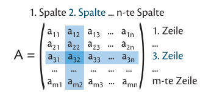

# Einführung
Eine Matrix sieht z.B. so aus:

$$
A = \begin{pmatrix}
    3 & 2 & 4 \\
    5 & 0 & 1 \\
    1 & 2 & 3 \\
    0 & 1 & 3
\end{pmatrix}
$$

Die Matrix $A$ besteht aus 4 Zeilen und 3 Spalten, also ist sie eine $4\times3$-Matrix.

Allgemein wird mit $a_{i,j}$ das Element in **Zeile $i$** und **Spalte $j$** bezeichnet, z.B. ist $a_{3,2}$ jenes Element der Matrix, das in der 3. Zeile und in der 2. Spalte steht.

Merkhilfe: "Zeile zuerst, Spalte später"

# Addition und Multiplikation mit einem Skalar

## Addition

Jedes Element einzeln addieren:
$$
C = A \plusmn B = \begin{pmatrix}
    a_{1,1} & a_{1,2} \\
    a_{2,1} & a_{2,2} \\
    a_{3,1} & a_{3,2} 
\end{pmatrix} \plusmn \begin{pmatrix}
    b_{1,1} & b_{1,2} \\
    b_{2,1} & b_{2,2} \\
    b_{3,1} & b_{3,2} 
\end{pmatrix} = \begin{pmatrix}
    a_{1,1} \plusmn b_{1,1} & a_{1,2} \plusmn b_{1,2} \\
    a_{2,1} \plusmn b_{2,1} & a_{2,2} \plusmn b_{2,2} \\
    a_{3,1} \plusmn b_{3,1} & a_{3,2} \plusmn b_{3,2} \\
\end{pmatrix}
$$

## Multiplikation mit einem Skalar

Jedes Element mit dem Skalar multiplizieren:

$$
D = k \cdot A = k \cdot \begin{pmatrix}
    a_{1,1} & a_{1,2} \\
    a_{2,1} & a_{2,2} \\
    a_{3,1} & a_{3,2} 
\end{pmatrix} = 
\begin{pmatrix}
    k \cdot a_{1,1} & k \cdot a_{1,2} \\
    k \cdot a_{2,1} & k \cdot a_{2,2} \\
    k \cdot a_{3,1} & k \cdot a_{3,2} \\
\end{pmatrix}
$$

## Multiplikation von Matrizen

**Achtung**: Diese Operation ist nicht kommutativ!

Zum Multiplizieren von Matrizen wird für jedes Element der finalen Matrix, die **Zeilen von der ersten mit der Spalten von der zweiten** Matrix multipliziert, in dem man jedes Element miteinander multipliziert, und diese Werte addiert:

 \
Bildquelle: https://notesbylex.com/_media/matrix-multiplication.gif

Wenn z.B. $A=3 \times 2$ und $B = 2 \times 2$:
- Mittleren 2 müssen zusammenpassen: $3 \times [2 \quad 2]\times 2$
- Äußeren 2 liefern die Größe der Ergebnismatrix: $3] \times 2 \quad 2 \times [2$, also $3 \times 2$

# Einheitsmatrix und inverse Matrizen

## Einheitsmatrix

Diagonalmatrix, bei der alle Elemente der Hauptdiagonale gleich $1$ sind, also z.B. $3 \times 3$:

$$
E = \begin{pmatrix}
    1 & 0 & 0 \\
    0 & 1 & 0 \\
    0 & 0 & 1
\end{pmatrix}
$$

Irgendeine Matrix (soweit multiplizierbar) mal der Einheitsmatrix ergibt die Matrix selber.

## Inverse Matrizen
Eine Matrix $A^{-1}$ ist die inverse Matrix zu einer quadratischen Matrix $A$ mit $\det(A) \neq 0$, wenn das Produkt $A \cdot A^{-1}$ bzw. $A^{-1} \cdot A$ die **Einheitsmatrix** ergibt.

# Lösen von linearen Gleichungssystemen

Wenn z.B. folgendes Gleichungssystem mithilfe der Matritzenrechnung gelöst werden soll:

1. $2x + 2y - z = 2$
2. $x - y + z = 6$
3. $2x - y + z = 9$

Man bestimmt die **Koeffizientenmatrix $A$**, den **Vektor der Variablen $\vec{x}$** sowie den **Vektor der Konstanten $\vec{b}$**:
$$
A = \begin{pmatrix}
    2 & 2 & -1 \\
    1 & -1 & 1 \\
    2 & -1 & 1
\end{pmatrix}
$$
$$
\vec{x} = \begin{pmatrix}
    x \\
    y \\
    z
\end{pmatrix}
$$
$$
\vec{b} = \begin{pmatrix}
    2 \\
    6 \\ 
    9
\end{pmatrix}
$$

Anschreiben der Form $A \cdot \vec{x} = \vec{b}$:
$$
\begin{pmatrix}
    2 & 2 & -1 \\
    1 & -1 & 1 \\
    2 & -1 & 1
\end{pmatrix} \cdot \begin{pmatrix}
    x \\
    y \\
    z
\end{pmatrix} = \begin{pmatrix}
    2 \\
    6 \\ 
    9
\end{pmatrix}
$$

Das Ziel ist es jetzt, auf $\vec{x}=\ldots$ zu kommen. Dazu müssen wir die **Inverse** von $A$, also $A^{-1}$, aufschreiben: 

$$
A^{-1} = \begin{pmatrix}
    0 & -1 & 1 \\
    1 & 4 & -3 \\
    1 & 6 & -4
\end{pmatrix}
$$

Jetzt muss diese Matrix, wichtig, ***von links*** auf beiden Seiten multipliziert werden. Da $A^{-1} \cdot A = \text{Einheitsmatrix}$, fällt der linke Teil wie bei einer normalen Umformung weg:

$$
\begin{pmatrix}
    x \\
    y \\
    z
\end{pmatrix} = \begin{pmatrix}
    0 & -1 & 1 \\
    1 & 4 & -3 \\
    1 & 6 & -4
\end{pmatrix} \cdot \begin{pmatrix}
    2 \\
    6 \\ 
    9
\end{pmatrix}
$$

Also: 

$$
\begin{pmatrix}
    x \\
    y \\
    z
\end{pmatrix} = \begin{pmatrix}
    0 \cdot 2 & + &  (-1)\cdot 6 & + &  1 \cdot 9 \\
    1 \cdot 2 & + & 4 \cdot 6 & + & (-3) \cdot 9 \\ 
    1 \cdot 2 & + & 6 \cdot 6 & + & (-4) \cdot 9
\end{pmatrix}
$$

Ausgerechnet ergibt das:

$$
\begin{pmatrix}
    x \\
    y \\
    z
\end{pmatrix} = \begin{pmatrix}
    3 \\
    -1 \\
    2
\end{pmatrix}
$$

Also die Lösung des linearen Gleichungssystem lautet:
$$
x = 3; \quad y = -1; \quad z = 2
$$

Falls $\det(A) = 0$, gibt es **keine eindeutige Lösung**.

# Transformationsmatrizen

Transformationen wie Drehungen oder Schiebungen von **Vektoren** können mithilfe von Matrizen durchgeführt werden.

## Drehungen
Drehungen müssen **gegen den Uhrzeigersinn** angewendet werden. 

## Streckungen
Eine Streckung kann ebenfalls durch eine Matrix beschrieben werden:

$$
S = \begin{pmatrix}
    s_x & 0 \\
    0 & s_y
\end{pmatrix}
$$

# Beispiel vom Buch

