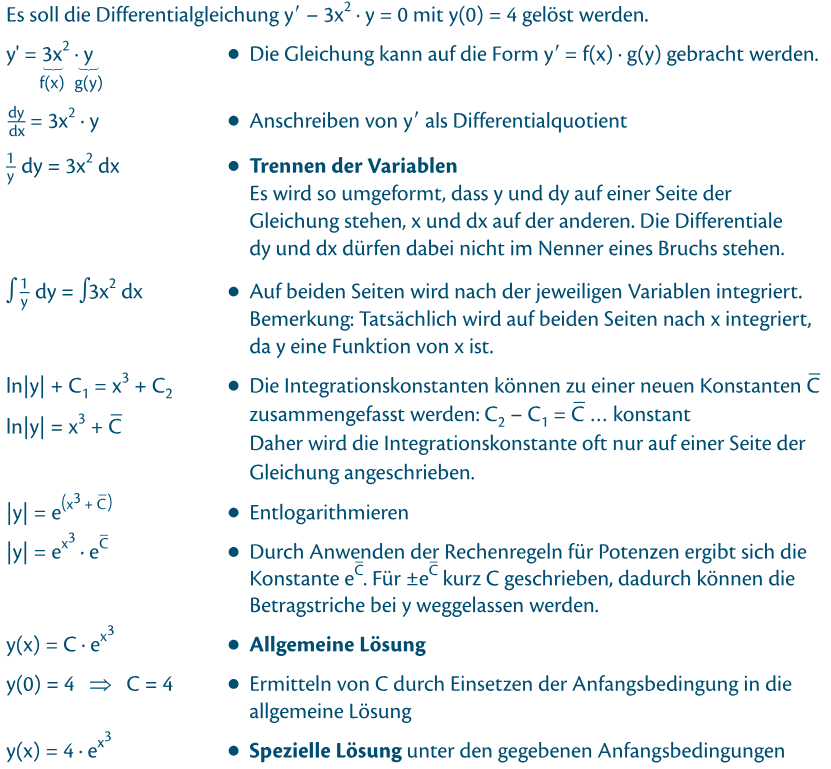
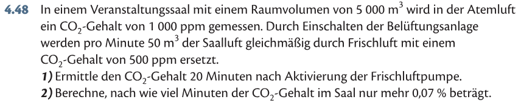
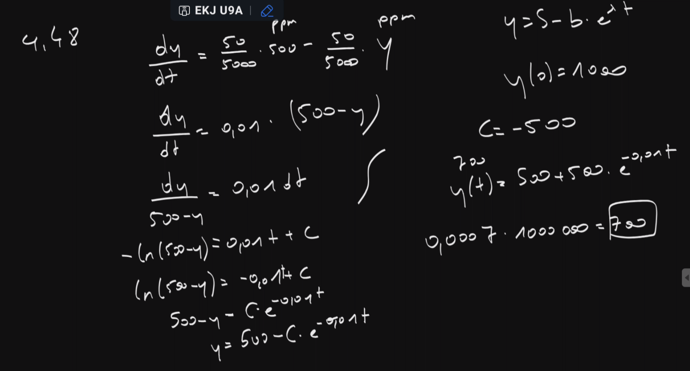

@ Stoff
# Trennung der Variablen
Nur möglich für Funktionen 1. Ordnung (d.H. max. 1 Ableitung)

Form der Gleichung muss sein:
$$
y' = f(x) \cdot g(y)
$$

## Beispiel
$$
y' = x^2 \cdot y
$$

**$y'$ als Bruch darstellen und umformen:**
$$
\frac{dy}{dx}=x^2 \cdot y \quad / \times dx \quad \div y
$$
$$
\frac{dy}{y}= x^2 \cdot dx
$$
**Beide Seiten nach $dx$ integrieren:**
$$
\frac{1}{y}dy = x^2 \cdot dx \quad / \int \ldots dx
$$
$$
\ln(y) + C_1 = \frac{x^3}{3}+C_2
$$
**Wir können beide Konstanten $C_1$ und $C_2$ in einer ($C_3$) zusammenfassen:**
$$
\ln(y) = \frac{x^3}{3} + C_3
$$
**Umformen:**
$$
\ln(y) = \frac{x^3}{3} + C_3 \quad / e^{(\ldots)}
$$
$$
y = e^{\frac{x^3}{3} + C_3}
$$
$$
y = e^{\frac{x^3}{3}} \cdot e^{C_3}
$$
**Da $e^{C_3}$ auch nur eine Konstante ist, kann sie als $C$ zusammengefasst werden:**
$$
y = e^{\frac{x^3}{3}} \cdot C
$$

### Probe

**Annahme:**
$$
y(0) = 4 
$$

**Einsetzen von $4$:**
$$
y = 4 \cdot e^{\frac{x^3}{3}}
$$
$$
y' = 4 \cdot e^{\frac{x^3}{3}} \cdot x^2
$$
$$
y' = y \cdot x^2
$$

## Beispiel aus dem Buch

# Lineare Differentialgleichungen 1. Ordnung
Form:
$$
y' + f(x) \cdot y = s(x)
$$
Wobei die Funktion $s(x)$ als **Störfunktion** bezeichnet wird. Wenn $s(x) \neq 0$, ist die funktion **inhomogen**, ansosten **homogen**. **Lineare Differentialgleichungen 1. Ordnung mit konstanten Koeffizienten** treten vor, wenn $f(x) = p$, also konstant ist. 

Falls eine Gleichung **homogen, linear und mit konstanten Koeffizienten** ist, kann sie mittels Trennen der Variablen gelöst werden. 

## Homogene lineare Differentialgleichungen 1. Ordnung mit konstanten Koeffizienten
Falls $f(x)=p$ und ist keine Störfunktion vorhanden (also $y' + p \cdot y = 0$), hat die Lösung die Form:
$$
y = C\cdot e^{-p \cdot x}
$$

## Inhomogene lineare Differentialgleichungen 1. Ordnung mit konstanten Koeffizienten
Bei der Form:
$$ 
y' + p \cdot y = s(x)
$$

### Beispiel
$$
y' + 2\cdot y = 4x -5 
$$
mit $y(0)= 0.5$ 

**Homogene Lösung:**

Die Störfunktion $s(x) = 4x-5$ ist eine lineare Funktion. Da der Lösungsansatz vom Typ der Störfunktion abhängt, wählt man hier eine allgemeine lineare Funktion:
$$
y_p = A \cdot x + B
$$
Da sowohl die Funktion selber als auch ihre Ableitung die Gleichung erfüllen müssen, benötigt man die Ableitung.

**Allgemein:**
$$
{y_p}'=A
$$

**Einsetzen in die Gleichung:**
$$
\textcolor{orange}{y'} + 2\cdot \textcolor{blue}{y} = 4x -5 
$$
$$
A + 2 \cdot (A \cdot x + B) = 4x -5
$$
**Ausmultiplizieren:**
$$
A + 2 A x + 2B = 4x -5
$$

@ Übungen

# 4.48
## Angabe

## Lösung

