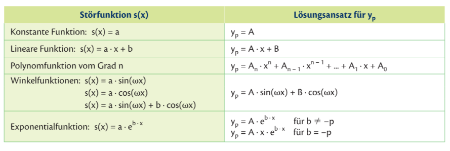
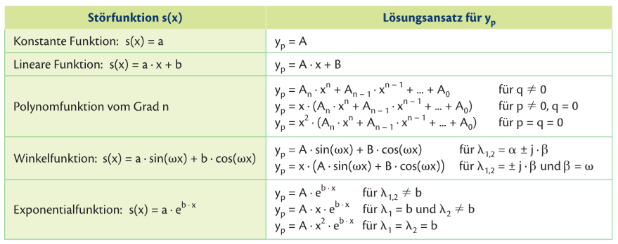
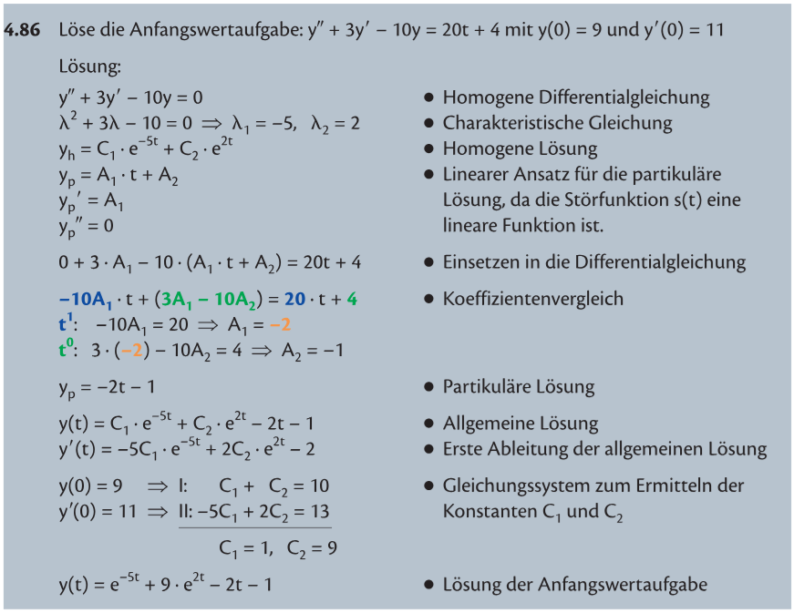

@ Stoff
# Trennung der Variablen
Nur möglich für Funktionen 1. Ordnung (d.H. max. 1 Ableitung)

Form der Gleichung muss sein:
$$
y' = f(x) \cdot g(y)
$$

## Beispiel
$$
y' = x^2 \cdot y
$$

$y'$ als Bruch darstellen und umformen:
$$
\frac{dy}{dx}=x^2 \cdot y \quad / \times dx \quad \div y
$$
$$
\frac{dy}{y}= x^2 \cdot dx
$$
Beide Seiten nach $dx$ integrieren:
$$
\frac{1}{y}dy = x^2 \cdot dx \quad / \int \ldots dx
$$
$$
\ln(y) + C_1 = \frac{x^3}{3}+C_2
$$
Wir können beide Konstanten $C_1$ und $C_2$ in einer ($C_3$) zusammenfassen:
$$
\ln(y) = \frac{x^3}{3} + C_3
$$
Umformen:
$$
\ln(y) = \frac{x^3}{3} + C_3 \quad / e^{(\ldots)}
$$
$$
y = e^{\frac{x^3}{3} + C_3}
$$
$$
y = e^{\frac{x^3}{3}} \cdot e^{C_3}
$$
Da $e^{C_3}$ auch nur eine Konstante ist, kann sie als $C$ zusammengefasst werden:
$$
y = e^{\frac{x^3}{3}} \cdot C
$$

### Probe

Annahme:
$$
y(0) = 4 
$$

Einsetzen von $4$:
$$
y = 4 \cdot e^{\frac{x^3}{3}}
$$
$$
y' = 4 \cdot e^{\frac{x^3}{3}} \cdot x^2
$$
$$
y' = y \cdot x^2
$$

## Beispiel aus dem Buch

# Lineare Differentialgleichungen 1. Ordnung mit konstanten Koeffizienten: Einführung
Form:
$$
y' + f(x) \cdot y = s(x)
$$
Wobei die Funktion $s(x)$ als **Störfunktion** bezeichnet wird. Wenn $s(x) \neq 0$, ist die funktion **inhomogen**, ansosten **homogen**. **Lineare Differentialgleichungen 1. Ordnung mit konstanten Koeffizienten** treten vor, wenn $f(x) = p$, also konstant ist. 

Falls eine Gleichung **homogen, linear und mit konstanten Koeffizienten** ist, kann sie mittels Trennen der Variablen gelöst werden. 

# Homogene lineare Differentialgleichungen 1. Ordnung mit konstanten Koeffizienten
Falls $f(x)=p$ und ist keine Störfunktion vorhanden (also $y' + p \cdot y = 0$), hat die Lösung die Form:
$$
y = C\cdot e^{-p \cdot x}
$$

# Inhomogene lineare Differentialgleichungen 1. Ordnung mit konstanten Koeffizienten
Bei der Form:
$$ 
y' + p \cdot y = s(x)
$$

Ist die allgemeine Lösung:
$$
y = y_h + y_p
$$
Wobei $y_h$ die **homogene** und $y_p$ die **partikuläre** Lösung ist. 

## Beispiel
$$
y' + 2\cdot y = 4x -5 
$$
mit:
$$
y(0)= 0.5
$$

### Homogene Lösung
Homogene Differenzialgleichung:
$$
y' +2\cdot y = 0
$$
Homogene Lösung:
$$
y_h = C \cdot e^{-2x}
$$

### Partikuläre Lösung

Die Störfunktion $s(x) = 4x-5$ ist eine lineare Funktion. Da der Lösungsansatz vom Typ der Störfunktion abhängt, wählt man hier eine allgemeine lineare Funktion:
$$
\textcolor{blue}{y_p = A \cdot x + B}
$$
Da sowohl die Funktion selber als auch ihre Ableitung die Gleichung erfüllen müssen, benötigt man die Ableitung.

Allgemein:
$$
\textcolor{orange}{{y_p}'=A}
$$

Einsetzen in die Gleichung:
$$
\textcolor{orange}{y'} + 2\cdot \textcolor{blue}{y} = 4x -5 
$$
$$
\textcolor{orange}{A} + 2 \cdot \textcolor{blue}{(A \cdot x + B)} = 4x -5
$$
Ausmultiplizieren:
$$
A + 2 A x + 2B = 4x -5
$$
Sortieren nach den Koeffizienten von $x$:
$$
\textcolor{red}{2A}\cdot x + (\textcolor{magenta}{A + 2B}) = \textcolor{red}{4} \cdot x + (\textcolor{magenta}{-5})
$$

Mit $x$: $\textcolor{red}{2A} = \textcolor{red}{4}$ \
Ohne $x$: $\textcolor{magenta}{A + 2B} = \textcolor{magenta}{-5}$

Lösungen von $A$ und $B$:
$$
A = 2; \quad B = -3.5
$$

Partikuläre Lösung:
$$
y_p = 2x - 3.5
$$

#### Lösen der Gleichung
Allgemeine Lösung:
$$
y = y_h + y_p
$$

Eingesetzt:
$$
y(x) = C \cdot e^{-2x} + 2x - 3.5
$$

Durch Einsetzen der Anfangsbedingungen ($y(0)= 0.5$) erhält man die Konstante $C$:
$$
0.5 = C \cdot  e^{-2x} + 2x - 3.5
$$
$$
0.5 = C - 3.5
$$
$$
C = 4
$$
Mit dem Einsetzen von $C$ bekommen wir die Spezielle Lösung:
$$
y(x) = 4 \cdot e^{-2x} + 2x - 3.5
$$

Hier wurde der Lösungsansatz für lineare Störfunktionen verwendet, wobei der Lösungsansatz $y_p = A \cdot x + B$ gleicht. Hier sind die Lösungsansätze anderer Störfunktionen:

# Variation der Konstanten

Form:
$$
y' + f(x) \cdot y = s(x)
$$

## Beispiel
$$
y'-2x \cdot y = e^{x^2}
$$

### Homogene Lösung
Nullsetzen der Störfunktion:
$$
y'-2x \cdot y = 0
$$
Lösen mit Trennung der Variablen:
$$
\frac{dy}{dx} -2x \cdot y = 0 \quad / + 2xy
$$
$$
\frac{dy}{dx} = 2x \cdot y \quad / \times dx \quad \div y
$$
$$
\frac{1}{y} dy = 2x \cdot dx \quad / \int \ldots dx
$$
$$
ln|y| = x^2 + C \quad / e^{(\ldots)}
$$
$$
y_h = C \cdot e^{x^2}
$$

### Partikuläre Lösung
**In der homogenen Lösung $y_h$ wird die Konstante $C$ durch die Funktion $C(x)$ ersetzt.**

Variation der Konstanten:
$$
y_p(x) = C(x) \cdot e^{x^2}
$$
Bilden der ersten Ableitung:
$$
{y_p}'(x) = C'(x) \cdot e^{x^2} + C(x) \cdot 2x \cdot e^{x^2}
$$
Einsetzen von $y_p$ und ${y_p}'$ in die inhomogene (originale) Gleichung, die Terme mit $C(x)$ müssen immer wegfallen:
$$
C'(x) \cdot e^{x^2} + \sout{2x \cdot C(x) \cdot e^{x^2}} - \sout{2x \cdot C(x) \cdot e^{x^2}} = e^{x^2}
$$
Vereinfachen der Gleichung:
$$
C'(x) \cdot e^{x^2} = e^{x^2} \quad / \div e^{x^2}
$$
$$
C'(x) = 1
$$
$$
C(x) = \int 1 \, dx = x
$$
(Für die bei der Integration anfallende Konstante kann $0$ gewählt werden, da nur **eine** spezielle Lösung gesucht wird.)

$C(x)$ in den Ansatz für $y_p$ einsetzen:
$$
y_p = x \cdot e^{x^2}
$$

### Allgemeine Lösung
Die allgemeine Lösung ergibt sich aus der Summe der Einzellösungen:
$$
y = y_h + y_p
$$
$$
y(x) = C \cdot e^{x^2} + x \cdot e^{x^2}
$$

# Lineare Differentialgleichungen 2. Ordnung mit konstanten Koeffizienten: Einführung

Hier kann auch wieder auf **homogen** und **inhomogen** unterschieden werden. Diese Differentialgleichungen folgen der Form:

$$
y'' + p \cdot y' + q \cdot y = s(x)
$$

# Homogene lineare Differentialgleichungen 2. Ordnung mit konstanten Koeffizienten

Wenn die Form:

$$
y'' + p \cdot y' + q \cdot y = 0
$$

gegeben ist, kann sie umgeschrieben werden zu:

$$
\lambda^2 + p \cdot \lambda + q = 0
$$

Mit einsetzen in die Mitternachtsformel bekommt man $\lambda_1$ und $\lambda_2$:

$$
\lambda_1, \lambda_2  = \frac{-b \plusmn \sqrt{b^2-4ac}}{2a}
$$

Die Lösungen der Differentialgleichungen sind:
$$
y_1 = C_1 \cdot e^{\lambda_1 \cdot x}
$$
$$
y_2 = C_2 \cdot e^{\lambda_2 \cdot x}
$$
und die **Linearkombination von Lösungen** der Differentialgleichung ist wieder eine Lösung der Differentialgleichung:
$$
y(x) = C_1 \cdot e^{\lambda_1 \cdot x} + C_2 \cdot e^{\lambda_2 \cdot x}
$$

# Inhomogene lineare Differentialgleichungen 2. Ordnung mit konstanten Koeffizienten

Wieder wie bei den Differentialgleichungen der 1. Ordnung, ist die Lösung wieder die Summe aus der **homogenen** und der **partikulären** Lösung, jedoch sind hierfür die Lösungsansätze teilweise anders:

## Beispiel
$$
y'' + 5y' + 6y = 2e^{-2x}
$$

### Homogene Lösung
$$
y'' + 5y' + 6y = 0
$$
$$
\lambda^2 + 5 \lambda + 6 = 0
$$
$$
\lambda_1 = -2; \quad \lambda_2 = -3
$$
$$
y_h = C_1 \cdot e^{-3x} + C_2 \cdot e^{-2x}
$$

### Partikuläre Lösung
$\lambda_1 = b = -2$ ist die Lösung der charakteristischen Gleichung, also ist $e^{-2x}$ Bestandteil der homogenen Lösung. Daher wird der Lösungsanzatz $y_p = A \cdot x \cdot e^{b \cdot x}$ gewählt: 

$$
y_p = A \cdot x \cdot e^{-2x}
$$
$$
{y_p}' = A \cdot e^{-2x} - 2A \cdot x \cdot e^{-2x}
$$
$$
{y_p}'' = -4A \cdot e^{-2x} + 4A \cdot x \cdot e^{-2x}
$$

Einsetzen in die originelle Differentialgleichung:

$$
-4 A \cdot e^{-2x} + 4A \cdot x \cdot e^{-2x} + 5 A \cdot e^{-2x} - 10A \cdot x \cdot e^{-2x} +6A \cdot x \cdot e^{-2x} = 2 \cdot e^{-2x}
$$
$$
\textcolor{red}{A} \cdot e^{-2x} = \textcolor{red}{2} \cdot e^{-2x}
$$
$$
\textcolor{red}{A} = \textcolor{red}{2}
$$

Partikuläre Lösung:
$$
y_p = 2 x \cdot e^{-2x}
$$

### Allgemeine Lösung
Summieren auf $y = y_h + y_p$:
$$
y(x) = C_1 \cdot e^{-3x} + C_2 \cdot e^{-2x} + 2 x \cdot e^{-2x}
$$

# TL;DR: Prozedur
Kann sein dass die nicht vollständig ist; Dinge wie **Variation der Konstanten** sind hier nicht beschrieben, es sollte aber trotzdem für eine gute Note ausreichen!
1. Mit der Störfunktion ersetzt durch $0$ die homogene Lösung finden
   1. Bei erster Ordnung: Lösen mittels Trennung der Variablen
      1. $y'$ als $\frac{dy}{dx}$ schreiben
      2. Alles mit $x$ bzw. $dx$ auf eine Seite, und alles mit $y$ bzw. $dy$ auf die andere bringen
      3. Beide Seiten integrieren, $dx$ und $dy$ fällt weg
      4. Umformen auf $y = \ldots$, Konstanten zusammenfassen
   2. Bei zweiter Ordnung: Lösen mittels Mitternachtsformel 
      1. Wie bei einem normalen Gleichungsystem, nur statt $x^2,\, x,\, 1$ gibt es $y'',\, y',\, y$, mit der ABC-Formel lösen
      2. Lösungen sind $y_n = C_n \cdot e^{\lambda_n \cdot x}$, wobei $n$ die Lösungsnummer ist ($1$ oder $2$) und $\lambda_n$ die Lösung ist
      3. Falls zwei Lösungen vorhanden sind, ist die Lösung die Summe von den beiden: $y_h = C_1 \cdot e^{\lambda_1 \cdot x} + C_2 \cdot e^{\lambda_2 \cdot x}$
2. Partikuläre Lösung finden
   1. Korrekten Lösungsansatz für die Störfunktion finden in der Formelsammlung, aufpassen dass die für die jeweils 1. und 2. Ordnung verschieden sind; z.B. $y_p = A \cdot x + B$
   2. In der originellen Funktion das $y$, bzw. $y'$ oder $y''$ mit dem Lösungsansatz, bzw. der ersten oder zweiten Ableitung des Lösungsansatzes, ersetzen
   3. Umformen, sodass alle Teile mit $x$ links stehen und alle ohne $x$ rechts stehen, z.B. $\textcolor{red}{2A}x + (\textcolor{magenta}{A + 2B}) = \textcolor{red}{4}x + (\textcolor{magenta}{-5})$
   4. Diese jeweils gleichsetzen, z.B. $\textcolor{red}{2A} = \textcolor{red}{4}$ und $\textcolor{magenta}{A+2B} = \textcolor{magenta}{-5}$
   5. Gleichungssystem lösen, damit $A$ und (falls existent) $B$ bekannt sind
   6. $A$ und $B$ in den Lösungsansatz einsetzen, z.B. $y_p=2x-3.5$
3. Beide Lösungen addieren: $y = y_h + y_p$

@ Übungen

# 4.48
## Angabe

## Lösung

# 4.51

# 4.86
