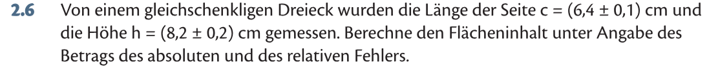
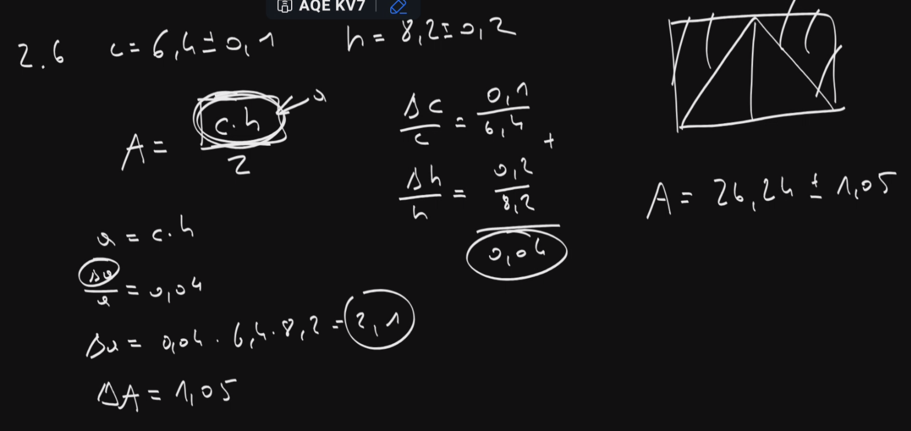

!noindex

# Ü2.2 (S. 28)
$$
a = \frac{x \cdot y}{z} \quad x = 4 \plusmn 0.1 \quad y = 2 \plusmn 0.2 \quad z = 6 \plusmn 0.3
$$
**Relativer Fehler:**
$$
\frac{\Delta a}{a_0} = |\frac{\Delta x}{x_0}| + |\frac{\Delta y}{y_0}| + |\frac{\Delta z}{z_0}| = 
$$
$$
= \frac{0.1}{4} + \frac{0.2}{2} + \frac{0.3}{6} = 0.175
$$
**Absoluter Fehler:**
$$
a_0 = \frac{4 \cdot 2}{6} = \frac{8}{6}
$$
Multiplizieren mit dem relativen Fehler:
$$
0.175 \cdot \frac{8}{6} = 0.2 \dot{3}
$$
$$
a = \frac{8}{6} \plusmn 0.2\dot{3}
$$

# Ü2.6 (S. 28)

# MAK

# Angabe
$$
a = \frac{x\cdot y}{x+y} 
$$
$$
x = 2 \plusmn 0.1 \quad x=3\plusmn0.3
$$

# Lösung
$$
a = \frac{6}{5}
$$

$$
\frac{0.4}{5} = 0.08
$$

Relativer Fehler:
$$
\frac{0.1}{2} + \frac{0.3}{3} + 0.08 = 0.23
$$

Absoluter Fehler:
$$
0.23 \cdot \frac{6}{5} = 0.276
$$