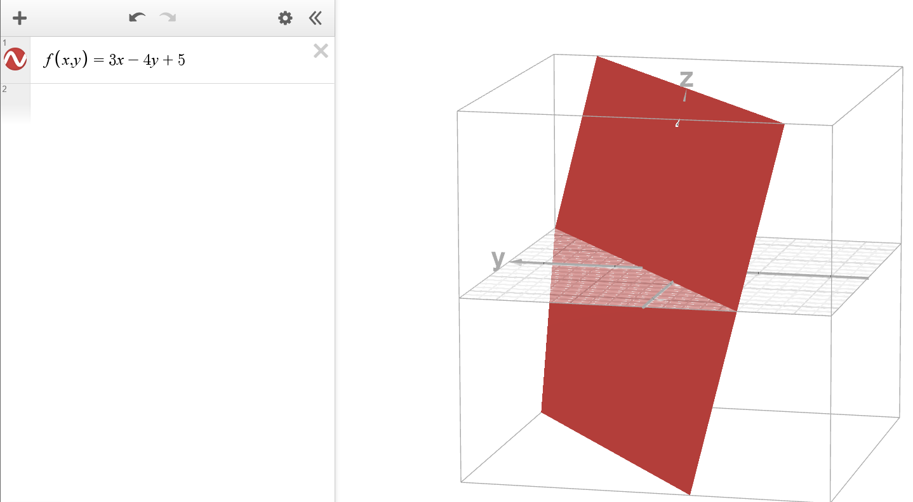

# Explizite Darstellung
$$
f(x,y) = 3x-4y+5
$$
kann umgeschrieben werden als:
$$
z = 3x-4y+5
$$

# Implizite Darstellung
auf 0 umformen:

$$
0 = 3x-4y-z+5
$$

# Zeichnen
Diese Funktionen sind **dreidimensional**.

# Tangentialebene

Funktion einer Tangente (bei einer Funktion mit 1 Variable):
$$
f(x_0)+f'(x_0)\cdot(x-x_0)
$$

Für die Tangentialebene muss zuerst die Ableitung gebildet werden, $f_x(x, y)$ ist abgeleitet nach $x$ und $f_y(x, y)$ ist abgeleitet nach $y$.

Funktion der Tangentialebene:
$$
f(x_0, y_0)+f_x(x_0, y_0)\cdot(x-x_0)+f_y(x_0,y_0)\cdot(y-y_0)
$$

Beispiel:
$$
f(x,y)=4x+2y-3x^2y
$$
$$
f_x(x,y)=4-6xy
$$
$$
f_y(x,y)=2-3x^2
$$
$$
P(1|2|z_0) = P(1|2|2)
$$

$$
\tau: \quad z=2-8\cdot(x-1)-1\cdot(y-2)
$$
$$
z=-8x-y+12
$$