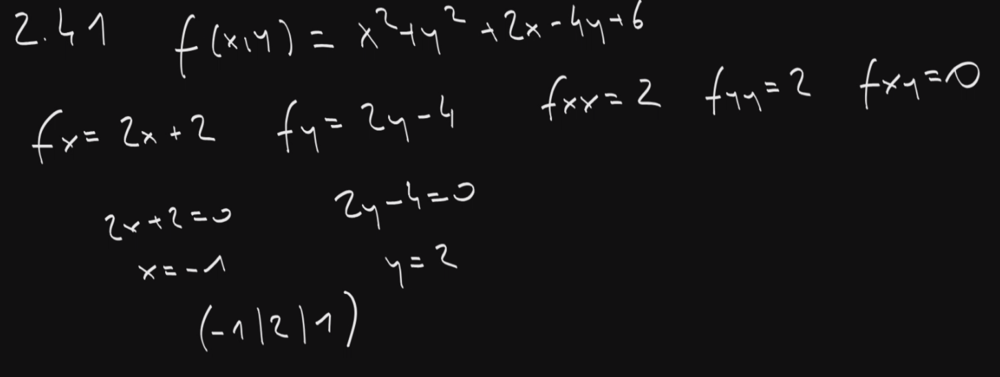

$$
f(x, y) = x^4y - 2xy^3
$$

$$
\frac{\delta f}{\delta x} = f_x = 4x^3y-2y^3
$$
$$
\frac{\delta f}{\delta y} = f_y = x^4-6xy^2
$$

Zweite Ableitung:

$$
\frac{\delta^2 f}{\delta x^2} = f_{xx} = 12x^2y
$$
$$
\frac{\delta^2 f}{\delta x \delta y}=f_{xy}=4x^3-6y^2
$$
$$
\frac{\delta^2 f}{\delta y^2} = f_{yy} = -12xy
$$
$$
\frac{\delta^2 f}{\delta y \delta x}=f_{yx}=4x^3-6y^2
$$

Die Reihenfolge der Ableitungen ist egal, also $f_{xy}=f_{yx}$, es gibt also drei Ableitungen zweiten Grades. 

# Extremstellen
