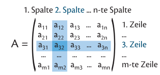

# Einführung
Eine Matrix sieht z.B. so aus:

$$
A = \begin{pmatrix}
    3 & 2 & 4 \\
    5 & 0 & 1 \\
    1 & 2 & 3 \\
    0 & 1 & 3
\end{pmatrix}
$$

Die Matrix $A$ besteht aus 4 Zeilen und 3 Spalten, also ist sie eine $4\times3$-Matrix.

Allgemein wird mit $a_{i,j}$ das Element in **Zeile $i$** und **Spalte $j$** bezeichnet, z.B. ist $a_{3,2}$ jenes Element der Matrix, das in der 3. Zeile und in der 2. Spalte steht.

Merkhilfe: "Zeile zuerst, Spalte später"

# Addition und Multiplikation mit einem Skalar

## Addition

Jedes Element einzeln addieren:
$$
C = A \plusmn B = \begin{pmatrix}
    a_{1,1} & a_{1,2} \\
    a_{2,1} & a_{2,2} \\
    a_{3,1} & a_{3,2} 
\end{pmatrix} \plusmn \begin{pmatrix}
    b_{1,1} & b_{1,2} \\
    b_{2,1} & b_{2,2} \\
    b_{3,1} & b_{3,2} 
\end{pmatrix} = \begin{pmatrix}
    a_{1,1} \plusmn b_{1,1} & a_{1,2} \plusmn b_{1,2} \\
    a_{2,1} \plusmn b_{2,1} & a_{2,2} \plusmn b_{2,2} \\
    a_{3,1} \plusmn b_{3,1} & a_{3,2} \plusmn b_{3,2} \\
\end{pmatrix}
$$

## Multiplikation mit einem Skalar

Jedes Element mit dem Skalar multiplizieren:

$$
D = k \cdot A = k \cdot \begin{pmatrix}
    a_{1,1} & a_{1,2} \\
    a_{2,1} & a_{2,2} \\
    a_{3,1} & a_{3,2} 
\end{pmatrix} = 
\begin{pmatrix}
    k \cdot a_{1,1} & k \cdot a_{1,2} \\
    k \cdot a_{2,1} & k \cdot a_{2,2} \\
    k \cdot a_{3,1} & k \cdot a_{3,2} \\
\end{pmatrix}
$$

## Multiplikation von Matrizen

**Achtung**: Diese Operation ist nicht kommutativ!

Zum Multiplizieren von Matrizen wird für jedes Element der finalen Matrix, die **Zeilen von der ersten mit der Spalten von der zweiten** Matrix multipliziert, in dem man jedes Element miteinander multipliziert, und diese Werte addiert:

 \
^https://notesbylex.com/_media/matrix-multiplication.gif^

Wenn z.B. $A=3 \times 2$ und $B = 2 \times 2$:
- Mittleren 2 müssen zusammenpassen: $3 \times [2 \quad 2]\times 2$
- Äußeren 2 liefern die Größe der Ergebnismatrix: $3] \times 2 \quad 2 \times [2$, also $3 \times 2$

