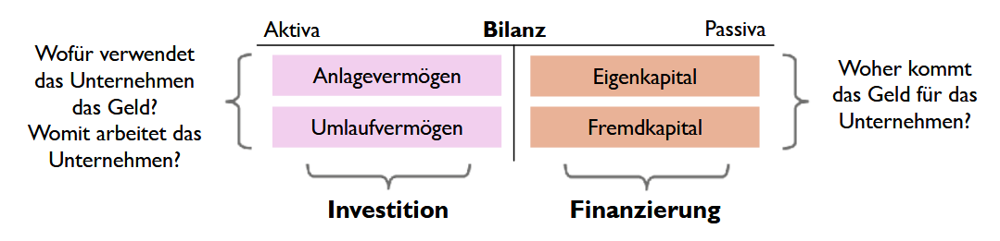

# Finanzierung (Finanzplan)

- **Investition** und **Finanzierung**
- Finanzplan zur Sicherstellung ausreichend **liquider Mittel** für die:
  - laufende Geschäftstätigkeit
  - Investitionen
- **Finanzierungmöglchkeiten:**
  - Innenfinanzierung
  - Außenfinanzierung
- Finanzierungsregeln und Finanzierungskennzahlen

# Zusammenhang Investition & Finanzierung

# Finanzplan

**Ziele:**
- Finanzierung **laufender Geschäftstätigkeit** (Miete, Gehälter, Rohstoffe)
- Finanzierung von **Investitionen** (Grundstück, Gebäude, Maschinen, Anlagen)

**Aufgaben:**
- Bechernung der **notwendigen Finanzmittel**
- Suche nach geeigneten **Formen der Finanzierung** bei **Kapitalbedarf**
- Suche nach **Veranlagungsmöglichkeiten** für **Überschüsse**

# Woraus besteht ein Finanzplan?
1. Planung der **Einnahmen**: Umsatzprognosen + sonstige Erträge; Einnahmen sind besonders schwierig zu schätzen
2. Planung laufender **Ausgaben**:
    - Fixkosten (Miete, Gehälter, Versicherungen)
    - variable Kosten (Materialkosten, Produktionsoksten)
    - Sonstige betriebliche Aufwendungen (z.B. Werbung, Wartung)
3. Planung von **Investitionen**: Anschaffung Maschinen, Fahrzeuge, Software:
    - Finanzierungsmöglichkeiten (Eigenkapital, Fremdkapital, Leasing)
4. Planung des **Liquiditätsbedarfs**:
    - Kurz-/mittel-/langfristig
    - Projektbezogen
5. **Kapitalbedarfs**- und **Finanzierungs**planung

    - Finanzierungsmöglichkeiten (Bankkredite, Eigenkapital, Fördermittel)
    - Tilgungs- und Zinsablagen
6. **Rentabilitäts**planung: GuV (Ertrag - Aufwand)
    - Rentabilitätskennzahlen (Umsatzrentabilität, Eigenkapitalrentabilität)
7. **Steuer**planung: Verausberechnung der **Steuerlast** und Optimierungsmöclichkeiten
8. **Risikomanagement**: Identifikation finanzieller Risiken, Risikominimierung

# Zusammenhang Bilanz, GuV, Cash-Flow-Statement

# Wirkung von Geschäftsfällen auf Gewinn/Cashflow

# Innenfinanzierung
$\Rarr$ Finanzierungsmöglichkeit vom Unternehmen; aus eigener Geschäftstätigkeit

1. Einhaltung von **Gewinnen** (Thesaurierung) ansatt Ausschüttung an Gesellschafter
2. **Abschreibungsfinanzierung**: Abschreibungen vur Leinvestition (mitdern Gewinn aber erfordern keine Auszahlung)
3. **Rückstellungsfinanzierung**: Bildung von Rückstellungen, die erst später ausgezahlt werden müssen
4. Verkauf von **Anlagevermögen**
5. Abbau von **Umlaufvermögen**: Reduktion Lagerbestände, Verkürzung Kendenzahlungszielen (Lieferforderungen reduzieren)

$\textcolor{lime}{+}$ **Vorteil**: Stärkt Liquidität und Unabhängigkeit \
$\textcolor{red}{-}$ **Nachteil**: Begrenzt, kann lange dauern

# Außenfinanzierung
$\Rarr$ Finanzierungsmöglichkeit von Unternehmen; mit externe Geldgeber

1. **Eigenkapital**finanzierung: keine Rückzahlungsverplichtung, aber Gewinnbeteiligung für Investoren
   - Kapitalerhöhung durch **Eigentümer** oder **neue Teilhaber** (Venture Capital für Startups, sonst Private Equity)
2. **Fremdkapital**finanzierung: Unternehmen bleibt **unabhängig**, aber es entstehen Zinskosten.

   - Bankkredite
   - Anleihen
   - Lieferantenkredite (verlängerte Zahlunsziele von Lieferanten)
   - Leasing (Nutzung von Maschinen/Fahrzeugen ohne Kauf)
   - Factoring (Verkauf von Forderungen)

3. **Hybridfinanzierung** (**Mezzanine-Kapital** - Mischform EK/FK)
   - Wandelanleihen (Anleihen, die später in Aktien umgewandelt werden)
   - Stille Beteiligung

# Business Angels
- **Reiche Leute**, die Start-Ups unterstützen (mit Kapital, Know-how, Netzwerken)
- Investment meist €25k bis €500k in Frühphase (für Unternehmensanteile)
- Erwarten **hohe Rendite** (10x oder mehr), oft durch späteren Verkauf (**Exit**)

$\textcolor{lime}{+}$ **Vorteile** für Startups:
- **Schnelle Finanzierung** ohne klassische Kredite
- Zugang zu **Wissen**, Erfahrung, vertwolle Geschäftskontakte
- **Flexible Verhandlungen** (Business Angels streben nicht nur nach kurzfristigen Profit)

$\textcolor{red}{-}$ **Nachteile** für Startups:
- Abgabe von **Unternehmensanteilen** (Verlust von Kontrolle)
- Hoher **Erwartungsdruck** auf Wachstum und Skalierbarkeit
- **Schwierige Suche** nach passenden Business Angel

# Venture Capital
Abgekürzt VC

- **Risikokapital**, welches **profesionelle Investoren** in Startups mit Potential investieren
- VC-Investoren streben einen **späteren Exit**
- VC-Investoren erwarten **hohe Rendite** (10x oder mehr)

$\textcolor{lime}{+}$ **Vorteile** für Startups:
- **Schnelles Wachstum** aufgrund hoher Finanzsummen
- Zugang zu **Netzwerken** und Know-How
- Kein Zwang zur Rückzahlung wie bei Krediten

$\textcolor{red}{-}$ **Nachteile** für Startups:
- Verlust von **Unternehmensanteilen**
- **Einfluss der Investoren** auf Entscheidungen
- Hoher **Erfolgsdruck** (Investoren erwarten schnelle Skalierung),
- Komplexe **Vertragsbindungen**

# Investitionskredite
$\Rarr$ **Langfristiger Kredit** für größere Anschaffungen bzw. Projekte (z.B. Maschinen, IT-Systeme)

- Keine Verwendung für laufende Betriebskosten (dafür gibt es Betriebsmittelkredite).
- Wird von **Banken** angeboten
- Laufzeit typisch 5-20 Jahre
- Rückzahlung in **Raten** mit **Zinsen** oder **endfälliges Modell**
- Zinssätze hängen ab von Bonität, Laufzeit, Sicherheiten
- Fixe oder variable Zinsen sind möglich

$\textcolor{lime}{+}$ **Vorteile**: Langfristige Planungssicherheit; steuerliche Absetzbarkeit der Zinsen; Schonung der Liquidität

$\textcolor{red}{-}$ **Nachteile**: Hohe Zinsen bei schlechter Bonität; meist lange Bindung; vorzeitige Rückzahlung mit Kosten

# Betriebsmittelkredite
$\Rarr$ **Kurzfristige Finanzierung laufender Geschäftsausgaben** (z.B. Löhne, Materialeinkäufe, Miete)

- Laufzeit typisch 1-3 Jahre
- Oft als kontokorrentähnliche Nutzung (Unternehmen kann auf den **Kreditrahmen** zugreifen) ((keine ahnung man))
- Zinsen nur für den genutzten Kreditbetrag
- **Höhere Zinssätze** als Investitionskredite
- **Sicherheiten erforderlich** (z.B. Forderungen, Warenbestände)

$\textcolor{lime}{+}$ **Vorteile**: Schnelle Liquiditätsbeschaffung; hohe Flexibilität; nicht langfristig bindend

$\textcolor{red}{-}$ **Nachteile**: Hohe Zinskosten; Gefahr von Fremdkapitalabhängigkeit

# Unternehmensfinanzierung über Anleihen
Mit Bonds oder Obligationen

- **Festverzinsliche Wertpapiere** mit dem Unternehmen Kapital am Kapitalmarkt aufnehmen
- Anleger kaufen Anleihe und erhalten da **regelmäßige Zinszahlungen** (Kupon) sowie am Ende **Rückzahlungen des Nennbetrags**:
  - Meist feste Laufzeit (z.B. 5, 10, 30 Jahre) mit Regelmäßigen Zinsen (Kupon) an Investoren
  - Zinshöhe hängt von Bonität ab

$\textcolor{lime}{+}$ **Vorteile**:
- **Große Geldbeträge ohne Eigenkapitalsabgabe**
- **Günstigere** Finanzierung als Bankkredite (vor allem für etablierte Unternehmen mit guter Bonität)

$\textcolor{red}{-}$ **Nachteile**:
- **Kreditwürdigkeit beeinflusst Zinskosten** (Niedrige Bonität $\rarr$ höhere Zinsen)
- **Hohe Emissionskosten** und komplexer Rechtlicher Prozess (Prospekthaftung)

# Lieferantenkredite
$\Rarr$ Einkauf von Waren/Dienstleistungen **auf Rechnung** (Zahlungsziel von 30, 60 oder 90 Tagen)

- Wenn mit **Skonto** (billiger wenn schneller gezahlt): Wenn existent aber nicht genutzt, Lieferantenkredit meist teurer als Bankkredit
- Oft keine Sicherheiten erforderlicht, Bonität wird trotzdem geprüft

$\textcolor{lime}{+}$ **Vorteile**:
- **Einfache Finanzierung** ohne Bank
- **Liquidität geschont**

$\textcolor{red}{-}$ **Nachteile**:
- **Begrenzte Kreditlinie** (abhängig vom Vertrauen)
- Zu viele unbezahlte Rechnungen **verschlechtern Bonität**

# Leasing
$\Rarr$ Nutzen von Wirtschaftsgut **ohne es zu kaufen**

- **Operatives Leasing**: Kurzfristig kündbar, ähnelt einer Miete
- **Finanzierungsleasing**: Langfristiger, oft mit Kaufoption zum Restwert am Ende der Laufzeit oder Verlängerung. Der Leasingnehmer:
   - schreibt Anlagegut ab und weist Barwert des Leasing als Verbindlichkeit aus
   - kann Zinsenanteil als Aufwand
   - trägt Instandhaltung und Risiken (Reparaturen, Versicherung))
- **Sale and Lease Back**: Anlagegut an Leasinggeber verkaufen und vom Leasingnehmer zurückleasen

$\textcolor{lime}{+}$ **Vorteile**:
- **Liquidität geschont**
- **Bilanzneutral** (bei Operativen Leasing)
- **Steuerliche Vorteile**

$\textcolor{red}{-}$ **Nachteile**:
- **Gesamtkosten oft höher als Kauf**

# Crowdfunding
$\Rarr$ Viele Menschen geben über eine Plattform kleine Geldbeträge um Projekt oder Unternehmen zu finanzieren

- **Reward-Based Crowdfunding**: Unterstützer erhalten **Produkt** oder Prämien (z.B. Kickstarter, Indiegogo)
- **Equity-Based Crowdfunding** (Crowdinvesting): Unterstützer erhalten **Unternehmensanteile**
- **Lending-Based Crowdfunding** (P2P-Lending): Crowd **vergibt Kredite und erhält Zinsen** (z.B. Auxmoney, Bondora)
- **Donation-Based Crowdfunding**: Reine Spenden **ohne Gegenleistung** (z.B. GoFundMe)

**Bekannte Plattformen:**
- **International**: Kickstarter, Indiegogo, GoFundMe, Seedmatch
- **Österreich**: StarteDeinProjekt, Greenrocket, Crowdfunding-Dienstleister (FMA Österreich)

$\textcolor{lime}{+}$ **Vorteile**:
- **Keine Rückzahlungspflicht**
- Direkter **Markettest** für neue Produkte
- Potenzielle **virale Verbreitung** duch Social Media

$\textcolor{red}{-}$ **Nachteile**:
- Erfolg **nicht garantiert**
- Hoher **Marketingaufwand**
- **Plattformgebühren** und steuerliche Aspekte

# Factoring
$\Rarr$ **Verkauf** von offenen (Kunden-)**Forderungen an Factor**, um sofortige liquide Mittel zu erhalten

- Factor finanziert vor, übernimmt **Ausfallsrisiko** und **Verwaltung** der Forderung
- Gebühren und Zinsen (teurer als Bankkredite, z.B. 0.5-5%)

$\textcolor{lime}{+}$ **Vorteile**:
- Schnelle **Liquiditätssteigerung**
- **Reduziertes Risiko** von Zahlungsausfällen
- **Entlastung der Buchhaltung** (Mahnwesen wird oft vom Factor übernommen)

$\textcolor{red}{-}$ **Nachteile**:
- **Hohe Kosten**
- **Abhängigkeit** vom Factoring-Dienstleister
- Mögliche **Negative Reaktion** vom Kunden (Rechnungen werden von Dritten eingefordert)

# Mezzanine Kapital
$\Rarr$ Mischung zwischen EK und FK, bietet flexible Finanzierungsoptionen

- **Keine Stimmrechte** für Kapitalgeber
- **Nachrangige Rückzahlung** (bei Insolvenz erst nach FK aber vor EK zurückgezahlt)

**Typische Formen:**
- **Stille Beteiligung**: Kapitalgeber beteiligt sich an Gewinn, bleibt aber anonym
- **Wandelanleihen**: FK, das später in EK umgewandelt werden kann
- **Nachrangdarlehen**: Werden erst nach dem FK bedient
- **Genussscheine**: Ähnlich einer Anleihe aber mit Gewinnbeteiligung

$\textcolor{lime}{+}$ **Vorteile**: Kapital aufnehmen ohne Verschuldung offiziell zu erhöhen 

$\textcolor{red}{-}$ **Nachteile**: Hohe Kosten

# Finanzierungsregeln - Finanzkennzahl
- **Eigenkapitalquote**
- Verschuldungsgrad (Gearing Ratio)
- Goldene Finanzierungsregel (Anlagendeckung)
- Cashflow
- "Praktiker-Cashflow"
- Fiktive Schuldentilgungsdauer
- Rentabilität des Eigenkapitals
- Quicktest - Kennzahl für finanzielle Stabilität und Ertragskraft

# Eigenkapitalquote
$$
\Rarr \quad \text{Eigenkapitalquote (\%): } \frac{\text{Eigenkapital}}{\text{Gesamtkapital}} \cdot 100\%
$$

Eigenkapital:
- Gezeichnetes Kapital (Grund- Stammkapital)
- Kapitalrücklagen (Ausgabe von Anteilen über Nennwert)
- Gewinnrücklagen + nicht ausgeschüttete Gewinne (soweit noch nicht in Rücklagen)

**Unterschiede nach Branchen**: Bei Einzelhandel und Banken geringer

$\textcolor{lime}{+}$ **Vorteile** einer hohen EK-Quote:
- **Höhere Kreditwürdigkeit**
- Geringeres Ausfallsrisiko (**Insolvenzrisiko sinkt**)
- **Größere Unabhängigkeit**: Geringere Zins- und Tilgungszahlungen, weniger abhängig von Gläubigern

$\textcolor{red}{-}$ **Nachteile** einer hohen EK-Quote:
- **Geringere Eigenkaptialrentabilität**

## Was man daraus ableiten kann:
||**Eigenkapital**|**Fremdkapital**|
|-|-|-|
|**Tilgung/Rückzahlung**|$\textcolor{red}{\times}$|$\textcolor{lime}{\checkmark}$|
|**Fristigkeit**|langfristig|langfristig/kurzfristig|
|**Kosten**|variabel (Dividende)|in der Regel fix (Zinsen)|
|**wenn höher...**|...mehr Reserven|...rentabler|

## Maßnahmen zur Steigerung dieser Quote
- **Gewinnthesaurierung**: Gewinne im Unternehmen lassen, anstatt sie als Dividenden auszuschütten
- **Kapitalerhöhung**: Zusätzliche EK-Anlagen durch Eigentümer oder externe Investoren
- **Reduzierung von FK**:Tilgung bestehender Kredite, um die Gesamtverbindlichkeiten zu senken
- **Effizientes Management des UV**: Optimierung Lagerbestände und Forderungen, um Liquidität freizusätzen.
- **Fördermittel und Subventionen**: Nutzung von Förderprogrammen (z.B. AWS oder FFG)
- **Umwandlung FK in EK**: Verhandlungen mit Gläubigern, um bestehende Schulden in EK umzuwandeln.

# Zusammenfassung

## Finanzplan

Besteht aus Planung der Einnahmen, Ausgaben, Investitionen, Liquiditätsbedarf, Finanzierung, Rentabilität, Steuern, Risikomanagement. 

Hat das Ziel, laufende Geschäftstätigkeit und Investitionen zu finanzieren, mit der Aufgabe der Berechnung der notwendigen Finanzmittel, und der Suche nach geeigneten Formen der Finanzierung bei Kapitalbedarf und Veranlagungsmöglichkeiten für Überschüsse

## Zusammenhang Bilanz, GuV, Cash-Flow-Statement
- Bilanz zeigt das Vermögen (AV/UV) und die Finanzierung (EK, Verbindlichkeiten, liquide Mittel) 
- Die GuV ermittelt den Gewinn als Differenz zwischen Erträgen und Aufwendungen und zeigt die Veränderung des EKs
- Das Cash-Flow-Statement stellt die Veränderung der liquiden Mittel durch Ein- und Auszahlungen dar

## Wirkung von Geschäftsfällen auf Gewinn/Cashflow
- Geschäftsfälle können unterschiedliche Auswirkungen auf liquide Mittel, EK und andere Bilanzpositionen haben
- Es gibt Fälle, die nur den Cashflow (liquide Mittel), nur den Gewinn (EK) oder beides beeinflussen
- Manche Geschäftsfälle wirken sich nur auf Bilanzpositionen aus, ohne Gewinn oder Cashflow zu beeinflussen (z.B. Umwandlung von FK in EK)

## Allgemeine Finanzierungsmöglichkeiten
||**Innenfinanzierung**|**Außenfinanzierung**|
|-|-|-|
|**Woraus?**|Aus eigener Geschäftstätigkeit|Mit externe Geldgeber|
|**Wie?**|Gewinne; Abschreibuns-/Rückstellungsfinanzierung; Verkauf AV/UV|EK-/FK-/Hybridsfinanzierung|
|**Stärkt Liquidität und Unabhängigkeit**|$\textcolor{lime}{\checkmark}$|$\textcolor{red}{\times}$|
|**Hohe Verfügbarkeit, geringe Dauer**|$\textcolor{red}{\times}$|$\textcolor{lime}{\checkmark}$|

## Konkrete Finanzierungsmöglichkeiten
||**Beschreibung**|**Info**|**Vorteile**|**Nachteile**|
|-|-|-|-|-|
|**Business Angels**|Reiche Leute, die Start-Ups unterstützen|Mit Kapital und Know-How; meist €25k bis €500k; erwarten hohe Rendite|Schnelle Finanzierung; Wissen; Flexibel|Unternehmensanteile; Erwartungsdruck; Schwierige Suche|
|**Venture Capital**|Risikokapital von professionelen Investoren für Start-Ups|Investoren streben späteren Exit und erwarten hohe Rendite|Schnelles Wachstum; Netzwerke und Wissen; kein Zwang zur Rückzahlung|Unternehmensanteile; Investoreneinfluss; Erfolgsdruck; komplexe Vertragsbindungen|
|**Investitionskredite**|Langfristiger Kredit für größere Anschaffungen|Nicht für laufende Kosten; Von Banken; typisch 5-20 Jahre|Langfristige Planungssicherheit; steuerliche Zinsabsetzbarkeit; Liquiditätsschonung|Hohe Zinsen; lange Bindung; Rückzahlung|
|**Betriebsmittelkredite**|Kurzfristiger Kredit für laufende Geschäftsausgaben|typisch 1-3 Jahre; Sicherheiten erforderlich|Schnelle Liquiditätsbeschaffung; hohe Flexibilität; kurzfristig|Hohe Zinskosten; Gefahr von Fremdkapitalabhängigkeit|
|**Finanzierung über Anleihen**|Festferzinsliche Wertpapiere; Anleger kaufen Anleihe und erhalten Zinszahlungen (Kupon)|Mit Bonds oder Obligationen; feste Laufzeit|Große Geldbeträge; günstig|Kreditwürdigkeit beeinflusst Zinskosten; hohe Emissionskosten|
|**Lieferantenkredite**|Einkauf von Waren/Dienstleistungen auf Rechnung|Ohne Skontonutzung oft teurer als Bankkredit|einfache Finanzierung ohne Bank|schont Liquidität|Begrenzte Kreditlinie; zu viel unbezahltes verschlechtert Bonität|
|**Leasing**|Nutzen von Wirtschaftsgut ohne es zu kaufen|Operatives Leasing (kurz), Finanzierungsleasing (lang), Save and Lease Back (verkaufen und leasen)|schont Liquidität; Bilanzneutral; steuerliche Vorteile|Gesamtkosten höher als Kauf|
|**Crowdfunding**|Viele Menschen geben über eine Plattform jeweils kleine Geldbeträge|Reward-Based (Produkt/Prämie); Equity-Based (Unternehmensanteile); Lending-Based (Zinsen); Donation-Based (keine Gegenleistung)|Keine Rückzahlungspflicht; Markettest; potenzielle Viralität|Erfolg nicht garantiert; Marketingaufwand; Plattformgebühren|
|**Factoring**|Verkauf von offenen (Kunden-)Forderungen an Factor|Um sofortige liquide Mittel zu erhalten; Factor finanziert vor; Gebühren und Zinsen|schnelle Liquiditätssteigerung; Reduziertes Risiko von Zahlungsausfällen; Entlastung der Buchhaltung|Hohe Kosten; Abhängigkeit vom Dienstleister; mögl. negative Reaktion von Kunden|

[nicht fertig]