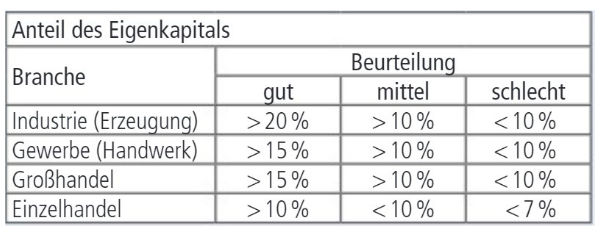

# Finanzierung (Finanzplan)

- **Investition** und **Finanzierung**
- Finanzplan zur Sicherstellung ausreichend **liquider Mittel** für die:
  - laufende Geschäftstätigkeit
  - Investitionen
- **Finanzierungmöglchkeiten:**
  - Innenfinanzierung
  - Außenfinanzierung
- Finanzierungsregeln und Finanzierungskennzahlen

# Zusammenhang Investition & Finanzierung

# Finanzplan

**Ziele:**
- Finanzierung **laufender Geschäftstätigkeit** (Miete, Gehälter, Rohstoffe)
- Finanzierung von **Investitionen** (Grundstück, Gebäude, Maschinen, Anlagen)

**Aufgaben:**
- Bechernung der **notwendigen Finanzmittel**
- Suche nach geeigneten **Formen der Finanzierung** bei **Kapitalbedarf**
- Suche nach **Veranlagungsmöglichkeiten** für **Überschüsse**

# Woraus besteht ein Finanzplan?
1. Planung der **Einnahmen**: Umsatzprognosen + sonstige Erträge; Einnahmen sind besonders schwierig zu schätzen
2. Planung laufender **Ausgaben**:
    - Fixkosten (Miete, Gehälter, Versicherungen)
    - variable Kosten (Materialkosten, Produktionsoksten)
    - Sonstige betriebliche Aufwendungen (z.B. Werbung, Wartung)
3. Planung von **Investitionen**: Anschaffung Maschinen, Fahrzeuge, Software:
    - Finanzierungsmöglichkeiten (Eigenkapital, Fremdkapital, Leasing)
4. Planung des **Liquiditätsbedarfs**:
    - Kurz-/mittel-/langfristig
    - Projektbezogen
5. **Kapitalbedarfs**- und **Finanzierungs**planung

    - Finanzierungsmöglichkeiten (Bankkredite, Eigenkapital, Fördermittel)
    - Tilgungs- und Zinsablagen
6. **Rentabilitäts**planung: GuV (Ertrag - Aufwand)
    - Rentabilitätskennzahlen (Umsatzrentabilität, Eigenkapitalrentabilität)
7. **Steuer**planung: Verausberechnung der **Steuerlast** und Optimierungsmöclichkeiten
8. **Risikomanagement**: Identifikation finanzieller Risiken, Risikominimierung

# Zusammenhang Bilanz, GuV, Cash-Flow-Statement
[todo: insert image]

# Wirkung von Geschäftsfällen auf Gewinn/Cashflow
[insert image or explain]

# Innenfinanzierung
$\Rarr$ Finanzierungsmöglichkeit vom Unternehmen; aus eigener Geschäftstätigkeit

1. Einhaltung von **Gewinnen** (Thesaurierung) ansatt Ausschüttung an Gesellschafter
2. **Abschreibungsfinanzierung**: Abschreibungen vur Leinvestition (mitdern Gewinn aber erfordern keine Auszahlung)
3. **Rückstellungsfinanzierung**: Bildung von Rückstellungen, die erst später ausgezahlt werden müssen
4. Verkauf von **Anlagevermögen**
5. Abbau von **Umlaufvermögen**: Reduktion Lagerbestände, Verkürzung Kendenzahlungszielen (Lieferforderungen reduzieren)

$\textcolor{lime}{+}$ **Vorteil**: Stärkt Liquidität und Unabhängigkeit \
$\textcolor{red}{-}$ **Nachteil**: Begrenzt, kann lange dauern

# Außenfinanzierung
$\Rarr$ Finanzierungsmöglichkeit von Unternehmen; mit externe Geldgeber

1. **Eigenkapital**finanzierung: keine Rückzahlungsverplichtung, aber Gewinnbeteiligung für Investoren
   - Kapitalerhöhung durch **Eigentümer** oder **neue Teilhaber** (Venture Capital für Startups, sonst Private Equity)
2. **Fremdkapital**finanzierung: Unternehmen bleibt **unabhängig**, aber es entstehen Zinskosten.

   - Bankkredite
   - Anleihen
   - Lieferantenkredite (verlängerte Zahlunsziele von Lieferanten)
   - Leasing (Nutzung von Maschinen/Fahrzeugen ohne Kauf)
   - Factoring (Verkauf von Forderungen)

3. **Hybridfinanzierung** (**Mezzanine-Kapital** - Mischform EK/FK)
   - Wandelanleihen (Anleihen, die später in Aktien umgewandelt werden)
   - Stille Beteiligung

# Anleihensfinanzierug
$\Rarr$ Finanzierungsmöglichkeit von Unternehmen; mit Bonds oder Obligationen

- **Festferzinsliche Wertpapiere** mit dem Unternehmen Kapital am Kapitalmarkt aufnehmen
- Anleger kaufen Anleihe und erhalten da **regelmäßige Zinszahlungen** (Kupon) sowie am Ende **Rückzahlungen des Nennbetrags**:
  - Meist feste Laufzeit (z.B. 5, 10, 30 Jahre) mit Regelmäßigen Zinsen (Kupon) an Investoren
  - Zinshöhe hängt von Bonität ab

$\textcolor{lime}{+}$ **Vorteile**:
- **Große Geldbeträge ohne Eigenkapitalsabgabe**
- **Günstigere** Finanzierung als Bankkredite (vor allem für etablierte Unternehmen mit guter Bonität)

$\textcolor{red}{-}$ **Nachteile**:
- **Kreditwürdigkeit beeinflusst Zinskosten** (Niedrige Bonität $\rarr$ höhere Zinsen)
- **Hohe Emissionskosten** und komplexer Rechtlicher Prozess (Prospekthaftung)

# Business Angels
- **Reiche Leute**, die Start-Ups unterstützen (mit Kapital, Know-how, Netzwerken)
- Investment meist €25k bis €500k in Frühphase (für Unternehmensanteile)
- Erwarten **hohe Rendite** (10x oder mehr), oft durch späteren Verkauf (**Exit**)

$\textcolor{lime}{+}$ **Vorteile** für Startups:
- **Schnelle Finanzierung** ohne klassische Kredite
- Zugang zu **Wissen**, Erfahrung, vertwolle Geschäftskontakte
- **Flexible Verhandlungen** (Business Angels streben nicht nur nach kurzfristigen Profit)

$\textcolor{red}{-}$ **Nachteile** für Startups:
- Abgabe von **Unternehmensanteilen** (Verlust von Kontrolle)
- Hoher **Erwartungsdruck** auf Wachstum und Skalierbarkeit
- **Schwierige Suche** nach passenden Business Angel

# Venture Capital
Abgekürzt VC

- **Risikokapital**, welches **profesionelle Investoren** in Startups mit Potential investieren
- VC-Investoren streben einen **späteren Exit**
- VC-Investoren erwarten **hohe Rendite** (10x oder mehr)

$\textcolor{lime}{+}$ **Vorteile** für Startups:
- **Schnelles Wachstum** aufgrund hoher Finanzsummen
- Zugang zu **Netzwerken** und Know-How
- Kein Zwang zur Rückzahlung wie bei Krediten

$\textcolor{red}{-}$ **Nachteile** für Startups:
- Verlust von **Unternehmensanteilen**
- **Einfluss der Investoren** auf Entscheidungen
- Hoher **Erfolgsdruck** (Investoren erwarten schnelle Skalierung),
- Komplexe **Vertragsbindungen**

# Investitionskredite
$\Rarr$ **Langfristiger Kredit** für größere Anschaffungen bzw. Projekte (z.B. Maschinen, IT-Systeme)

- Keine Verwendung für laufende Betriebskosten (dafür gibt es Betriebsmittelkredite).
- Wird von **Banken** angeboten
- Laufzeit typisch 5-20 Jahre
- Rückzahlung in **Raten** mit **Zinsen** oder **endfälliges Modell**
- Zinssätze hängen ab von Bonität, Laufzeit, SicherheitenS
- Fixe oder variable Zinsen sind möglich

$\textcolor{lime}{+}$ **Vorteile**: Langfristige Planungssicherheit; steuerliche Absetzbarkeit der Zinsen; Schonung der Liquidität

$\textcolor{red}{-}$ **Nachteile**: Hohe Zinsen bei schlechter Bonität; meist lange Bindung; vorzeitige Rückzahlung mit Kosten

# Betriebsmittelkredite
$\Rarr$ **Kurzfristige Finanzierung laufender Geschäftsausgaben** (z.B. Löhne, Materialeinkäufe, Miete)

- Laufzeit typisch 1-3 Jahre
- Oft als kontokorrentähnliche Nutzung (Unternehmen kann auf den **Kreditrahmen** zugreifen) ((keine ahnung man))
- Zinsen nur für den genutzten Kreditbetrag
- **Höhere Zinssätze** als Investitionskredite
- **Sicherheiten erforderlich** (z.B. Forderungen, Warenbestände)

$\textcolor{lime}{+}$ **Vorteile**: Schnelle Liquiditätsbeschaffung; hohe Flexibilität; nicht langfristig bindend

$\textcolor{red}{-}$ **Nachteile**: Hohe Zinskosten; Gefahr von Fremdkapitalabhängigkeit

# Lieferantenkredite
$\Rarr$ Einkauf von Waren/Dienstleistungen auf **auf Rechnung** (Zahlungsziel von 30, 60 oder 90 Tagen)

- Wenn mit **Skonto** (billiger wenn schneller gezahlt): Wenn existent aber nicht genutzt, Lieferantenkredit meist teurer als Bankkredit
- Oft keine Sicherheiten erforderlicht, Bonität wird trotzdem geprüft

$\textcolor{lime}{+}$ **Vorteile**:
- **Einfache Finanzierung** ohne Bank
- **Liquidität geschont**

$\textcolor{red}{-}$ **Nachteile**:
- **Begrenzte Kreditlinie** (abhängig vom Vertrauen)
- Zu viele unbezahlte Rechnungen **verschlechtern Bonität**

# Leasing
$\Rarr$ Nutzen von Wirtschaftsgut **ohne es zu kaufen**

- **Operatives Leasing**: Kurzfristig kündbar, ähnelt einer Miete
- **Finanzierungsleasing**: Langfristiger, oft mit Kaufoption zum Restwert am Ende der Laufzeit oder Verlängerung. Der Leasingnehmer:
   - schreibt Anlagegut ab und weist Barwert des Leasing als Verbindlichkeit aus
   - kann Zinsenanteil als Aufwand
   - trägt Instandhaltung und Risiken (Reparaturen, Versicherung))
- **Sale and Lease Back**: Anlagegut an Leasinggeber verkaufen und vom Leasingnehmer zurückleasen

$\textcolor{lime}{+}$ **Vorteile**:
- **Liquidität geschont**
- **Bilanzneutral** (bei Operativen Leasing)
- **Steuerliche Vorteile**

$\textcolor{red}{-}$ **Nachteile**:
- **Gesamtkosten oft höher als Kauf**

# Crowdfunding
$\Rarr$ Viele Menschen geben über eine Plattform kleine Geldbeträge um Projekt oder Unternehmen zu finanzieren

- **Reward-Based Crowdfunding**: Unterstützer erhalten **Produkt** oder Prämien (z.B. Kickstarter, Indiegogo)
- **Equity-Based Crowdfunding** (Crowdinvesting): Unterstützer erhalten **Unternehmensanteile**
- **Lending-Based Crowdfunding** (P2P-Lending): Crowd **vergibt Kredite und erhält Zinsen** (z.B. Auxmoney, Bondora)
- **Donation-Based Crowdfunding**: Reine Spenden **ohne Gegenleistung** (z.B. GoFundMe)

**Bekannte Plattformen:**
- **International**: Kickstarter, Indiegogo, GoFundMe, Seedmatch
- **Österreich**: StarteDeinProjekt, Greenrocket, Crowdfunding-Dienstleister (FMA Österreich)
:
# Factoring
$\Rarr$ **Verkauf** von offenen (Kunden-)**Forderungen an Factor**, um sofortige liquide Mittel zu erhalten

- Factor finanziert vor, übernimmt **Ausfallsrisiko** und **Verwaltung** der Forderung
- Gebühren und Zinsen (teurer als Bankkredite, z.B. 0.5-5%)

$\textcolor{lime}{+}$ **Vorteile**:
- Schnelle **Liquiditätssteigerung**
- **Reduziertes Risiko** von Zahlungsausfällen
- **Entlastung der Buchhaltung** (Mahnwesen wird oft vom Factor übernommen)

$\textcolor{red}{-}$ **Nachteile**:
- **Hohe Kosten**
- **Abhängigkeit** vom Factoring-Dienstleister
- Mögliche **Negative Reaktion** vom Kunden (Rechnungen werden von Dritten eingefordert)

# Mezzanine Kapital
$\Rarr$ Mischung zwischen EK und FK, bietet flexible Finanzierungsoptionen

- **Keine Stimmrechte** für Kapitalgeber
- **Nachrangige Rückzahlung** (bei Insolvenz erst nach FK aber vor EK zurückgezahlt)

**Typische Formen:**
- **Stille Beteiligung**: Kapitalgeber beteiligt sich an Gewinn, bleibt aber anonym
- **Wandelanleihen**: FK, das später in EK umgewandelt werden kann
- **Nachrangdarlehen**: Werden erst nach dem FK bedient
- **Genussscheine**: Ähnlich einer Anleihe aber mit Gewinnbeteiligung

$\textcolor{lime}{+}$ **Vorteile**: Kapital aufnehmen ohne Verschuldung offiziell zu erhöhen 

$\textcolor{red}{-}$ **Nachteile**: Hohe Kosten

# Finanzierungsregeln - Finanzkennzahl
- **Eigenkapitalquote**
- Verschuldungsgrad (Gearing Ratio)
- Goldene Finanzierungsregel (Anlagendeckung)
- Cashflow
- "Praktiker-Cashflow"
- Fiktive Schuldentilgungsdauer
- Rentabilität des Eigenkapitals
- Quicktest - Kennzahl für finanzielle Stabilität und Ertragskraft

# Eigenkapitalquote
$$
\Rarr \quad \text{Eigenkapitalquote (\%): } \frac{\text{Eigenkapital}}{\text{Gesamtkapital}} \cdot 100\%
$$

Eigenkapital:
- Gezeichnetes Kapital (Grund- Stammkapital)
- Kapitalrücklagen (Ausgabe von Anteilen über Nennwert)
- Gewinnrücklagen + nicht ausgeschüttete Gewinne (soweit noch nicht in Rücklagen)

**Unterschiede nach Branchen**: Bei Einzelhandel und Banken geringer

$\textcolor{lime}{+}$ **Vorteile** einer hohen EK-Quote:
- **Höhere Kreditwürdigkeit**
- Geringeres Ausfallsrisiko (**Insolvenzrisiko sinkt**)
- **Größere Unabhängigkeit**: Geringere Zins- und Tilgungszahlungen, weniger abhängig von Gläubigern

$\textcolor{red}{-}$ **Nachteile** einer hohen EK-Quote:
- **Geringere Eigenkaptialrentabilität**

## Was man daraus ableiten kann:
||**Eigenkapital**|**Fremdkapital**|
|-|-|-|
|**Tilgung/Rückzahlung**|$\textcolor{red}{\times}$|$\textcolor{lime}{\checkmark}$|
|**Fristigkeit**|langfristig|langfristig/kurzfristig|
|**Kosten**|variabel (Dividende)|in der Regel fix (Zinsen)|
|**wenn höher...**|...mehr Reserven|...rentabler|

## Maßnahmen zur Steigerung dieser Quote
- **Gewinnthesaurierung**: Gewinne im Unternehmen lassen, anstatt sie als Dividenden auszuschütten
- **Kapitalerhöhung**: Zusätzliche EK-Anlagen durch Eigentümer oder externe Investoren
- **Reduzierung von FK**:Tilgung bestehender Kredite, um die Gesamtverbindlichkeiten zu senken
- **Effizientes Management des UV**: Optimierung Lagerbestände und Forderungen, um Liquidität freizusätzen.
- **Fördermittel und Subventionen**: Nutzung von Förderprogrammen (z.B. AWS oder FFG)
- **Umwandlung FK in EK**: Verhandlungen mit Gläubigern, um bestehende Schulden in EK umzuwandeln.

[nicht fertig]
