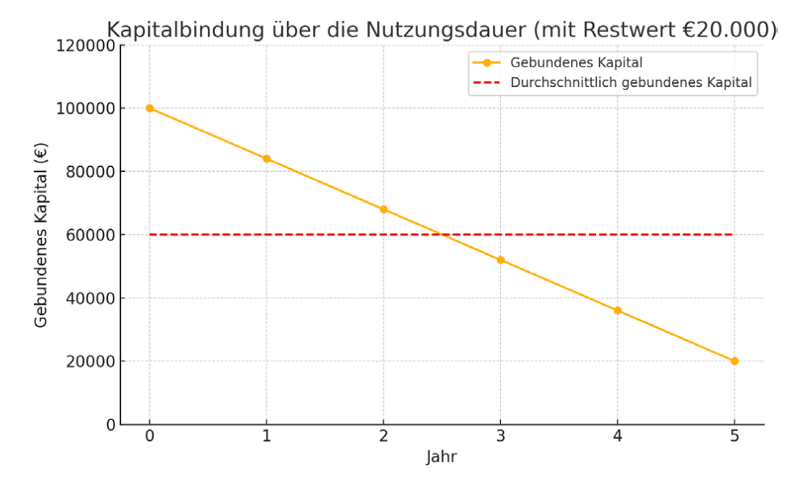

# Einführung
- Methoden zur Entscheidung, ob und welche Investition getätigt werden soll
- Statische oder Investitionsrechnung (Durchschnittswerte oder auf 1 Jahr):
  - **Kostenvergleichsrechnung**: Welche kostet weniger?
  - **Gewinnvergleichsrechnung**: Welche bringt mehr absoluten Gewinn?
  - **Rentabilitätsrechnung**: Welche bringt mehr relativen Gewinn?
  - **Amortisationsrechnung**: Wie schnell ist sie abbezahlt?
- Dynamische Rentabilitätsrechnung (Zeitwert vom Geld wird berücksichtigt):
  - **Kapitalwert**: Wie viel ist sie auf heute wert?
  - **Dynamische Amortisationsdauer**: Wie schnell ist sie mit Berücksichtigung von Zinseszins abbezahlt?
  - **Interner Zinsfuß**: "Welche Verzinsung des bringt die Investition?" (steht genau so in den Folien, ich habe absolut keinen Schimmer was damit gemeint ist)

# Arten
**Anlass:**
- **Ersatzinvestition**: Etwas Kaputtes/veraltes wird ersetzt
- **Erweiterungsinvestition**: Anschaffung von etwas Zusätzlichen
- **Rationalisierungsinvestition**: Anschaffung erfolgt, um laufende Betriebskosten einzusparen
- **Umstellungsinvestition**: Investition erfolgt wegen Änderung im Absatzprogramm

**Zeitpunkt:**
- **Gründungsinvestition**: Zur ersten Ausstattung des Unternehmens
- **Folgeinvestition**: Eine Investition (die schon getätigt wurde) erfordert eine zweite. 

**Objekt:**
- **Sachinvestition**: Sachanlagen, Maschinen, Grundstücke, Gebäude, Lagerbestände (einfach sachen halt)
- **Finanzinvestition**: Wertpapiere, Aktien 
- **Immaterielle Investition**: Patente, Lizenzen, Schulungen, Forschung, Entwicklung

# Methoden

**Qualitative Kriterien:**
- **Scoring-Methode**: Bestes Ranking

**Quantitative Kriterien:**
- **Statische Investitionsrechenverfahren:**
  - **Kostenvergleich**: Geringste Kosten
  - **Rentabilitätsvergleich**: Höchste (Kapital-)Rentabilität
  - **Statische Amortisationsdauer**: Geringste Amortisationsdauer
- **Dynamische Investitionsrechenverfahren:**
  - **Kapitalwert**: Höchster Kapitalwert
  - **Interner Zinsfuß**: Höchster interner Zinsfuß
  - **Dynamische Amortisationsdauer**: Kürzeste Amortisationsdauer

# Vor- und Nachteile (Statisch/Dynamisch)

||**Statische Investitionsrechenverfahren**|**Dynamische Investitionsrechenverfahren**|
|-|-|-|
|Wofür?|Kurzfristige Investitionen|Kapitalintensive Investitionen|
|Einfach und schnell und nicht komplex?|$\textcolor{lime}{\checkmark}$|$\textcolor{red}{\times}$|
|Relevante Daten einfach zu bekommen|$\textcolor{lime}{\checkmark}$|$\textcolor{red}{\times}$|
|Berücksichtigt mehrere Perioden|$\textcolor{red}{\times}$|$\textcolor{lime}{\checkmark}$|
|Berücksichtigt Zeitpunkte von Zahlungen und Zinseffekte anstatt nur Durchschnittswerte|$\textcolor{red}{\times}$|$\textcolor{lime}{\checkmark}$|
|Hohe Aussagekraft|$\textcolor{red}{\times}$|$\textcolor{lime}{\checkmark}$|

# Kostenvergleich

## Auslastung ist bekannt
Vergleich der Kosten pro Jahr oder pro Stück

- **Variable Kosten**: Höhe ist von Nutzung abhängig (z.B. Strom)
- **Fixe Kosten**: Höhe ist gleich, egal wie viel genutzt wird (z.B. Miete)

$$
\text{Kalkulatorische Abschreibung} = \frac{\text{Anschaffungswert} \textcolor{red}{-} \text{Restwert}}{\text{Nutzungsdauer}}
$$
$$
\text{Kalkulatorische Zinsen} = \frac{\text{Anschaffungswert} \textcolor{lime}{+} \text{Restwert}}{\text{Nutzungsdauer}} \times \text{Zinssatz}
$$

- **Restwert**: Wert der Investition am Ende der Nutzungsdauer

## Auslastung ist unbekannt
Ermittlung der **kritischen Auslastung**

$$
\text{Kritische Auslastung} = \text{(schreib ich jz nicht auf weil wir bekommen sowieso Formelsammlung)}
$$

# Rentabilitätsvergleich
**Rentabilität**: Die **Verzinsung** des eingesetzten Kapitals in % auf Basis von **Gewinn** oder **Einsparung**

$$
\text{Rentabilität}=\frac{\text{Gewinn}}{(\text{Anfangskapital}+\text{Endkapital})\div 2}
$$

Der $\text{Gewinn}$ kann hier auch die $\text{Kostenersparnis}$ sein.

# Statische Amortisationsdauer
Innerhalb welches Zeitraumes wird die Investition zurückbezahlt?

$$
\text{Amortisation} = \frac{\text{Anschaffungswert}-\text{Restwert}}{\text{Gewinn}}
$$

Der $\text{Gewinn}$ kann hier auch die $\text{Kostenersparnis}$ sein.