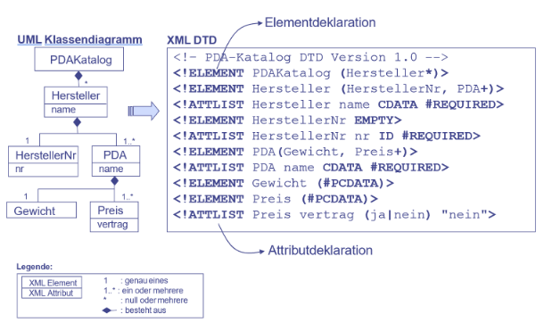
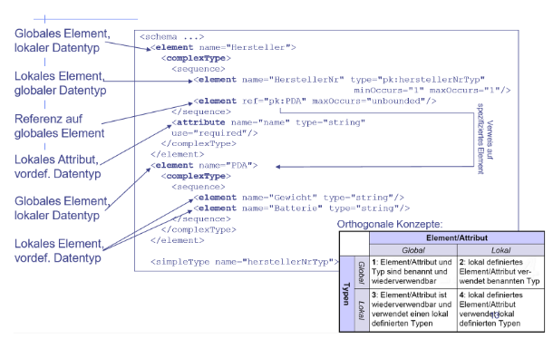
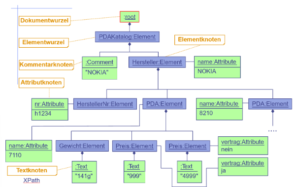
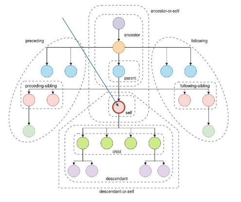

# Übersicht

- Gehört zur Familie der **Datenbeschreibungssprachen** bzw. erweiterbare **Auszeichnungssprachen** (Markup-Languages) wie JSON, YAML, Markdown oder LaTeX
- ermöglicht hierarchische und flexible Organisation von Daten
- Selbstbeschriebend, plattformunabhänging, erweiterbar, lesbar (von Menschen und Maschinen), validierbar und standatisiert

# Anwendungsbereiche
- RSS und Atom Feeds
- SOAP
- SVG
- Datenformat für Konfigurationsdateien
- REST APIs
- Dokumentenmanagement
- EPUB
- Gesundheitsdaten
- Geodaten

# XML vs HTML vs JSON
|XML|HTML|JSON|
|-|-|-|
|Eigene Tags definierbar|Festgelegte Tags|Schlüssel-Wert-Paare|
|Case-sensitie|Nicht case-sensitive|Case-sensitive|
|Behandelt Leerzeichen als Teil des Inhalts|Leerzeichen im Inhalt werden meist auf eines gekürzt|Leerzeichen zwischen Schlüsseln und Werten werden ignoriert|
|Intolerant gegenüber syntaktischen und formalen Fehlern|Tolerant gegenüber syntaktische Fehler|Intolerant gegenüber syntaktischen Fehlern|
|Strikte Unterscheidung zwischen inhaltlicher Strukturierung und Formattierung|Mix zwischen inhaltlischer Strukturierung und Formattierung des Outputs|Konzentriert sich rein auf Datenstrukturierung und enthält keine Formattierungsinformationen|
|Leere Elemente erlaubt|Leere Elemente nicht erlaubt (eigentlich schon, aber steht so in den Folien)|Leere Objekte und leere Arrays erlaubt|
|Hoher Entwicklungsaufwand|Geringer Entwicklungsaufwand|Geringer Entwicklungsaufwand|

# Element vs. Attribut

z.B. bei `<product brand="lays">Kartoffelchips</product>` ist das ganze das **Element** und `brand` ein **Attribut** des Elementes. 

Da wird man sich oft die Frage stellen, ob man eine Information als **Element** oder **Attribut** speichern soll. Deswegen gibt es folgende Tabelle:

|Kriterium|Element|Attribut|
|-|-|-|
|**Datenstruktur**|Wenn die Daten eine hierarchische Struktur erfordern|Wenn die Daten flach sind und keine Hierarchie benötigen|
|**Erweiterbarkeit**|Besser geeignet, wenn man zusätzliche Informationen oder Unterstrukturen hinzufügen möchte|Weniger flexibel für zusätzliche Daten|
|**Mehrzeilige Inhalte**|Für Inhalte, die über mehrere Zeilen gehen können|Nur für kurze, einzeilige Daten|
|**Lesbarkeit**|Besser für komplexe Daten, da sie eine visuelle Struktur bieten|Können schwer lesbar sein, wenn zu viele Attribute verwendet werden|
|**Semantik**|Wenn die Daten eine eigene Bedeutung haben (z.B. ein Titel oder eine Beschreibung)|Wenn es sich um zusätzliche Informationen handelt (z.B. ID, Metadaten)

# Wohlgeformtheit
Ein XML-Dokument ist wohlgeformt, wenn es den Syntaxregeln entspricht:
- Es existiert genau ein Wurzelelement
- Jeder Start-Tag muss ein dazugehöriges End-Tag besitzen
- Tags dürfen einander nicht überschneiden
- Attributwerte müssen in Anführungszeichen stehen (paarweise "..." oder '...')
- XML-Tags dürfen keine Leerzeichen enthalten und dürfen nicht mit Ziffern oder Bindestrichen beginnen
- Ein Element darf nicht zwei Attribute mit gleichem Namen besitzen
- Kommentare dürfen nicht innerhalf Tags stehen
- Reservierte Zeichen `<` und `&` dürfen nicht innerhalb von Elementinhalten oder Attributwerten auftreten (müssen ggf. maskiert werden)

Wohlgeformte Dokumente können zwar von jedem XML-Parser eingelesen werden, jedoch sagt die Wohlgeformtheit nichts darüber aus:
- Welche Elementnamen überhaupt vorkommen dürfen
- In welcher  Reihenfolge die Elemente im XML-Dokument eirscheinen müssen
- Welches Element das Kind-Element eines anderen sein darf
- Wie oft die Element im XML-Dokument erscheinen dürfen
- Welche Attribute in bestimmten Elementen verwendet werden dürfen

# Validität
Ein XML-Dokument ist valide, wenn:
- Es wohlgeformt ist
- Einem formalen Dokumentenmodell entspricht

Ein formales Dokumentenmodell definiert die von ihr akzeptierten **Elemente (Vokabular)** zowie die **Dokumentenstruktur (Grammatik)**

Ein formales Dokumentenmodell kann mithilfe:

- Einer **Document Type Declaration (DTO)** (beschränkte möglichkeiten), oder
- eines XML-Schemas (XSD) (mehr möglichkeiten)

definiert werden. 

# DTD und XSchema
Werden gebraucht um ein Schema zu definieren, z.B. was nötig ist um die Validität zu überprüfen oder welche Tags wie bzw. wo vorkommen

*Das hier im genauen zu verstehen ist nicht testrelevant!*

## DTD

## XSchema

# XPath

- Abfragesprache zur Adressierung und Auswertung von XML-Dokumenten
- Arbeitet mit Knoten (Element, Attribute, ...) und Achsen (Beziehung zwischen Knoten)
- XML-Dokumente haben eine Baumstruktur $\rightarrow$ XPath sucht über Pfade innerhalb dieser Baumstruktur nach Knoten bzw. Information

# XPath - Möglichkeiten
- Filter (Prädikate)
- Mengenoperatoren (Vereinigung)
- Indizes
- Boolsche Operatoren (and, or)
- Arithmetische Operatoren (+, -, *, ...)
- Funktionsbibliothek (`last()`, `count()`, `contains()`, ...)
- Schleifen (ab XPath 2.0)
- Bedingungen (ab XPath 2.0)

$\Rightarrow$ Seit XPath 2.0 Teilmenge von XQuery

# XPath - Grafiken/Diagramme

