# Einführung

**NoSQL** = **N**ot **o**nly **SQL** 

Bedeutung: Datenbanken, die einen **nicht relationalen Ansatz** verfolgen. 

- **Relationale DBs** haben Leistungsprobleme bei datenintensiven Applikationen $\rightarrow$ nur effizient, wenn sie für häufige, aber kleine Transaktionen oder für große Batch-Transaktionen mit seltenen Schreibzugriffen optimiert sind $\rightarrow$ können schlecht mit gleichzeitig hohen Datenanforderungen und häufigen Datenänderungen umgehen.
- **NoSQL-Architekturen** bieten meist nur schwache Garantien hinsichlich Konsistenz und eingeschränkte Transaktionen, sie sind auf steigende Datenmenden und häufige Datenänderungen ausgelegt. (Ausnahmen bestätigen die Regel.)

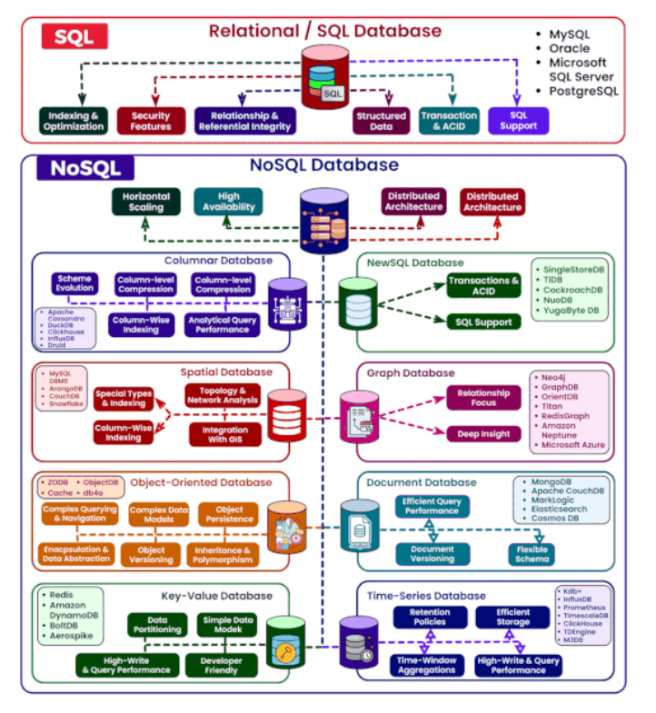
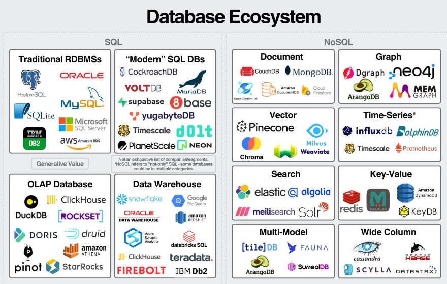

# Arten
[ Mehr dazu in [3 NoSQL Datenbanken](/4chif/dbi/3%20nosql%20datenbanken) ] 

- **Document-based**
  - Dokumente als JSON, BSON oder XML
  - Schnell & flexibel
- **Key-Value-Stores**
  - Einfachste Form
  - Sehr schnell 
- **Column-Oriented**
  - Daten in Spalten statt in Zeilen
  - Skalierbar, effizient
- **Graph-Based**
  - Konzentriet sich auf Beziehungen zwischen Elementen

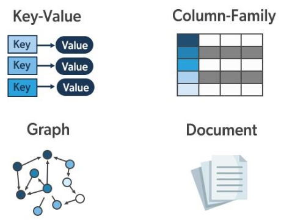

# Vertikale vs. horizontale Skalierung

Ansätze zur Verbesserung der Leistung und Kapazität eines Datenbanksystems, insbesondere wenn die Datenmenge oder die Anzahl der Anfragen zunimmt. 

- **Vertikale Skalierung**: Leistung eines Servers erhöhen
- **Horizontale Skalierung**: Mehrere Servers verwenden

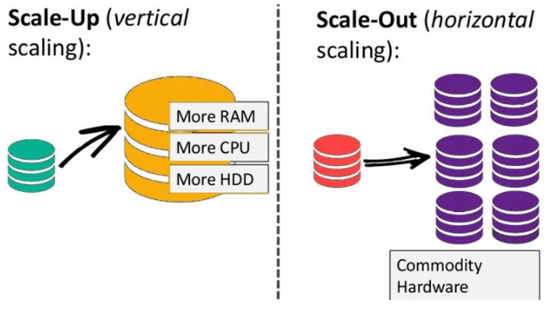

## Vertikale Skalierung (Scale Up)

Leistung eines einzelnen Servers wird erhöht, indem man dessen Hardware aufrüstet:
- Erhöhung der CPU-Leistung (schnellere Prozessoren, mehr Kerne)
- Hinzufügen von mehr Arbeitsspeicher (RAM)
- Verwendung schnellerer Festplatten (z.B. SSDs statt HDDs)
- Netzwerk-Upgrades für höhere Bandbreite

$\textcolor{lime}{+}$ **Einfach umzusetzen**: Die bestehende Architektur bleibt erhalten, keine Änderungen an der Anwendung oder Datenbankstruktur notwending \
$\textcolor{lime}{+}$ **Von den meisten relationalen DBs unterstützt** \
$\textcolor{red}{-}$ **Begrenzte Skalierung**: Hardware-Upgrades haben physische und wirtschaftliche Grenzen. \
$\textcolor{red}{-}$ **Single Point of Failure**: Wenn der Server ausfällt, ist das gesamte System betroffen. 

## Horizontale Skalierung (Scale Out)

Zusätzliche Server (Knoten) werden in das System eingebunden, um die Last zu verteilen:
- Verteilung der Daten auf mehrere Server (Sharding)
- Replikation der Daten auf mehrere Knoten (Datenkopien zur Erhöhung der Verfügbarkeit)
- Verwendung von Load-Balancern, um Anfragen auf mehrere Server zu verteilen

$\textcolor{lime}{+}$ **Unbegrenzte Skalierbarkeit**: Theoretisch können so viele Server wie nötig hinzugefügt werden. Ideal für Anwendungen mit wachsendem Datenvvolumen oder hohen Benutzerzahlen. \
$\textcolor{lime}{+}$ **Höhere Verfügbarkeit**: Wenn ein Knoten ausfällt, können andere Knoten die Arbeit übernehmen (Fehlertoleranz). \
$\textcolor{lime}{+}$ **Kosteneffizienz**: Statt teurer High-End-Hardware können günstigere Standard-Server verwendet werden. \
$\textcolor{red}{-}$ **Komplexität**: Verteilte Systeme sind schwerer zu verwalten, erfordern Mechanismen wie Sharding, Replikation und Konsistenzmanagement. \
$\textcolor{red}{-}$ **Eventual Consistency**: Um horizontale Skalierung zu ermöglichen, wird manchmal die Konsistenz geopfert. \
$\textcolor{red}{-}$ **Nicht geeignet für relationale DBs**: Erfordert Einsatz aufwändiger Anpassungen.

# ACID
ACID beschriebt gewünschte Eigenschaften von Transaktionen. Dieses ist für verteilte NoSQL-Datenbanken zu strikt, weshalb diese auf einem anderen Prinzip basieren:

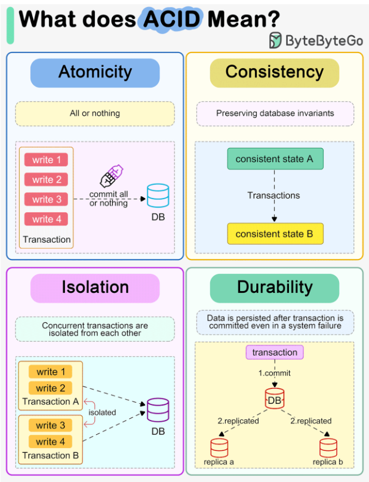

# BASE
- **B**asically **A**vailable: \
    NoSQL-Datenbanken prioritisieren Verfügbarkeit auch bei Ausfällen. Das System bleibt funktionsfähig, liefert immer eine Antwort auf Anfragen--entweder erfolgreich oder als Fehler--und toleriert dabei vorüber Inkonsistenzen.
- **S**oft-State: \
    Der Zustand des Systems kann sich ohne direkte Anfragen verändern, da Konsistenz in NoSQL-Datenbanken nicht sofort, sondern mit der Zeit erreicht wird. Es dauert, bis alle Knoten eines verteilten Systems synchronisiert sind. 
- **E**ventually Consistent: \
    Datenkopien auf verschiedenen Knoten werden nach und nach synchronisiert. Am Ende sind sie konsistent, auch wenn es vorübergehend Inkonsistenzen gibt. Dies ermöglicht schnelle Reaktionen bei großen Datenmengen. 

# CAP-Theorem
Konzept, dass die Kompromisse zwischen Konsistenz, Verfügbarkeit und Partitionstoleranz **in verteilten Systemen** erklärt. 

- **Konsistenz** bezieht sich auf die Eigenschaft eines Systems, bei dem alle Knoten eine konsistente Ansicht der Daten haben. Das bedeutet, dass alle Clients zur gleichen Zeit die gleichen Daten sehen, unabhängig davon, mit welchem Knoten sie verbunden sind. 
- **Verfügbarkeit** bezieht sich auf die Fähigkeit eines Systems, jederzeit auf Anfragen von Nutzern zu reagieren.
- **Partitionstoleranz** bezieht sich auf die Fähigkeit eines Systems, auch bei einer Netzwerkpartition weiter zu arbeiten.

# Netzwerkpartitionierung
Eine Netzwerkpartition tritt auf, wenn Knoten in einem verteilten System aufgrund von Netzwerkfehlern nicht mehr miteinander kommunizieren können. Wenn eine Netzwerkpartiion auftritt, muss sich das System zwischen Konsistenz und Verfügbarkeit entscheiden. 

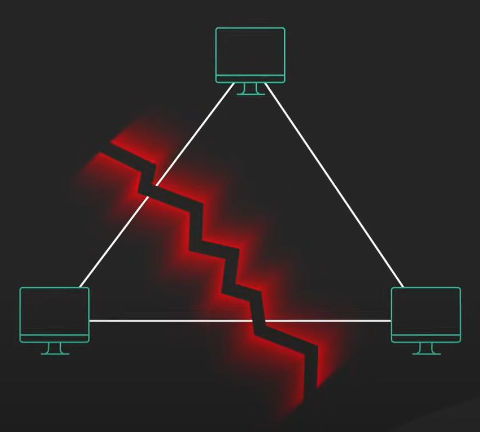

Wenn das System **Konsistenz** prioritisiert, kann es bis zur Behebung der Partition nicht verfügbar sein. 

Wenn das System **Verfügbarkeit** prioritisiert, kann es Aktualisierungen an den Daten zulassen, was zu inkonsistenzen führen kann, bis die Partition behoben ist. 

## Beispiel: Bank
Kleine Bank mit 2 Bankomaten, die über ein Netzwerk verbunden sind. Kontostand darf niemals unter 0 fallen!

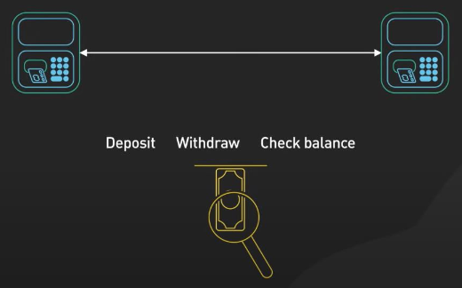

Es gibt keine zentrale DB, die den Kontostand speichert; er wird auf beiden Bakomaten gespeichert. Wenn ein Kunde einen Bankomaten benutzt, wird der Kontostand auf beiden Bankomaten über das Netzwerk aktualisiert $\rightarrow$ Bankomaten haben eine konsistente Ansicht des Kontostands.

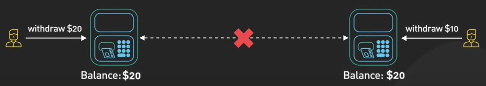

Netzwerkpartition $\rightarrow$ Bankomaten können nicht mehr miteinander kommunizieren $\rightarrow$ System muss zwischen Konsistenz und Verfügbarkeit wählen.

**Konsistenz**: Geldautomat könnte die Verarbeitung von Einzahlungen oder Abhebungen verweigern, bis die Partition behoben ist. Dadurch bleibt der Kontostand konsistent, aber das System ist für Kunden nicht verfügbar.

**Verfügbarkeit**: Könnte für Bank teuer werden. Kunde könnte den gesamten Kontostand an beiden Geldautomaten abheben. Wenn das Netzwerk wieder online ist, wird die Inkonsistenz behoben, und der Kontostand ist jetzt negativ:

Aus diesen Gründen ist es besser, wenn man für eine Bank die **Konsistenz** prioritisiert, da falsche Daten schwere Auswirkungen haben könnten. 

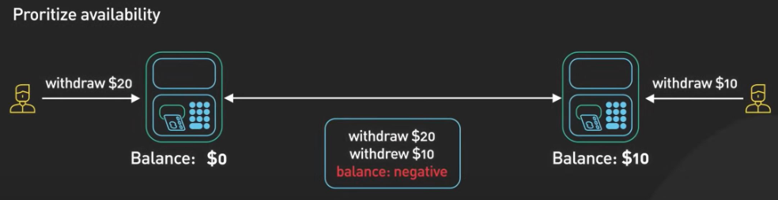

## Beispiel: Social Media

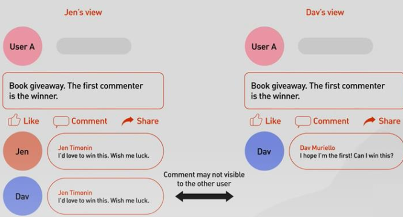

Während einer Netzwerkpartition muss wieder zwischen Verfügbarkeit und Konsistenz wählen.

**Verfügbarkeit**: Es könnte es sein, dass 2 Nutzer gleichzeitig einen Kommentar zu demselben Beitrag abgeben, aber der Kommentar eines Nutzers für den anderen erst sichtbar wird, wenn die Partition behoben ist. 

**Konsistenz**: Die Kommentarfunktion könnte für Nutzer bis zur Behebung der Partition nicht verfügbar sein. 

Für ein soziales Netzwerk ist es oft akzeptabel, **Verfügbarkeit** zu prioritiseren, auch wenn die Nutzer hin und wieder leicht unterschiedliche Ansichten sehen.

# CAP-Dreieck

Das CAP-Dreieck besagt, dass jede Datenbank nur maximal **zwei** von **Availability**, **Consistency** bzw. **Partition Tolerance** unterstützen kann. 

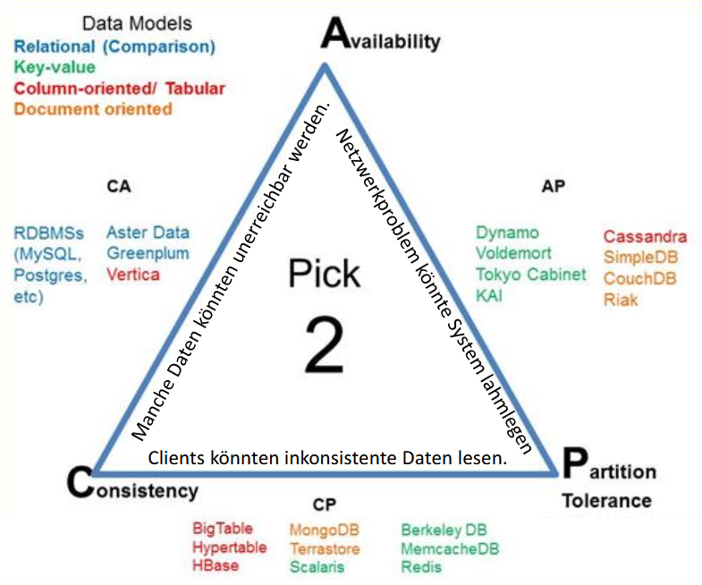

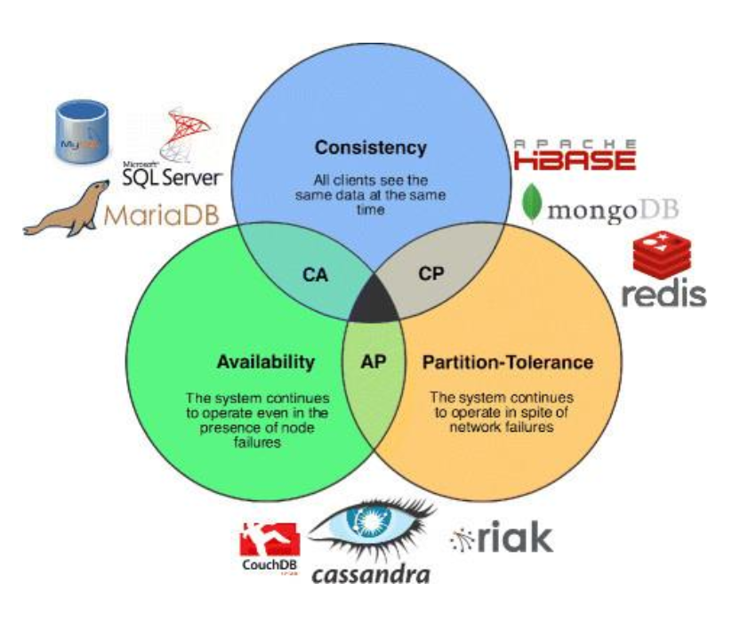

# CAP in der Praxis 

*Quelle: https://www.alexdebrie.com/posts/when-does-cap-theorem-apply/*

## Beispiel 1
Einzelknoteninstanz einer relationalen DB. 

Cron-Job, der Logs löscht, aber falsch konfiguriert ist $\Rightarrow$ Festplatte füllt sich mit Logs und DB stürzt ab.

CAP? CAP ist nicht anwendbar auf Einzelknoten. Deine einzelne DB-Instanz ist ausgefallen $\rightarrow$ nicht lustig! :(

[Beispiel 1](assets/cap-bsp-1.png)

## Beispiel 2
Wir fügen Replikation hinzu und haben jetzt einen Cluster mit drei Knoten.

Wieder falscher Cron-Job $\rightarrow$ Festplatte von einem Knoten voll, ein Knoten fällt aus $\rightarrow$ andere 2 Knoten übernehmen Last.

CAP? CAP nicht anwendbar, da nur Knoten ausgefallen und keine Netzwerkpartition $\rightarrow$ geringere Verfügbarkeit $\rightarrow$ weniger schlimm, aber auch nicht lustig :(

## Beispiel 3

Wie Beispiel 2, aber jetzt kann ein Knoten aufgrund einer Netzwerkpartition mit anderen 2 nicht mehr kommunizieren. 

CAP? CAP! System entscheidet, eine erfolgreiche Antwort vom isolierten Knoten auszugeben, auch wenn dieser eventuell nicht über den neuesten Stand der Daten von anderen Knoten verfügt (Verlust von Konsistenz) $\rightarrow$ **AP**

Höhere Verfügbarkeit: Alle 3 Knoten könenn antworten. Es werden fehlerhafte Anfragen reduziert, die in Beispiel 2 durch überlastete Knoten enstanden wären.

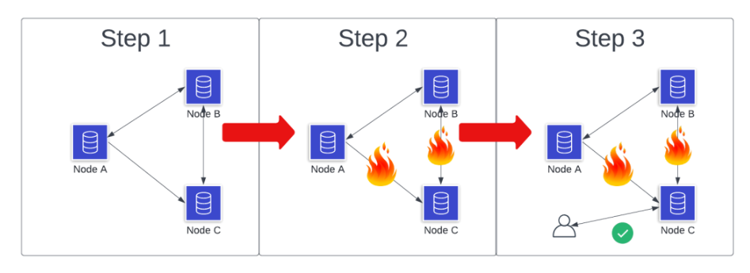

## Beispiel 4
Wie Beispiel 3, aber diesmal erlauben wir dem isolierten Knoten nicht, auf Client-Anfragen zu antworten.

CAP? CAP! Wir opfern Verfügbarkeit $\rightarrow$ **CP**

Clientanforderungen, die unseren isolierten Knoten erreichen, erhalten einen Fehler, was unsere Verfügbarkeitszahlen reduziert. 

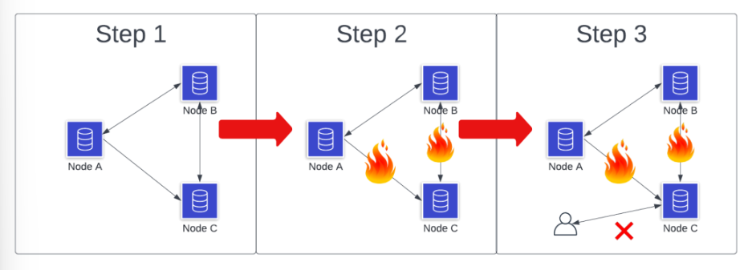

## Beispiel 5
Wieder isolierter Knoten durch Netzwerkpartitionierung $\rightarrow$ empfängt eine Leseanforderung für ein Datenelement $\rightarrow$ anstatt sofort zu antworten, wartet der Knoten.

42 Tage später ist die Netzwerkpartitionierung repariert $\rightarrow$ Knoten empfängt alle Aktualisierungen und antwortet dem Client mit einer konsistenten Ansicht der angeforderten Daten.

CAP? Eventuell nicht anwendbar oder: yeah, wir haben das CAP-Theorem besiegt :) ...

Verfügbarkeitsaspekt von CAP hat keine Zeitkomponente als Teil der Anfrage. Obwohl die meisten Kunden eine schnellere Antwort bevorzugen würden, *könnten* wir wohl warten, bis die Partition aufgelöst ist.

Theoretisch haben wir hier **CA** $\rightarrow$ wir opfern die Partionstoleranz, indem wir einfach warten, bis sie verschwindet $\rightarrow$ nicht lustig :(

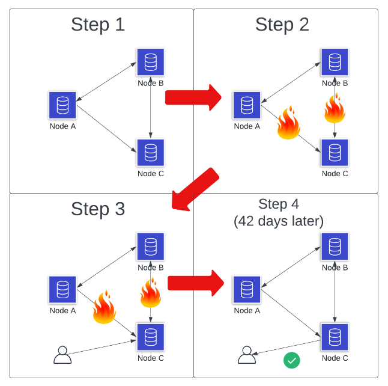

# CA-Systeme?

CA-Systeme (Konsistenz+Verfügbarkeit) funktionieren **nur ohne Partitionen**. Da Partitionen in verteilten Systemen unvermeidbar sind, ist diese Kombination unrealistisch oder nicht praktikabel. Das CAP-Theorem ist nur anwendbar, wenn es Netzwerkpartitionen gibt. 

Streng genommen geht es beim CAP-Theorem also immer um eine Entscheidung zwischen Konsistenz (CP) und Verfügbarkeit (AP) und beides (CA) ist gar keine Option!

Damit ein verteiltes System keine Partitionstoleranz benötigt, müsste es in einem Netzwerk laufen, das garantiert niemals Nachrichten verliern (oder verspätet zustellt) und dessen Knoten garantiert niemals ausfallen. Wir arbeiten aber nicht mit solchen Systemen, weil es sie nicht gibt.

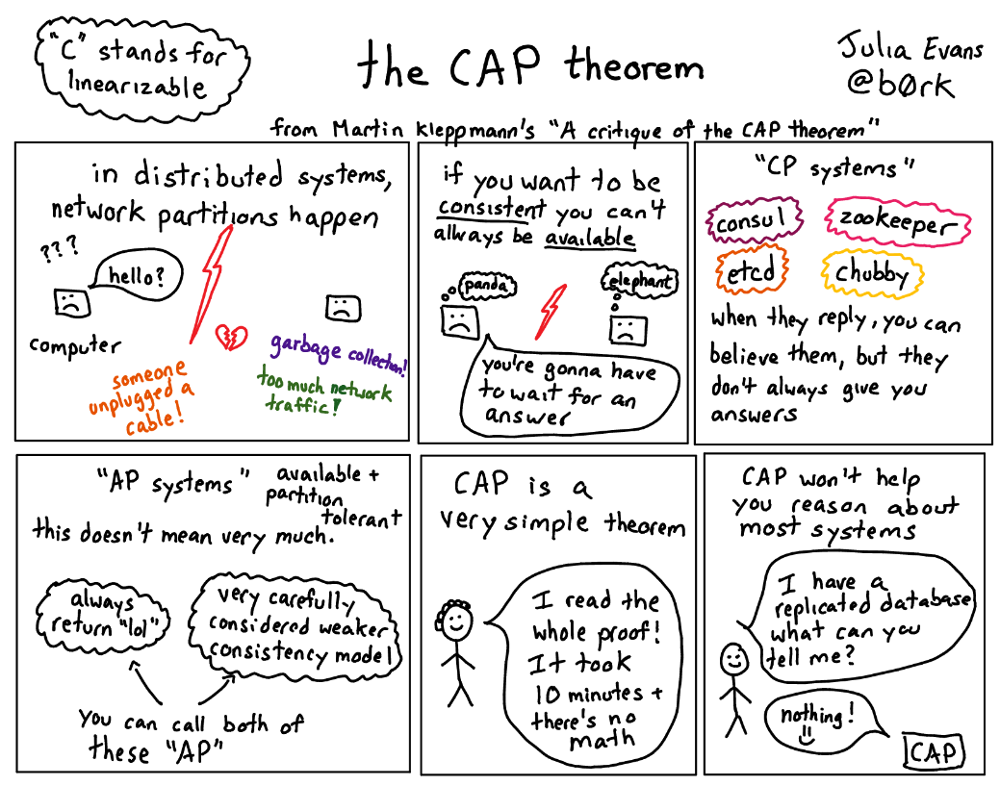

# Wahrscheinlichkeiten

Die Wahrscheinlichkeit, dasss ein Knoten ausfällt, steigt exponentiell mit der Anzahl der Knoten:

$$
P(\text{jeder Fehler}) = 1-P(\text{einzelner Knoten fällt nicht aus})^{\text{Anzahl der Knoten}}
$$

Wenn ein einzelner Knoten eine Wahrscheinlichkeit von $99.9\%$ hat, in einem bestimmten Zeitraum nicht auszufallen, liegt die Wahrscheinlichkeit bei einem Cluster von 40 Knoten bei $96.1\%$. Mit anderen Worten, die Wahrscheinlichkeit, dass etwas schief geht, liegt bei etwa $\text{4\%}$. (Und dabei wird davon ausgegangen, dass die Ausfälle nichts miteinander zu tun haben; in Wirklichkeit neigen sie dazu, sich kaskadierend zu häufen.)