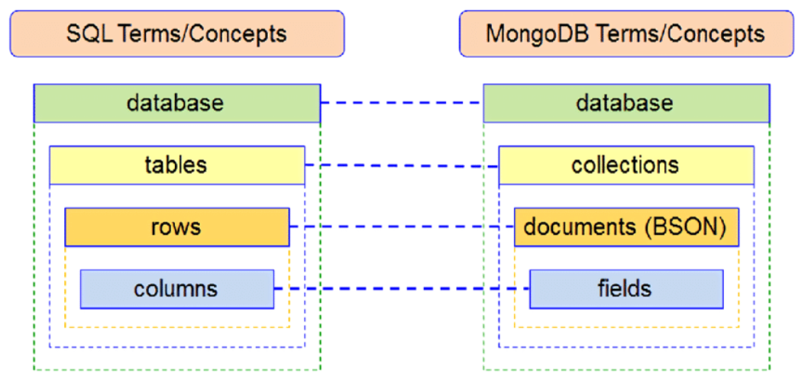
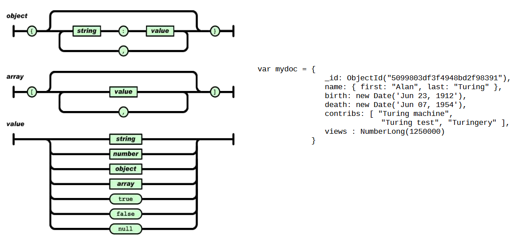
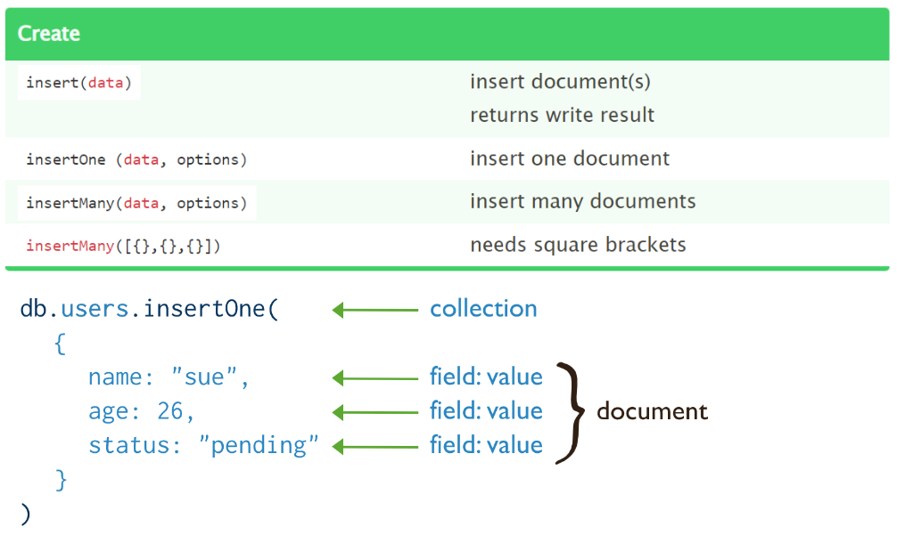
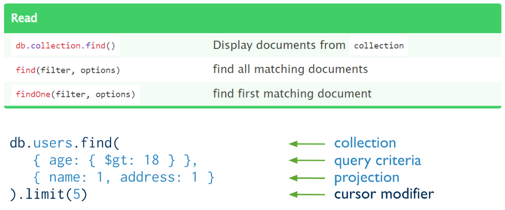
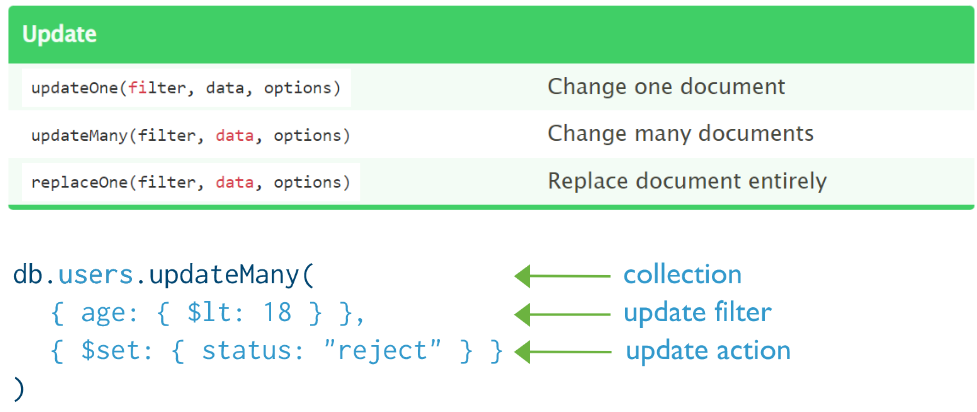
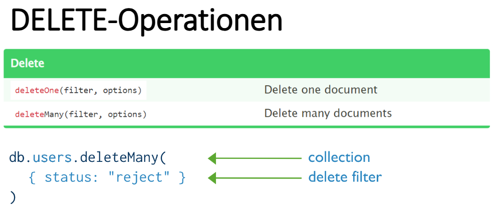
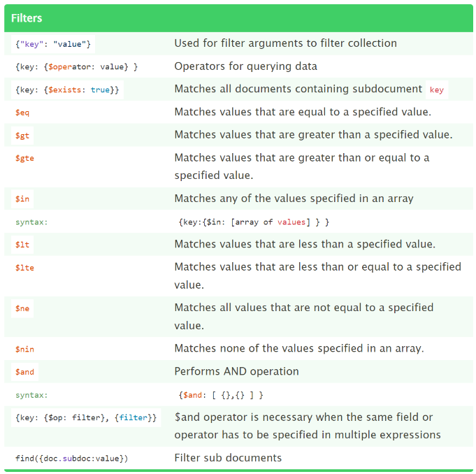
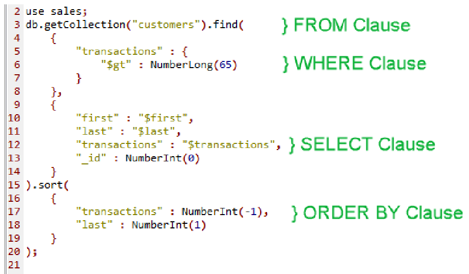
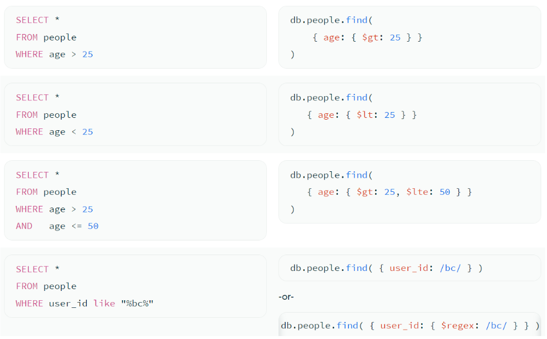

# Eigenschaften
- Dokumenten-orientiert
- Schemafrei
- Ausgelegt auf große Datenmengen (hu**mongo**us=gigantisch)
- Benutzt **JSON** (gespeichert als **BSON** (Binary JSON))
- Open-Source

# Datenorganisation
- **Document**: Grundeinheit zum Speichern, keine Relationen; wie eine Tabellenzeile
- **Collection**: Sammlung von Dokumenten, schemafrei; wie eine Tabelle
- **Database**: Sammlung von Collections, ein Server kann mehrere DBs verwalten



# JSON & BSON

- JavaScript Object Notation
- Wird benutzt in REST 

Beispiel:
```json
{
"name": "HP Laptop",
"price": 1200,
"tags": ["Linux supported", "Ultrabook"]
}
```



## BSON
- Binary JSON
- Intern von MongoDB verwendet
- Bietet auch `date`-Datentyp
- lightweight, transversierbar, effizient

# Operationen


## Create


## Read


## Update


## Delete


## Filters


# Beispiele für Abfragen





# Vorteile und Nachteile

## Vorteile
- $\textcolor{lime}{+}$ **Skalierbarkeit**: Gute horizontale Skalierbarkeit
- $\textcolor{lime}{+}$ **Flexibilität**: Keine Schemadefinition notwendig

## Nachteile
- $\textcolor{red}{-}$ **Kein ACID**: Keine strikte ACID-Konformität wie traditionelle SQL-DBs
- $\textcolor{red}{-}$ **Datenanalyse**: SQL Bietet mehr Möglichkeiten für komplexe Abfragen
- $\textcolor{red}{-}$ **Keine Transaktionen**

# CAP-Theorem
- Früher: Verfügbarkeit kann leicht ausfallen
- Jetzt: Primär Verfügbarkeit und Partitionstoleranz (AP)