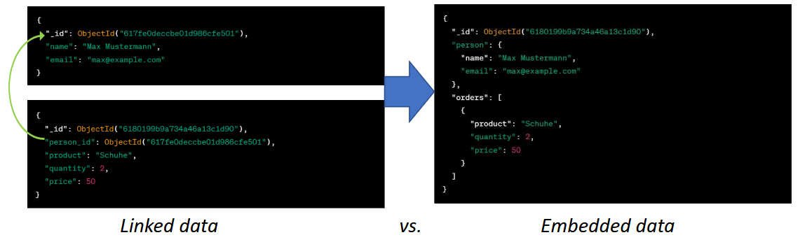
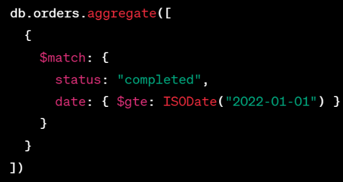
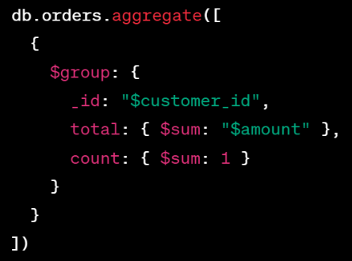
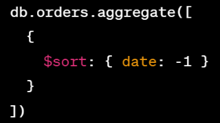
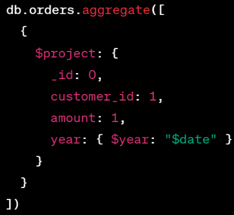
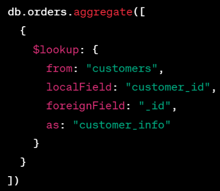

# Embedded Documents
- Dokumente innerhalb Dokumente
- Ermöglicht speichern komplexer Datenstrukturen, ohne seperater Collections 



## Vorteile
- $\textcolor{lime}{+}$ **Datenintegrität**: Stellen sicher, dass Daten, die zusammengehören, immer zusammen gespeichert werden
- $\textcolor{lime}{+}$ **Leistung**: Eine Abfrage kann sich auf eine einzelne Collection beschränken, anstatt über mehrere Collections suchen zu müssen
- $\textcolor{lime}{+}$ **Lesbarkeit**: Ermöglichen, Datenmodelle intuitiver und natürlicher auszudrücken

## Nachteile
- $\textcolor{red}{-}$ **Erhöhte Größe**: Erhöhte Größe des Hauptdokuments, kann **Leistung** beim Schreiben beeinträchtigen
- $\textcolor{red}{-}$ **Komplexität**: Erhöhte Komplexität der Datenstrukture, vor allem wenn es viele verschachtelte Dokumente gibt
- $\textcolor{red}{-}$ **Erschwertes Aktualisieren**: Aktualisieren von Daten kann vor allem dann erschwert sein, wenn sich das eingebettete Dokument auf mehrere andere bezieht. 

## Embedded oder Linked?
### Fragestellungen
- Wie oft wird auf die eingebetteten Daten zugegriffen?
- Werden die eingebetteten Daten für Abfragen verwendet?
- Ändern sich die eingebetteten Daten oft?

### Grundlegendes
- Verwende standartmäßig **embedded**, außer es gibt einen überzeugenden Grund, das nicht zu tun, (z.B. wenn es notwendig ist, auf ein Objekt alleine zugreifen zu können)
- Joins und Lookups sollen vermieden werden, außer wenn sie zu einem besseren Schema-Design führen
- Arrays sollten nicht unbegrenzt wachsen können

# Aggregationen
- Daten aus n-beliebigen Collections **extrahieren**, **transformieren**, und **analysieren**
- Effiktiv für komplexe Abfragen und Datenmanipulationen

## $match
Filtert Dokumente, die bestimmte Bedingungen erfüllen.

**Beispiel**: Nur Bestellungen mit dem Status `completed` und einem Datum nach dem 1. Jänner 2022 zurückgeben.



**Operatoren**: 
- `$eq`: Equal to (`==`)
- `$ne`: Not equal to (`!=`)
- `$gt`: Greater than (`>`)
- `$lt`: Less than (`<`)
- `$gte`: Greater than or equal to (`>=`)
- `$lte`: Less than or equal to (`<=`)
- `$in`: In array
- `$nin`: Not in array

## $group
Gruppiert Dokumente basierend auf einem oder mehreren Feldern und
führt Aggregationen wie Summe, Durchschnitt, Min/Max usw. durch.

**Beispiel**: Bestellungen nach Kunden gruppieren und die Summe der Beträge sowie die Anzahl der Bestellungen für jeden Kunden zurückgeben.



**Akkumuluatoren**:
- **`$sum`**: Summe
- **`$avg`**: Durchschnitt
- **`$min`**: Niedrigster Wert
- **`$max`**: Höhster Wert
- **`$push`**: Element zu einem Array hinzufügen
- **`$addToSet`**: Wie `$push` aber vermeidet Duplikate
- **`$first`**: Erstes Element
- **`$last`**: Letztes Element

## $sort
Sortiert Dokumente basierend auf einem oder mehreren Feldern.

**Beispiel**: Bestellungen nach Datum sortieren, beginnend mit dem neuesten Datum.



## $project
Projektion von Feldern, um nur bestimmte Felder in den Ergebnissen
anzuzeigen.

**Beispiel**: Nur die Kunden-ID, den Betrag und das Jahr der Bestellung zurückgeben.



## $lookup
Verknüpft Dokumente aus einer anderen Collection mit den Dokumenten in der aktuellen Collection (ähnlich zu JOIN).

**Beispiel**: Die Bestellungen und Kunden werden basierend auf der Kunden-ID verknüpft und die Kundeninformationen in einem eingebetteten Feld `customer_info` zurückgibt.



# Schema
|SQL (RDBMS)|MongoDB|
|-|-|
|Datenmodell $\Rarr$ Applikation|Applikation $\Rarr$ Datenmodell|
|Während Entwicklung Schemaänderung notwendig $\rarr$ Datenmodel "denormalisieren" $\rarr$ Performanceverlust|Applikation bestimmt Datenmodell|
|Fokus auf **Datenspeicher**|Fokus auf **Datennutzung**|

MongoDB ist grundsätzlich **Schemalos**, aber Schemadefinition ist möglich, aber anders wie bei SQL (RDBMS): 
- Mehrere erlaubte Datentypen
- Regex-Pattern
- Schemas kombinieren
- keine Default-Werte
- keine Fremdschlüssel

# JSON-Schema
- Definiert wie JSON-Daten **strukturiert** sein sollten, welche **Felder** vorhanden sein müssen, welche **Datentypen** sie haben sollten und welche **anderen Einschränkungen** gelten.
- Gibt **Fehlermeldungen** aus
- BSON-Datentypen: `double`, `string`, `object`, `array`, `binData`, `objectId`, `bool`, `date`, `null`, `regex`, `javascript`, `int`, `timestamp`, `long`, `decimal`, `minKey`, `maxKey`

## Basisschema
- `$schema`: Gibt an, dass dieses Schema mit Version 4 des IETF-Standards übereinstimmt
- `$id`: Definiert die Basis-URI zum Auflösen anderer URI-Referenzen innerhalb des Schemas (relevant für komplexere Schemata)
- `title` & `description`: rein deskriptiv
- `type`: Definiert den Datentyp.

```json
{
"$schema": "https://json-schema.org/draft/2020-12/schema",
"$id": "https://example.com/product.schema.json",
"title": "Record of Employee",
"description": "This document records the details of an employee",
"type": "object"
}
```

## Einschränkungen
- `type`: Datentyp des Feldes
- `pattern`: Regular Expression; gibt an wie der String aussehen muss
- `minLength`/`maxLength`: Mindest-/Maximallänge für Strings
- `minimum`/`maximum`: Mindest-/Maximalwert für Zahlenwerte
- `required`: obligatorische Felder
- `const`: erlaubt nur einen gültigen Wert, z.B. Shop, bei dem man nur Versand nach Ö erlaubt (nicht im Beispiel)

**Beispiel**

```json
{
    "properties": {
        "id": {
            "type": "string"
        },
        "name": {
            "type": "string",
            "minLength": 2,
            "pattern" : "/^[A-Za-z]+$/"
        },
        "age": {
            "type": "number",
            "minimum": 16
        }
    },
    "required": [
        "id",
        "name",
        "age"
    ]
}
```

## Arrays
- `items`: definiert Datentyp für alle Elemente in einem Array
- `prefixItems`: für Arrays, bei denen jedes Element ein anderes Schema hat und der Ordnungsindex jedes Elements aussagekräftig ist
- `contains`: Array muss angegeben Typ mind. 1x enthalten
- `minContains`/`maxContains`: gibt an, wie oft ein Schema mit einer `contains`-Einschränkung übereinstimmen soll
- `minItems`/`maxItems`: schränkt Arraylänge ein
- `uniqueItems`: gibt an, ob jedes Element in einem Array einzigartig sein muss

**Beispiel**

```json
{
    "type": "array",
    "items": {
        "type": "number"
    },
},
{
    "type": "array",
    "prefixItems": [
        { "type": "number" },
        { "type": "string" },
        { "enum": ["Street", "Avenue", "Boulevard"] },
        { "enum": ["NW", "NE", "SW"] }
    ]
},
{
    "type": "array",
    "contains": {
        "type": "number"
    },
    "minContains": 2,
    "maxContains": 3
}
```

## Format
In JSON gibt es keinen eigenen Datentyp für Datumswerte usw. 

Das Schlüsselwort `format` ermöglicht die grundlegende semantische Identifizierung bestimmter Arten von Zeichenfolgewerten, die häufig verwendet werden.

Beispiele: `date`, `datetime`, `time`, `email`, `hostname`, `ipv6`, `hostname`, `uri`, `uuid`, …

**Beispiel**

```json
{
    "type": "string",
    "format": "date"
},
{
    "type": "string",
    "format": "email"
}
```

## Enum
Wird verwendet um einen Wert auf eine feste Menge von Werten einzuschränken. 

Jedes Element, das wir in unserem Schema als `enum` angeben, muss einzigartig sein.

**Beispiel**

```json
    {
        "maritalstatus": ["single", "married", "divorced", "widowed"]
    },
    "required": ["id", "name", "age"]
```

## Verschachtelungen
Innerhalb der Datenstruktur können verschachtelte Datenstrukturen vorkommen. 

Diese sind genauso aufgebaut wie die Hauptstruktur, d.h. sie können zB ein eigenes lokal gültiges required-Feld besitzen!

**Beispiel**

```json
{
    "properties" : {
        "dimensions": {
            "type": "object",
            "properties": {
                "length": { "type": "number" },
                "width": { "type": "number" },
                "height": { "type": "number" }
        },
        "required": [ "length", "width", "height" ]
    }
}
```

## Referenzen
`$ref`: Verweist auf ein externes Schema.

**Beispiel**

```json
{
    "warehouseLocation": {
        "$ref": "https://example.com/geographical-location.schema.json"
    },
}
```

Verweist auf:

```json
{
    "$id": "https://example.com/geographical-
    location.schema.json",
    "$schema": "https://json-
    schema.org/draft/2020-12/schema",
    "title": "Longitude and Latitude",
    "description": "A geographical coordinate on a
    planet (most commonly Earth).",
    "required": [ "latitude", "longitude" ],
    "type": "object",
    "properties": {
        "latitude": {
            "type": "number",
            "minimum": -90,
            "maximum": 90
        },
        "longitude": {
            "type": "number",
            "minimum": -180,
            "maximum": 180
        }
    }
}
```

## Rekursion
Schema, das auf sich selbst verweist und so effektiv eine "Schleife" im Validator erzeugt, was sowohl zulässig als auch nützlich ist. 

Beachte jedoch, dass ein `$ref`-Verweis auf einen anderen `$ref` eine Endlosschleife verursachen kann und ausdrücklich untersagt ist.

**Beispiel**

```json
{
    "type": "object",
    "properties": {
        "name": { "type": "string" },
        "children": {
            "type": "array",
            "items": { "$ref": "#" }
        }
    }
}
```

Verweist auf:

```json
{
    "name": "Elizabeth",
    "children": [
        {
            "name": "Charles",
            "children": [
                {
                    "name": "William",
                    "children": [
                        { "name": "George" },
                        { "name": "Charlotte" }
                    ]
                },
                {
                    "name": "Harry"
                }
            ]
        }
    ]
}
```

## Komposition
- `allOf`: angegebene Daten müssen für alle angegebenen Unterschemata gültig sein
- `anyOf`: angegebene Daten müssen für eines oder mehrere der angegebenen Unterschemata gültig sein
- `oneOf`: angegebene Daten müssen für genau eines der angegebenen Unterschemata gültig sein
- `not`: angegebene Daten dürfen für keines der angegeben Unterschemata gültig sein

**Beispiel**

```json
{
    "allOf": [
        { "type": "string" },
        { "maxLength": 5 }
    ],
    "anyOf": [
        { "type": "string", "maxLength": 5 },
        { "type": "number", "minimum": 0 }
    ],
    "oneOf": [
        { "type": "number", "multipleOf": 5 },
        { "type": "number", "multipleOf": 3 }
    ],
    "not":
    { "type": "string" }
}
```