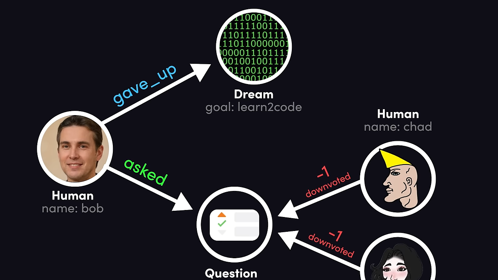
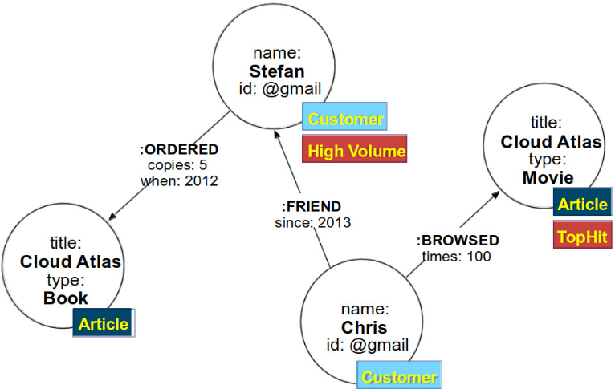
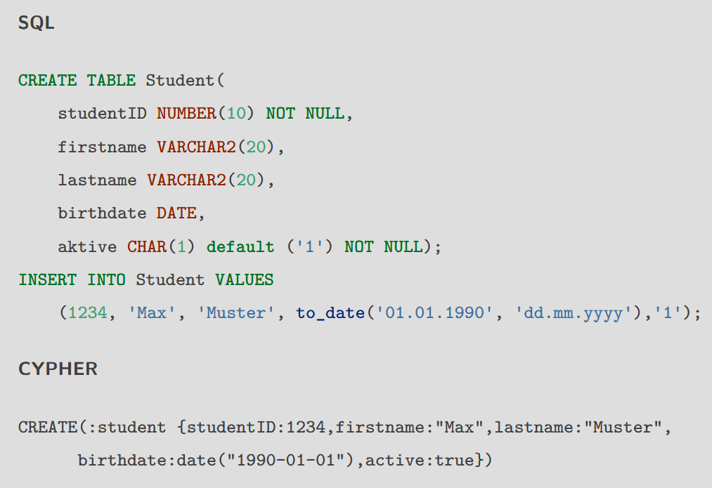

# Graph



- **Nodes** connected by **relations** (aka edges)
- Relations are part of the data, unlike RDBMS where it's a static scheme
- Good for complex content/questions
- Usual global search is expensive
- Answers in-between the lines (things)
- Response time is constant and not influenced by the amount of data 
- Uses **cypher** as a scripting language, a little similar to SQL

# Advantages
- $\textcolor{lime}{+}$ **Natural and powerful**: Quick, problem-free object mapping
- $\textcolor{lime}{+}$ **Easy structural queries**: No need for joins, relations are the most important thing
- $\textcolor{lime}{+}$ **Expandable homogenous model**: Relations can be created between formerly unconnected data

# Property Graph
- **Nodes** (things)
- **Relations**/edges (usually directed)
- **Key-value** properties: eg. name, last login, amount of posts
- **Label**: eg. person, article, procedure
- **Indexes**: eg. exactly by name, fulltext by description
- **Constraint**: eg. name must be unique



# Operationen

## CREATE


```cypher
CREATE(:student {studentID:1234,firstname:"Max",lastname:"Muster",
    birthdate:date("1990-01-01"),active:true})
```

## MATCH
1. Starting with nodes and relations
2. Find patterns within graphs
3. Calculate the results

Here:

1. For a user called "Stefan” who has friends: 
   ```cypher
   MATCH (n:user {name: "Stefan"}, (n)-[:FRIEND]->(f),
   ```
2. Find all articles, his friends browsed at least 4 times:
   ```cypher
   (f)-[r:VIEWED]->(a)) WHERE r.browsed >= 4
   ```
3. Return those sorted by occurrence:
   ```cypher
   RETURN a
   ORDER BY r.browsed
   ```

## UPDATE
Now we'll add a last name to "Stefan":

```
MATCH (n:user {name: "Stefan"})
SET
    n.lastname = "Maier"
```

or change a value in the same way:

```
MATCH (n:user {name: "Stefan"})
SET
    n.lastname = "Müller"
```

## DELETE
Works in a similar way: Find a node/relation and delete it. 
,
Nodes still connected to relations cannot be deleted unless `DETACH DELETE` is used, which removes nodes and all its connections.

If we try deleting the user, which currently has relations:

❌ $\textcolor{red}{\text{Error}}$ ❌
```cypher
MATCH (n:user {name: "Stefan"}, (n)-[r:FRIEND]->(f))
DELETE n
```

But if we delete the relations first:

✅ $\textcolor{lime}{\text{Ok!}}$ ✅
```cypher
MATCH (n:user {name: "Stefan"}, (n)-[r:FRIEND]->(f))
DELETE r
MATCH (n:user {name: "Stefan"}, (n)-[r:FRIEND]->(f))
DELETE 
```

Or we use `DETACH DELETE`:

✅ $\textcolor{lime}{\text{Ok!}}$ ✅
```cypher
MATCH (n:user {name: "Stefan"}, (n)-[r:FRIEND]->(f))
DETACH DELETE 
```

## CREATE vs MERGE

Normal create:

```
CREATE
    (alice:Person {name:'Alice', age: 38, eyes: 'brown'}),
    (bob:Person {name: 'Bob', age: 25, eyes: 'blue'}),
    (alice)-[:KNOWS]->(bob)
```

Create new elements depending on a match result:

```
CREATE
    (alice:Person {name:'Alice', age: 38, eyes: 'brown'}),
    (bob:Person {name: 'Bob', age: 25, eyes: 'blue'})

MATCH
    (a:Person {name: "Alice"}),
    (b:Person {name: "Bob"})
MERGE (a)-[r:LOVES]->(b)
```

# Neo4j Java
```java
GraphDatabaseService = new EmbeddedGraphDatabase( "var/graphDb" );

Transaction tx = gds.beginTransaction();
{
    Node stefan = db.createLabeledNode( label("Person") );
    stefan.setProperty( "name", "Stefan" );
    Node chris = db.createNode( label("Person") );
    chris.setProperty( "name", "Chris" );
    stefan.createRelationshipTo( chris, withName("FRIEND") );
    tx.success();
}
finally
{
    tx.finish();
}
```

# Neo4j REST
Create:

```
curl -XPOST http://localhost:7474/db/data/node -d '{ "name": "Stefan" }'
```

Run cypher:

```
curl -XPOST http://localhost:7474/db/data/cypher -d "Cypher-Query"
```

# Index
- To find the graph's starting point (because performance depends on that)
- Can be distinguished via:
  - **Search-performance index** (exact matches, filter for indexes)
  - **Semantic indexes** (approximate values, includes vector and full-text indexes)
  
## Commands
- Create index
    ```cypher
    CREATE INDEX example_index_1 FOR (a:Actor) ON (a.name)
    ```
- Create composite index
    ```cypher
    CREATE INDEX example_index_1 FOR (a:Actor) ON (a.name, a.born)
    ```
- Show index
    ```cypher
    SHOW INDEXES YIELD name, labelsOrTypes, properties, type
    ```

# Unique Constraints
- User needs `CREATE_CONSTRAINT` permission
- For nodes and relations
- Applied to a label
    ```cypher
    CREATE CONSTRAINT book_isbn
    FOR (book:Book) REQUIRE book.isbn IS UNIQUE
    ```
- Composite constraint
    ```cypher
    CREATE CONSTRAINT prequels
    FOR ()-[prequel:PREQUEL_OF]-()
    REQUIRE (prequel.order, prequel.author) IS UNIQUE
    ```

# ACID
- ✅ Is ACID conform
- Transactions:
  - `:BEGIN`
  - `:COMMIT` / `:ROLLBACK`
  - `CALL dbms.listTransactions()`
  - Usually not called via CLI but through code
- Locking:
  - Node/relationship based
  - Automatic
  - Deadlock detection