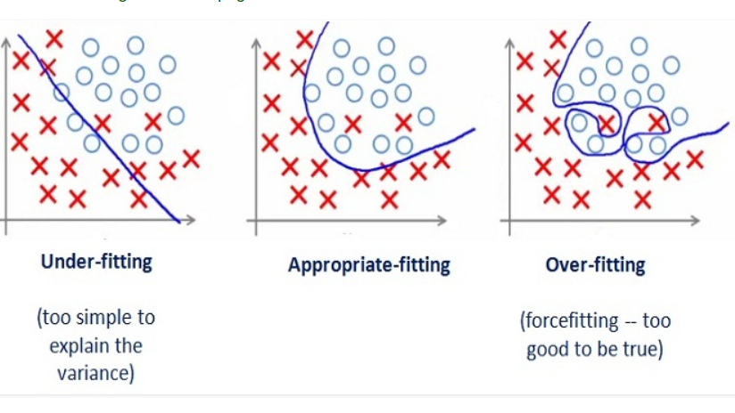

# Überblick

- Traditionelles Programmieren: Daten & Regeln $\rightarrow$ Antworten
- Artificial Intelligence: Daten & Antworten $\rightarrow$ Regeln

- **Klassifikationsprobleme**: Ausgabe soll eine Klasse sein, z.B. Hund/Katze oder Männlich/Weiblich. So viele Ausgangsknoten wie Klassen (außer bei binären Problemen), welche jeweils von 0 bis 1 gehen.
- **Regressionsprobleme**: Ausgabe soll eine Zahl sein, z.B. Umsatz. Der Ausgang ist der Wert selbst. Der Fehler kann mit MAE (mean absolute error) beschrieben werden.

# Over- und Underfitting

