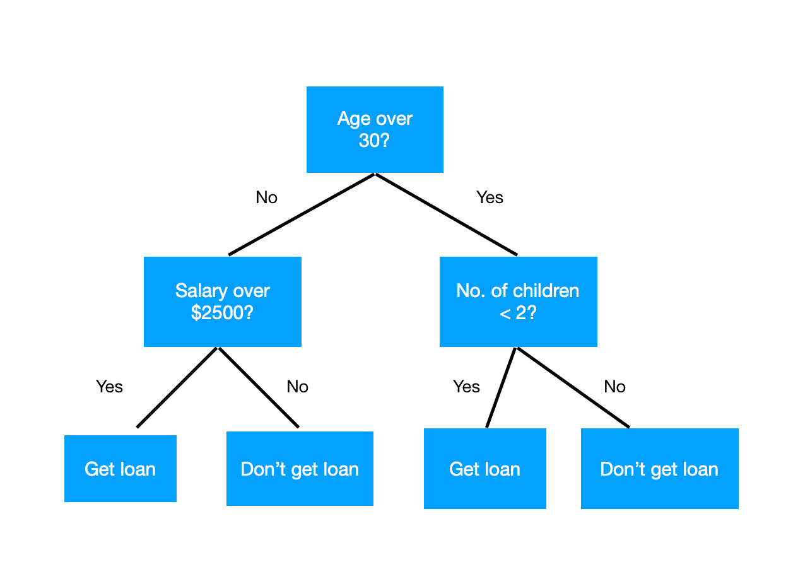

# Überblick

Es wird ein Baum aus Entscheidungen gemacht, um ein Resultat zu bekommen. 

# Hyperparameter
- Die maximale Tiefe des Baumes
- Wie viele es jeweils in einem Node geben muss, um einen Split zu machen
- Welcher Algorithmus verwendet werden soll

# Algorithmen
Beide Algorithmen probieren Parameter aus, nachdem gesplittet werden soll. Gewählt wird der, der jeweils am nächsten zu 0 ist.

## Gini
Generell ungenauer, aber viel schneller als Entropy. 

Beste: 0; schlechteste: 0.5

$$
1 - \sum {Pi}^2
$$
Beispiel:
$$
P_1 = \frac{3}{7} \quad P_2 = \frac{4}{7}
$$
$$
1 - ((\frac{3}{7})^2 + (\frac{4}{7})^2) \approx 0.49
$$

# Entropy
Generell genauer, aber viel rechenintensiver als Gini.

Beste: 0; schlechteste: 1

$$
- \sum Pi \cdot \log_2(Pi)
$$
Beispiel:
$$
- \frac{3}{7} \cdot \log_2(\frac{3}{7}) - \frac{4}{7}\cdot \log_2(\frac{4}{7}) \approx 0.9852
$$