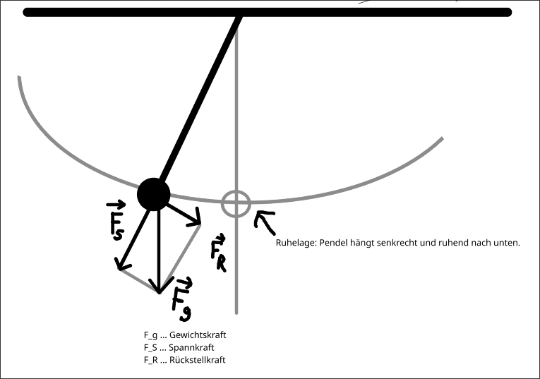
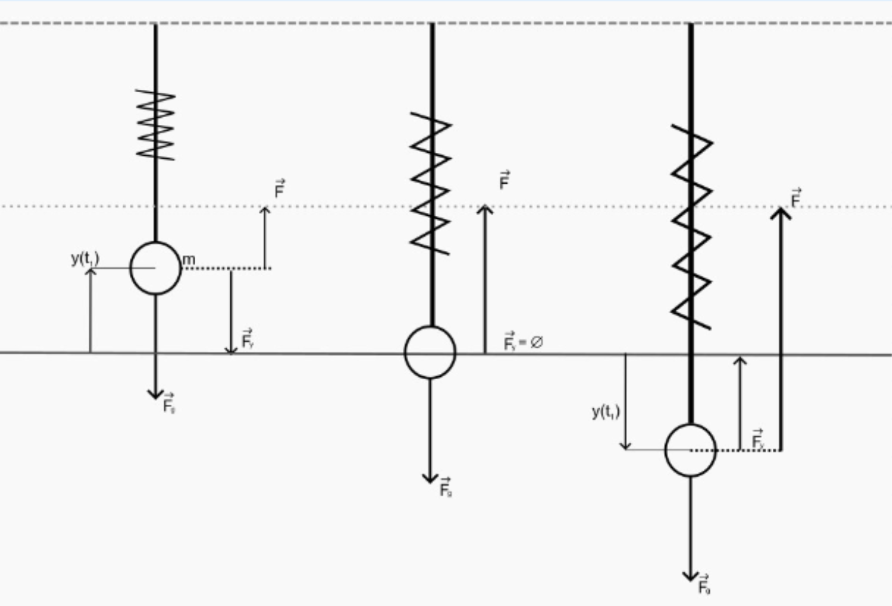
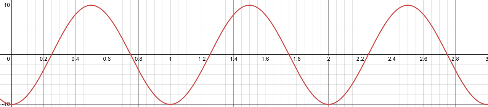

@ Stoff

# Einführung

Schwingungen sind **zeitlich periodische** Bewegungen eines Körpers um seiner Ruhelage. 
Ursache für die Schwingung sind Rückstellkraft und Trägheit des Körpers. 
Ein Schwingungsfähiger Körper wird auch **Oszillator** genannt.

# Wichtige Größen

$$
T \ldots \text{Periodendauer} \quad [T] = 1s \\
f \ldots \text{Frequenz} \quad [f] = 1Hz 
$$

$$
T = \frac{1}{f}
$$

$$
\omega \ldots \text{Kreisfrequenz/Winkelgeschwindigkeit} \quad [\omega] = 1s^{-1}
$$
$$
\omega = 2 \pi \cdot f = \frac{2 \pi}{T}
$$

# Harmonische Schwingungen

Eine Schwingung heißt harmonisch, wenn die momentane Auslenkung (Elongation) $y$ aus der Gleichgewichtslage durch die Gleichung:
$$
y(t) = A \cdot \sin(\omega \cdot t + \varphi_0)
$$
beschrieben wird.
$$
A \ldots \text{Amplitude (max. Auslenkung)} \\
\varphi_0 \ldots \text{Phasenverschiebung/Nullphasenwinkel}
$$
Rechteck- und Sägezahnschwingungen sind **nicht** harmonisch.

Andere Gleichungen:
$$
y(t) = A \cdot \sin(\frac{2 \pi}{T} \cdot t)
$$

# Federpendel

Das Hook'sche Gesetz für die Federkraft einer Schraubenfeder entspricht dem linearen Kraftgesetz. 
Daher vollführt ein Federpendel **harmonsiche Schwingungen**. 

^ todo: use svg instead of png

$$
T = 2 \pi \sqrt{\frac{m}{D}}
$$
$$
D \ldots \text{Federkonstante} \quad [D]=1 \frac{N}{m} = 1 \frac{kg}{s^2}
$$
$$
\Rightarrow T \propto \sqrt{m}, \quad T \propto \frac{1}{\sqrt{D}}
$$
$$
D = \omega^2 \cdot m
$$

@ Übungen

# Harmonische Schwingungen: Zettel 1, Ü2

## Angabe

Eine Sinusförmige Schwingung besitzt eine Schwingungsdauer von $0.6s$ und eine Amplitude von $40mm$. Wie groß ist die Auslenkung $0.02s$ nach Schwingungsbeginn?

## Lösung

**Gegeben ist**:
$$
T = 0.6s \quad A = 40mm \quad t = 0.02s
$$
**Gesucht ist**: 
$$
y = \text{?}
$$

**Annahme**: $\varphi_0=0$

$$
y(t) = A*\sin(\frac{2 \pi}{T} \cdot t) \\
y(0.02s) = 40mm \cdot \sin(\frac{2 \pi}{0.6} \cdot 0.02) \\
y(0.02s) \approx 8.32mm
$$

# Harmonische Schwingungen: Zettel 1, Ü3

## Angabe
Eine Sinusförmige Schwingung besitzt eine Amplitude von $10cm$ und eine Frequenz von $2Hz$. Nach welcher Zeit (vom Nulldurchgang weg) beträgt die Auslenkung erstmals $8cm$? 

## Lösung
**Gegeben ist**:
$$
A = 10cm \quad f=2Hz \quad \varphi_0=0 \quad y(t)=8cm
$$
**Gesucht ist**:
$$
t = \text{?}
$$

Gesucht ist die Zeit, bei der $8cm$ erreicht werden. 

$$
\omega = 2 \pi \cdot f \\
y(t) = A \cdot \sin(\omega \cdot t + \varphi_0) \\
y(t) = 8
$$

$$
y(t) = A \cdot \sin(2 \pi \cdot f \cdot t + \varphi_0)  \quad / \div A\\
\frac{y(t)}{A} = \sin(2 \pi \cdot f \cdot t + \varphi_0)
$$
Da $\varphi_0=0$, kann es weggelassen werden.
$$
\frac{y(t)}{A} = \sin(2 \pi \cdot f \cdot t) \quad / \arcsin(\ldots) \\
\arcsin(\frac{y(t)}{A}) = 2 \pi \cdot f \cdot t \quad / \div (2 \pi \cdot f) \\
\frac{\arcsin(\cfrac{y(t)}{A})}{2 \pi \cdot f} = t
$$
Einsetzen der Variablen:
$$
t = \frac{\arcsin(\cfrac{8 \sout{cm}}{10 \sout{cm}})}{2 \pi \cdot 2Hz}
$$
Ausrechnen von `asin(8/10)/(2*pi*2)` ergibt:
$$
t \approx 0.074s
$$

# Federpendel - Experiment
**Gegeben ist**:
$$
T = 0.437s \quad \Delta y = 5.8cm \quad F_g = 0.51N
$$

**Lösen**: 
$$
F_g = D \cdot \Delta y \\
D \approx 0.088 \frac{N}{cm}
$$
$$
T = 2 \pi \cdot \sqrt{\frac{m}{D}} \\
m \approx 43g
$$
$$
F_g = m \cdot g \\
F_g = 0.043kg \cdot 9.81 \frac{m}{s^2} \approx 0.421N
$$

# Federpendel: Ü2.1.04
## Angabe
Mit welcher Masse wurde eine **Feder** mit einer Federkonstanten von $1 \frac{N}{dm}$
belastet, wenn die Periodendauer eine Sekunde beträgt?
Skizzieren Sie drei volle Schwingungen des Pendels, 
wenn Sie eine Amplitude von $10cm$ verwenden und annehmen, 
dass zu Beginn das Federpendel nach unten aus der Gleichgewichtslage ausgelenkt wurde.
Geben Sie die Schwingungsgleichung der ungedämpften Schwingung an. 

## Lösung
**Gegeben ist**:
$$
D = 1 \frac{N}{dm} \quad T=1s \quad \Delta y=10cm
$$
**Gesucht ist**:
$$
y(t) = \text{?}
$$

1. Lösen für $m$:
$$
T = 2 \pi \cdot \sqrt{\frac{m}{D}}  \quad / \div 2 \pi\\
\frac{T}{2 \pi} = \sqrt{\frac{m}{D}} \quad / \ldots^2\\
\frac{T^2}{4 \pi^2} = \frac{m}{D} \quad / \cdot D \\
m = \frac{D \cdot T^2}{4 \pi ^2} \\
m = \frac{10kg \cdot 1s^2}{4 \pi ^2} \\
m \approx 0.253kg
$$
2. Lösen für $\omega$:
$$
\omega = 2 \pi \cdot f = \frac{2 \pi}{T}
\omega = 2 \pi \cdot s^{-1}
$$
3. Aufstellung der gleichung $y(t)$:
$$
y(t) = A \cdot \sin( \omega \cdot t + \varphi_0) \\
y(t) = 10cm \cdot \sin(2\pi s^{-1} \cdot t - \frac{\pi}{2})
$$
4. Zeichnen der Gleichung mit Desmos mit Eingabe $10\cdot\sin(2\pi\cdot x-\frac{\pi}{2})$:
