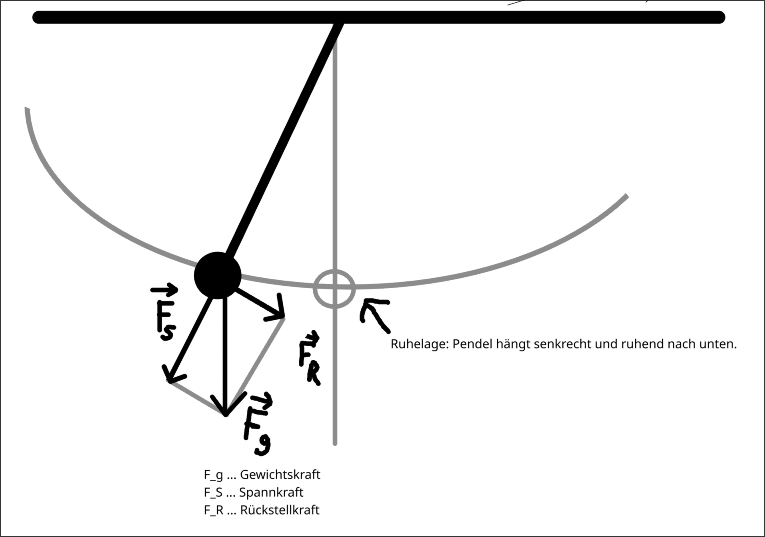
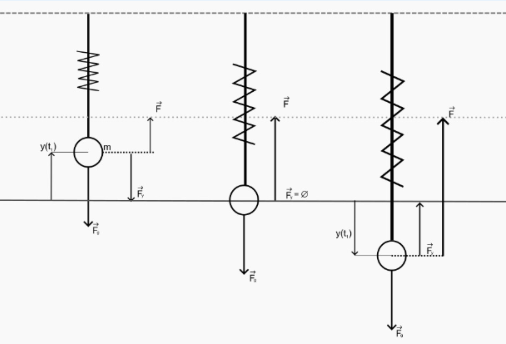
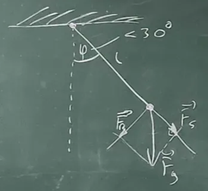
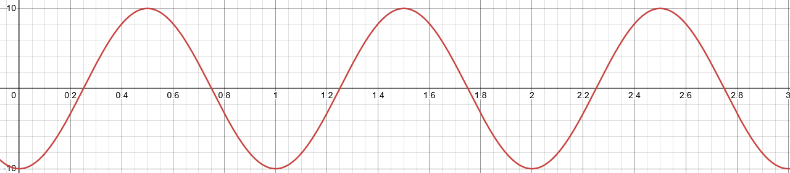

@ Stoff

# Einführung

Schwingungen sind **zeitlich periodische** Bewegungen eines Körpers um seiner Ruhelage. 
Ursache für die Schwingung sind Rückstellkraft und Trägheit des Körpers. 
Ein Schwingungsfähiger Körper wird auch **Oszillator** genannt.

# Wichtige Größen

$$
T \ldots \text{Periodendauer} \quad [T] = 1s \\
f \ldots \text{Frequenz} \quad [f] = 1Hz 
$$

$$
T = \frac{1}{f}
$$

$$
\omega \ldots \text{Kreisfrequenz/Winkelgeschwindigkeit} \quad [\omega] = 1s^{-1}
$$
$$
\omega = 2 \pi \cdot f = \frac{2 \pi}{T}
$$

# Harmonische Schwingungen

Eine Schwingung heißt harmonisch, wenn die momentane Auslenkung (Elongation) $y$ aus der Gleichgewichtslage durch die Gleichung:
$$
y(t) = A \cdot \sin(\omega \cdot t + \varphi_0)
$$
beschrieben wird.
$$
A \ldots \text{Amplitude (max. Auslenkung)} \\
\varphi_0 \ldots \text{Phasenverschiebung/Nullphasenwinkel}
$$
Rechteck- und Sägezahnschwingungen sind **nicht** harmonisch.

Andere Gleichungen:
$$
y(t) = A \cdot \sin(\frac{2 \pi}{T} \cdot t)
$$

# Federpendel

Das Hook'sche Gesetz für die Federkraft einer Schraubenfeder entspricht dem linearen Kraftgesetz. 
Daher vollführt ein Federpendel **harmonsiche Schwingungen**. 

^ todo: use svg instead of png

$$
T = 2 \pi \sqrt{\frac{m}{D}}
$$
$$
D \ldots \text{Federkonstante} \quad [D]=1 \frac{N}{m} = 1 \frac{kg}{s^2}
$$
$$
\Rightarrow T \propto \sqrt{m}, \quad T \propto \frac{1}{\sqrt{D}}
$$
$$
D = \omega^2 \cdot m
$$

# Fadenpendel
*s. Buch S. 22*

Beim Fadenpendel hängt eine Masse $m$ an einem Faden mit vernachlässigbarer Masse.
Idealisiert man die Masse zu einem Massenpunkt und denkt den Faden masselos, erhält man ein mathematisches Pendel.

Periodendauer eines Fadenpendels (gilt nur für kleine Auswirkungen ($\varphi < 30 \degree$)):
$$
T = 2 \pi \sqrt{\frac{l}{g}}
$$

Das **linear Kraftgesetz** gilt auch nur unter der Bedingung kleiner Auswirkungen.

**Kleinwinkelnäherung:** $\sin(\varphi) \approx \varphi$

$$
\vec{F_g} \ldots \text{Gewichtskraft} \\
\vec{F_S} \ldots \text{Spannkraft} \\
\vec{F_R} \ldots \text{Rückstellkraft}
$$

@ Übungen

# Harmonische Schwingungen: Zettel 1, Ü2

## Angabe

Eine Sinusförmige Schwingung besitzt eine Schwingungsdauer von $0.6s$ und eine Amplitude von $40mm$. Wie groß ist die Auslenkung $0.02s$ nach Schwingungsbeginn?

## Lösung

**Gegeben ist:**
$$
T = 0.6s \quad A = 40mm \quad t = 0.02s
$$
**Gesucht ist:** 
$$
y = \text{?}
$$

**Annahme:** $\varphi_0=0$

$$
y(t) = A*\sin(\frac{2 \pi}{T} \cdot t) \\
y(0.02s) = 40mm \cdot \sin(\frac{2 \pi}{0.6} \cdot 0.02) \\
y(0.02s) \approx 8.32mm
$$

# Harmonische Schwingungen: Zettel 1, Ü3

## Angabe
Eine Sinusförmige Schwingung besitzt eine Amplitude von $10cm$ und eine Frequenz von $2Hz$. Nach welcher Zeit (vom Nulldurchgang weg) beträgt die Auslenkung erstmals $8cm$? 

## Lösung
**Gegeben ist:**
$$
A = 10cm \quad f=2Hz \quad \varphi_0=0 \quad y(t)=8cm
$$
**Gesucht ist:**
$$
t = \text{?}
$$

Gesucht ist die Zeit, bei der $8cm$ erreicht werden. 

$$
\omega = 2 \pi \cdot f \\
y(t) = A \cdot \sin(\omega \cdot t + \varphi_0) \\
y(t) = 8
$$

$$
y(t) = A \cdot \sin(2 \pi \cdot f \cdot t + \varphi_0)  \quad / \div A\\
\frac{y(t)}{A} = \sin(2 \pi \cdot f \cdot t + \varphi_0)
$$
Da $\varphi_0=0$, kann es weggelassen werden.
$$
\frac{y(t)}{A} = \sin(2 \pi \cdot f \cdot t) \quad / \arcsin(\ldots) \\
\arcsin(\frac{y(t)}{A}) = 2 \pi \cdot f \cdot t \quad / \div (2 \pi \cdot f) \\
\frac{\arcsin(\cfrac{y(t)}{A})}{2 \pi \cdot f} = t
$$
Einsetzen der Variablen:
$$
t = \frac{\arcsin(\cfrac{8 \sout{cm}}{10 \sout{cm}})}{2 \pi \cdot 2Hz}
$$
Ausrechnen von `asin(8/10)/(2*pi*2)` ergibt:
$$
t \approx 0.074s
$$

# Federpendel - Experiment
**Gegeben ist:**
$$
T = 0.437s \quad \Delta y = 5.8cm \quad F_g = 0.51N
$$

**Lösen:** 
$$
F_g = D \cdot \Delta y \\
D \approx 0.088 \frac{N}{cm}
$$
$$
T = 2 \pi \cdot \sqrt{\frac{m}{D}} \\
m \approx 43g
$$
$$
F_g = m \cdot g \\
F_g = 0.043kg \cdot 9.81 \frac{m}{s^2} \approx 0.421N
$$

# Federpendel: Ü2.1.04
## Angabe
Mit welcher Masse wurde eine **Feder** mit einer Federkonstanten von $1 \frac{N}{dm}$
belastet, wenn die Periodendauer eine Sekunde beträgt?
Skizzieren Sie drei volle Schwingungen des Pendels, 
wenn Sie eine Amplitude von $10cm$ verwenden und annehmen, 
dass zu Beginn das Federpendel nach unten aus der Gleichgewichtslage ausgelenkt wurde.
Geben Sie die Schwingungsgleichung der ungedämpften Schwingung an. 

## Lösung
**Gegeben ist:**
$$
D = 1 \frac{N}{dm} \quad T=1s \quad \Delta y=10cm
$$
**Gesucht ist:**
$$
y(t) = \text{?}
$$

**Lösen für $m$:**
$$
T = 2 \pi \cdot \sqrt{\frac{m}{D}}  \quad / \div 2 \pi\\
\frac{T}{2 \pi} = \sqrt{\frac{m}{D}} \quad / \ldots^2\\
\frac{T^2}{4 \pi^2} = \frac{m}{D} \quad / \cdot D \\
m = \frac{D \cdot T^2}{4 \pi ^2} \\
m = \frac{10kg \cdot 1s^2}{4 \pi ^2} \\
m \approx 0.253kg
$$
**Lösen für $\omega$:**
$$
\omega = 2 \pi \cdot f = \frac{2 \pi}{T}
\omega = 2 \pi \cdot s^{-1}
$$
**Aufstellung der gleichung $y(t)$:**
$$
y(t) = A \cdot \sin( \omega \cdot t + \varphi_0) \\
y(t) = 10cm \cdot \sin(2\pi s^{-1} \cdot t - \frac{\pi}{2})
$$
**Zeichnen der Gleichung mit Desmos mit Eingabe $10\cdot\sin(2\pi\cdot x-\frac{\pi}{2})$:**

# Weitere Übungen zu Schwingungen (Zettel)

**Besonders wichtig:** 2, 5, 7, 8, 9, 10, 12, 13, 14

# Zettel Ü2

## Angabe
Ein harmonisch schwingender Massepunkt ist $0.2s$ nach Passieren der Ruhelage $0.45m$ von dieser entfernt. Wie groß sind die Frequenz $f$ und welche Periodendauer $T$, wenn die Amplitude $y_{max}=0.6m$ beträgt?

## Lösung

**Gegeben ist:**
$$
t = 0.2s \quad y(t) = 0.45m \quad A = 0.6m
$$

**Gesucht ist:**
$$
f = \text{?} \quad T = \text{?}
$$

**Aufstellen der Gleichung $y(t)$:**
$$
y(t) = A \cdot \sin( \omega \cdot t + \varphi_0)
$$

**Da $\varphi_0=0$, kann es weggelassen werden:**
$$
y(t) = A \cdot \sin( \omega \cdot t)
$$
**Umformen der Gleichung auf $\omega$:**
$$
y(t) = A \cdot \sin( \omega \cdot t) \quad / \div A \\
\frac{y(t)}{A} = \sin( \omega \cdot t) \quad / \arcsin(\ldots) \\
\arcsin(\frac{y(t)}{A}) = \omega \cdot t \quad / \div t \\
\omega = \frac{\arcsin(\cfrac{y(t)}{A})}{t}
$$

**Aufstellen der Gleichung $\omega$ auf $f$:**
$$
\omega = 2 \pi \cdot f \quad / \div 2 \pi \\
f = \frac{\omega}{2 \pi}
$$
**Einsetzen von $\omega$ in die obere Gleichung:**
$$
f = \frac{(\cfrac{\arcsin(\cfrac{y(t)}{A})}{t})}{2 \pi}
$$
**Einsetzen der Werte in die Gleichung**:
$$
f = \frac{(\cfrac{\arcsin(\cfrac{0.45 \sout{m}}{0.6 \sout{m}})}{0.2s})}{2 \pi}
$$
**Ausrechnen von `(asin(0.45/0.6)/0.2)/(2*pi)` gibt:**
$$
f \approx 0.675Hz
$$
**Ausrechnen von $T$:**
$$
T = \frac{1}{f}
$$
$$
T \approx 1.482s 
$$

# Zettel Ü7

# Angabe

Eine Feder hat eine Federkonstante $k = 30 \frac{N}{m}$. Wie groß ist die Masse $m$ eines daran hängendes Gewichtstückes, das Schwingungen der Amplitude $y_{max}=0.05m$ ausführt und mit der Geschwindigkeit $v = 0.8 \frac{m}{s}$ durch die Ruhelage geht?

# Lösung

**Gegeben ist:**
$$
D = 30 \frac{N}{m} \quad A = 0.05m \quad v = 0.8 \frac{m}{s} 
$$

**Gesucht ist:**
$$
m = \text{?}
$$

**Relevante Formeln:**
$$
D = \omega^2 m \\
\omega = \frac{2 \pi}{T} \\
y(t) = A \cdot \sin(\omega \cdot t)
$$
**Die Ableitung von $y(t)$ gibt die Änderung der Distanz, also die Geschwindigkeit.**

**Um $A \cdot \sin(\omega \cdot t)$ ableiten zu können, muss die Kettenregel angewendet werden ($(f(g(x)))' = f'(g(x)) \cdot g'(x)$):**
$$
y'(t)=A \cdot \cos(\omega \cdot t) \cdot \omega
$$
**Wenn wir hier für $t$ den Wert $0$ einsetzen (wie in der Angabe steht ""durch die Ruhelage"") und statt $y'(0)$ wir $v$ schreiben bekommen wir:**
$$
v = A \cdot 1 \cdot \omega
$$
**Um $\omega$ zu erhalten:**
$$
v = A \cdot \omega \quad / \div A \\
\omega = \frac{v}{A}
$$

**Umformen auf $m$:**
$$
D = \omega^2 m \quad / \div \omega^2 \\
m = \frac{D}{\omega^2}
$$

**Einsetzen von $\omega$ von der oberen Gleichung:**
$$
m = \frac{D}{(\cfrac{v}{A})^2}
$$
**Einsetzen der Variablen und umformen der Gleichung:**
$$
m = \frac{30 \frac{kg}{s^2}}{(\frac{0.8 \frac{m}{s}}{0.05m})^2}
$$
$$
m = \frac{30 \frac{kg}{s^2}}{\frac{0.8^2 \frac{m^2}{s^2}}{0.05^2m^2}} 
$$
$$
m = \frac{30 \cdot kg \cdot \sout{s^{-2}}}{\frac{0.8^2 \cdot \sout{m^2} \cdot \sout{s^{-2}}}{0.05^2 \sout{m^2}}} 
$$
$$
m = \frac{30 \cdot kg}{\frac{0.8^2}{0.05^2}} 
$$
$$
m = \frac{30}{\frac{0.8^2}{0.05^2}} kg
$$
**Ausrechnen von `30/((0.8**2)/(0.05**2))` gibt:**
$$
m \approx 0.117kg
$$
@ Formeln

# Schwingungen

$$
T = 1s \quad \ldots \text{Periodendauer} \\
f = 1Hz \quad \ldots \text{Frequenz} \\
$$
$$
T = \frac{1}{f}
$$
$$
\omega = 1s^{-1} \quad \ldots \text{Kreisfrequenz/Winkelgeschwindigkeit}
$$
$$
\omega = 2 \pi \cdot f = \frac{2 \pi}{T}
$$

# Harmonische Schwingungen

$$
y(t) = 1m \quad \ldots \text{Momentane Auslenkung} \\
A = 1m \quad \ldots \text{Amplitude} \\
\varphi_0 = 1s^{-1} \quad \ldots \text{Phasenverschiebung/Nullphasenwinkel}
$$
$$
y(t) = A \cdot \sin(\omega \cdot t + \varphi_0)
$$

# Federpendel
$$
T = 2 \pi \cdot \sqrt{\frac{m}{D}}
$$
$$
D = 1 \frac{N}{m} = 1 \frac{kg}{s^2} \quad \ldots \text{Federkonstante}
$$
$$
T \propto \sqrt{m} \quad T \propto \frac{1}{\sqrt{D}}
$$
$$
D = \omega^2 m
$$

# Fadenpendel 
$$
T = 2 \pi \sqrt{\frac{l}{g}}
$$
$$
l = 1m \quad \ldots \text{Länge des Fadenpendels} \\
g \approx 9.81 \frac{m}{s^2} \quad \ldots \text{Erdanziehungskraft}
$$
$$
\sin(\varphi) \approx \varphi
$$