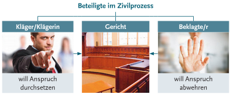
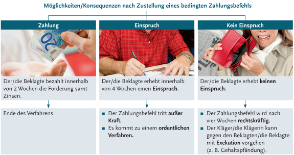
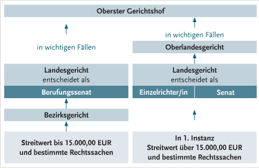

# Einführung

**Bedeutung**: Jemand setzt seine rechtlichen Ansprüche gegen andere Personen durch. Gilt für Personen und für juristische Personen (z.B. bei Firmen).

**Beteiligte**: **Kläger** und **Beklagter**. Beide sind gleichberechtigt. Sie können einen **Rechtsanwalt** beiziehen. 

Ein Zivilprozess sollte immer nur die **letzte Möglichkeit** sein, Rechtsfrieden wiederherzustellen, da er für beide Zeit, Geld und Nerven in Anspruch nimmt.

# Unterschiede zum Strafprozess
| |**Zivilprozess**|**Strafprozess**|
|-|-|-|
|**Zweck**|Zivilrechte Ansprüche klären|Ahndung von Straftaten|
|**Parteien**|Kläger, Beklagter|Staat, Angeklagte|
|**Beiweislast**|Kläger|Staat|
|**Rechtsfolgen**|Schadensersatz, Erfüllung des Vertrages, ...|Geldstrafen, Freiheitsstrafen, ...|
|**Beispiele**|Vertragsstreitigkeit, Schadensersatzforderung, Scheidung, ...|Diebstahl, Körperverletzung, Betrug, Verkehrsdelikt, ...|

# Verfahrensarten
- **Streitiger Zivilrechtsweg**: Alles normale
- **Außerstreitverfahren**: Wenn z.B. Kinder betroffen sind ("Interessen schutzbedürftiger Personen sind zu berücksichtigen")

# Verfahrensgrundsätze
## Öffentlichkeit
In der Regel **öffentlich zugänglich**, d.H. jeder darf unangemeldet zuhören kommen. Ausnahmen sind z.B. familienrechtliche Prozesse wie Scheidung

## Parteiöffentlichkeit
Kläger und Beklagter dürfen an Verhandlungen teilnehmen. Sie werden auch von Terminen und gerichtliche Entscheidungen (über Rechtsanwalt) verständigt.

## Dispositionsgrundsatz
Unterscheidung **Zivilprozess** vom **Strafprozess**. Prozessparteien bestimmen, ob und worüber, und Parteien könenn auch über das Ende des Prozesses frei entscheiden. 

*verstehe ich selber nicht ganz :(*

## Beiderseitiges rechtliches Gehör
Jede Partei darf sich im Verfahren äußern. 

# Zuständigkeit
## Örtliche Zuständigkeit
- **Allgemein**: Richtet sich nach dem **Wohnsitz** des **Beklagten**
- **Besonders**: z.B. wo der Schaden zugefügt wurde
- Bei **Bestellungen**: Im EU-Ausland kann der Online-Besteller an seinem allgemeinen Gerichtsstand klagen (EU-Recht)

z.B. Wenn du aus **Linz** kommst und wegen Schadensersatz eines Unfalls der in **Salzburg** passierte jemand dich klagen will, kannst du in **Linz** (allgemeiner Gerichtsstand) oder **Salzburg** (Gerichtsstand der Schadenszufügung) geklagt werden. 

## Sachliche Zuständigkeit
- **Bezirksgerichte**: 
  - Zuständig für:
    - Streitwerte bis €15k
    - bestimmte Arten von Streitigkeiten als Eigenzuständigkeit
  - Einen Einzelrichter
- **Landesgerichte**: 
  - Zuständig für:
    - Alles andere
    - Streitwerte über €15k
    - Als Eigenzuständigkeit in paar sachen
  - Auch Einzelrichter, außer eine Partei beantragt **Senatsprozess** bei Streitwert über €100k, dann sind es 3 Richter

# Verfahrensablauf
## Mahnverfahren
Für Geldforderungen bis €75k. 

Der Kläger bringt eine **Mahnklage** beim zuständigen Gericht ein. Das Gericht prüft nicht, ob der Kläger wirklich einen Anspruch auf der Zahlung hat. Der Beklagter bekommt einen **bedingten Zahlungsbefehl**.

d.H. Entweder du zahlst, du sagst "neee das stimmt net" (dann ordentliches Verfahren) oder du bist blöd und machst einfach gar nichts, dann wird's rechtskräftig und du musst nach 4 wochen doch zahlen lol

## Ordentliches Verfahren
Dazu kommt es, wenn eines der folgenden zutrifft:
- Beklagte erhebt Einspruch vom Zahlungsbefehl
- Streitwert von mind. €75k
- Es handelt sich um keine Geldleistung

1. **Klage**
   - **Bezirksgericht**: Dem Beklagten wird Klage mit Ladung zur mündlichen Verhandlung zugestellt
   - **Landesgericht**: Beklagte wird aufgefordert, innerhalb von 4 Wochen zur Klage schriftlich Stellung zu nehmen (= **Klagebeantwortung**, muss vom Rechtsanwalt verfasst werden)
2. **Vorbereitende Tagsatzung**
   - Richter bespricht mit den Parteien die **Prozessthemen** und Beweise werden bereits aufgenommen
3. **Versäumnissurteil** oder **(weitere) mündliche Streitverhandlung** 
   - **Versäumnissurteil**: 
     - Wenn der Beklagter nicht vor Gericht erscheint
     - Es kommt zu keiner Verhandlung, Kläger gewinnt einfach
   - **(weitere) mündliche Streitverhandlung**: 
     - Es werden **Beweise** aufgenommen. Beweismittel sind: Zeugen, Urkunden (z.B. Verträge), Sachverständigengutachten, Lokalaugenschein, Parteinenvernahme
4. **Urteil**
   - Schriftlich

### Verfahrensdauer
In der Praxis liegt zwischen den einzelnen Abschnitten Aufgrund von gesetzlicher Fristen und Belastung der Gerichte oft **Wochen oder Monate**.

**Verzögerungen** können auch auftreten wegen:
- Erkrankung eines Zeugen
- Unmöglichkeit, einen Sachverständigertermin zu erhalten
- Neues Parteivorbringen etc.
- Widerspruch gegen Versäumnisurteil

# Rechtsmittel
- Kläger oder Beklagter ist mit dem Urteil nicht einverstanden (z.B. seiner Meinung nach Beweise falsch interpretiert oder Gesetze falsch angewendet)? $\rarr$ Entscheidung der ersten Instanz kann bekämpft werden
- **Nächste Instanz**: Überprüfung des Urteil der Unterinstanz. 
- Kann sein, dass das Ersturteil aufgehoben wird und in der ersten Instanz neu verhandelt werden muss (aufgrund Feststellung von grober Mängel im Beweisverfahren)

Erreicht nicht immer den Obersten Gerichtshof. 

## Instanzenzug

# Anwaltspflicht, Kosten und Verfahrenshilfe

## Anwaltspflicht

Absolute Anwaltspflicht besteht bei Streitigkeiten, bei denen es um mehr als €5k geht. 

Wenn weniger als €5k? Parteien ohne Anwelt müssen Schutz durch Hilfestellungen im Prozess bekommen

## Kosten
- Staat verlangt **Gerichtsgebühren**
- Vorschuss auf **Sachverständigengebühren**. Die gewonnene (obsiegende) Partei bekommt die von der unterliegenden zurückgezahlt
- Kosten des **Rechtsanwaltes** zind durch Rechtsanwaltstarifgesetz geregelt (richtet sich nach Streitwert und Umfang des Verfahrens). 
  - Hier muss auch die unterlegene Partei den Anwalt der obsiegenden zahlen, es sei denn wenn die Kosten uneinbringlich sind. 

## Verfahrenshilfe
Existiert, damit auch minderbemittelte Bürger die Möglichkeit haben, einen Prozess zu führen. 

Diese reicht von der Befreiung von den Gerichts-und Sachverständigerngebühren bis zur kostenlosen Vertretung durch einen Rechtsanwalt (bei Prozessverlust müssen aber die Kosten der obsiegenden Partei trotzdem gezahlt werden!)