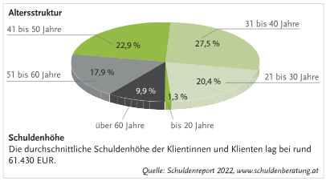

# Einführung
Es kommt zu einer Exekution, sobald:
- Rechtskräftige und vollstrekcte Entscheidung (Zahlungsbefehl, Urteil, Beschluss) d.h. ein **Exekutionstitel** vorliegt.
- Unteil im Zivilprozess darf nuch mit **Gerichtshilfe** im Exekutionsverfahren durchgesetzt werden
- **Bezirksgerichte** sind für eine Durchführung zuständig
- Mit Exekutionstitel kann Gläubiger mind. 30 Jahre auf das Vermögen bzw. Einkommen des Schuldners zugreifen (also man kann sich supi für's halbe leben verschulden)

# Aufgabe des Gerichtsvollzieher
- **Gerichtsvollzieher** (Exekutor): Gerichtsbediensteter mit der Aufgabe festzustellen, ob ein verurteilter Schuldner über pfändbare Gegenstände verfügt
- Hauptaufgabe: Zahlung verlangen und (Teil-)Zahlungen kassieren.
  - Nicht möglich? $\Rarr$ **Pfändungsprotokoll** (alle Pfandbaren Fahrnisse des Schuldners werden aufgeführt)
- Dem Gerichtsvollzieher ist unbedingt **Einlass in die Wohnung** zu gewähren, ansonsten kann er die Polizei und einen Schlosser heranziehen und sich gewaltsam Zugang zur Wohnung verschaffen (aber erst, wenn er es zuvor zu unterschiedlichen Zeiten versucht hat, jemanden anzutreffen)

**Inkassobüros**: Treiben offene Forderungen ein. Kommt oft für Schuldner teuer. Mitarbeitern von Inkassobüros muss aber kein Zutritt zur Wohnung gewährt werden.

# Arten des Exekutionsverfahren
**Exekution wegen Geldforderung des Gläubigers:**
- **Fahrnisexekutionsverfahren**: Pfändung und Verwertung beweglicher Sachen (z.B. Fernseher, Stereoanlage, Teppich)
- **Forderungsexekution**: z.B. Lohnpfändung
- **Liegenschaftsexekution**: Pfändung und Verwertung bzw. Versteigerung von Liegenschaften

**Exekution zur Erwirkung von Handlungen und Unterlassungen:**
- Gerichtsvollzieher nimmt Schuldner den Gegenstand weg und händigt ihn den Gläubiger aus
- Bei unvertretbaren Handlungen:
  - Schuldner kann zur Duldung bzw. Unterlassung gezwungen werden (z.B. Herausgabe eines Gemäldes, Unterlassung gesetzwidriger Werbung)

Im folgenden wird nur die Exekution wegen **Geldforderung** behandelt. 

# Fahrnisexekutionsverfahren
Pfändung und Verwertung beweglicher Sachen (z.B. Fernseher, Stereoanlage, Teppich).

**Ablauf:**
1. **Exekutionsantrag** vom Gläubiger
2. **Exekutionsbewilligungsbeschluss**
3. **Pfändung**: Gerichtsvollzieher Pfändet die Gegenstände und verzeichnet sie im **Pfändungsprotokoll**
4. **Schätzung**
5. **Versteigerung**: Der Erlös der versteigerten Gegenstände wird nach Reihenfolge der Pfändung unter den Gläubigern verteilt
6. **Neuerlicher Vollzug**: Falls der Versteigerungserlös nicht ausreicht, kann die betreibende Partei den **neuerlichen Vollzug** der Fahrnisexekution beantragen

**Gepfändet werden kann**: Alle Gegenstände, die sich in der Gewahrsame des Schuldners befinden, unabhängig davon, ob dieser tatsächlicher Eigentümer ist oder nicht (falls nicht, muss der tatsächliche Eigentümer nachweisen, dass der Gegenstand ihm gehört).

**Jedoch nicht gepfändet werden kann**: 
- Notwendigsten Möbel und Hausrat (Kahlpfändung)
- Gegenstände, die zur Fortsetzung der Erwerbstätigkeit notwendig sind
- Höchstpersönliche Sachen (z.B. der Ehering, Orden, Fotos)

Möglichkeit der **Austauschpfändung**: z.B. wenn es nur eine teure Sofa zum sitzen gibt kann der Gläubiger diese versteigern wenn er eine billigerne Sitzgelegenheit zur Verfügung stellt. 

# Forderungsexekution, Lohnpfändung

Wenn der Schuldner ein **Erwerdbseinkommen** (Lohn, Gehalt) hat, kann das auch gepfändet werden. 

**Lohnpfändung:**
- Häufigste Form der Forderungsexekution
- Einkommen von Schuldnern wird bis auf **Existenzminimum** gepfändet und direkt an die Gläubiger überwiesen

**Existenzminimum:**
- Hängt von der Anzahl der Sorgepflichten (Kinder, nicht berufstätige Ehegatten) und von der Höhe des Einkommens
- Untergrenze des Existenzminimums: €1.21

# Sonstige Exekutionsarten
Exekution kann auch durch folgendes geführt werden:
- Zwangsversteigerung von **Liegenschaften** (Häuser, Eigentumswohnungen, Grundstücke)
- Zwangsweise Pfandrechtsbegründung
- Zwangsverwaltung einer Liegenschaft
- **Gewerberechte** können auch gepfandet werden

Bei der Überschuldung bietet die staatlich anerkannte **Schuldenberatung** kostenlose Unterstützung.

Statistik zur Schuldenberatung:

