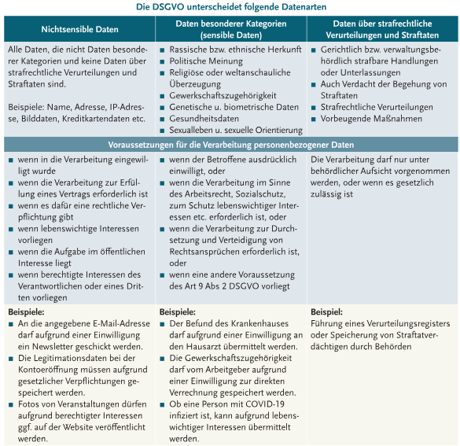

# Einführung

Tritt vor, wenn **personenbezogene Daten** verarbeitet werden. 

- **Personenbezogen**: Mit diesen Daten ist Rückschluss auf eine eindeutige Person möglich (z.B. Name, Telefonnummer, etc)
- "**Verantwortlicher**": Eine Person bzw. Unternehmen, Behörde etc., die personenbezogene Daten verarbeitet und alleiene oder mit anderen über Zwecke und Mittel der Verarbeitung entscheidet.

Jeder in Österreich hat das Recht auf Datenschutz, wenn ein schutzwürdiges Geheimhaltungsinteresse vorliegt; die Daten, welche man von sich preisgibt, soll jeder für sich entscheiden können. 

# Rechtsgrundlagen

- **Datenschutz-Grundverordnung (DSGVO)**: EU-Vorschrift seit 2018
- **Datenschutzgesetz (DSG)**: Umsetzung der Klauseln aus dem DSGVO, enthählt aber außerdem z.B. **Datengeheimnis** und das Grundrecht auf Datenschutz auch juristischen Personen zugänglich. 

# Datenarten & Erlaubnistatbestände
Ein **gesetzlicher Erlaubnistatbestand** muss vorliegen, damit Daten überhaupt verarbeitet werden dürfen. 

**Unterscheidung Datenarten der DSGVO:**
- **Nichtsensible Daten**: Nicht besonderer Kategorie und nicht über Straftaten. Beispiele: Name, Adresse, IP-Adresse, Bilddaten, Kreditkartendaten etc. 
  - Erfordert generell Einwilligung in der Verarbeitung
- **Daten besonderer Kategorien (sensible Daten)**: Rassische bzw. ethnische Herkunft, politische Meinung, Religion, Gewerkschaftszugehörigkeit, Genetische und biometrische Daten, Gesundheitsdaten, Sexualleben
  - Erfordert generell ausdrückliche Einwilligung
- **Daten über strafrechtliche Verurteilungen und Straftaten**: Inkl. Verdacht
  - Erfordert generell behördliche Aufsicht

Gesamte Tabelle, weil das is mir jz doch ein bisschen zu blöd das ganze irgendwie abzutippen:

# Pflichten von Verantwortlichen und Auftraggebern

**Auftragsverarbeiter**: Person/Behörde/Einrichtung/etc die personenbezogene Daten im **Auftrag des Verantwortlichen** verarbeitet. Verantwortliche dürfen selbst entscheiden, auf welcher Art und Weise personenbezogene Daten verarbeitet werden, jedoch ist der Auftragsverarbeiter weisungsgebunden, und muss die Daten aussschließlich auf Anordnung des Verantwortlichen verarbeiten. Beispielsweise darf Microsoft nicht die Daten eines Elektrohändlers die dieser in MS Excel eingegeben hat verwenden.

## Rechenschaftspflicht
Die Bestimmungen der DSGVO müssen nicht nur eingehalten werden, sondern sie müssen diese auch **nachweisen** können. 

## Verarbeitungsverzeichnis
- Müssen von Verantwortlichen und Auftragsverarbeiter geführt werden, wo sämtliche Datenverarbeitungen dokumentiert werden
- Internes Dokument, muss der **Aufsichtsbehörde** auf Verlangen vorgelegt werden
- Unternehmen **weniger als 250 Mitarbeiter**: Muss nicht geführt werden wenn: 
  - Kein Risiko auf die Rechte und Freiheiten der Betroffenen besteht
  - Die Verarbeitung nur gelegentlich erfolgt 
  - Keine sensiblen Daten verarbeitet werden
- Wenn neue und riskante Technologien verwendet werden ist vorab eine **Datnschutz-Folgenabschätzung** durchzuführen

## Datensicherheitsmaßnahmen
**Privacy by Design** & **Privacy by Default**

Durch technische und organisatorische Maßnahmen muss ein **angemessenes Schutzniveau** für personenbezogene Daten gewährleistet werden. 

## Datenschutzbeauftragter
Verantwortliche müssen immer dann **verpflichtend** einen Datenschutzbeauftragten bestellen, wenn eines der folgenden zutrifft:
- Der Verantwortliche ist eine Behörde oder Stelle
- Die Kerntätigkeit liegt in der umfangreichen regelmäßigen und systematischen **Überwachung**
- Die Kerntätigkeit ist die Verarbeitung von Daten besonderer Kategorien

Dieser muss den Verantwortlichen im Datenschutz beraten und kontrollieren. Er ist dann auch die Schnittstelle zur Aufsichtsbehörde. 

## Auftragsverarbeiter-Vereinbarung
Nötig, wenn der Verantwortliche einen Dienstleister einstellt, der in seinem Namen und auf seine Anordnung personenbezogene Daten verarbeitet. 

## Dokumentation/Meldung von Datenschutzverletzungen
- **Datenschutzverletzung**: Wenn die Vertraulichkeit, Integrität oder Verfügbarkeit von personenbezogenen Daten verletzt wird
- Müssen **dokumentiert** werden und binnen **72 Stunden** an die Behörde gemeldet werden, sofern Risiken für Betroffene Personen nicht ausgeschlossen werden können
- Betroffene müssen **informiert** werden wenn ein großes Risiko für sie besteht

# Rechte der Betroffenen
Neben der **allgemeinen Informationspflicht** gibt es Rechte, die vom Verantwortlichen auf Antrag **binnen einem Monat** (in Ausnahmefällen zwei Monaten) erledigt werden müssen.

## Informationspflicht bei Datenerhebung
Falls ein **Antragsformular** vom Betroffenen ausgefüllt wird, ist der Verantwortliche verpflichtet, ihm über folgende Fakten zu informieren:
- Die eigene Identität des Verantwortlichen
- Die Art und Kategorie der verarbeiteten Daten
- Der Zweck und die Rechtmäßigkeit der Datenverarbeitung
- Die Betroffenenrechte sowie Hinweis auf die Möglichkeit zur Beschwerde bei der Aufsichtsbehörde

## Transparenz
Sobald der Verantwortliche mit personenbezogener Daten einer betroffener Person arbeitet, muss diese darüber informiert werden, was mit Daten passieren wird. Diese Informationen müssen transparent und für jeden einfach verständlich sein. Beispiel: Cookie-Banner auf Websiten

## Recht auf Auskunft
Wenn Daten verarbeitet werden hat die betroffene Person das Recht auf folgende Informationen: Verarbeitungszwecke, Dateninhalte, Datenempfänger- bzw. Empfängerkategorien, geplante Speicherdauer, Bestehen eines Rechts zum löschen, widersprechen o.A., Bestehen eines Beschwerderechts bei einer Aufsichtsbehörde, verfügbare Informationen über Datenherkunft, Bestehen einer automatisierten Entscheidungsfindung, Profiling eingeschlossen. 

## Recht auf Berichtigung
Falls Daten unrichtig sind (z.B. falsches Geburtsdatum) oder unvollständig sind.

## Recht auf Löschung
(Recht auf "Vergessenwerden")

Voraussetzung ist Erfüllung von mind. einem der folgenden Gründe:
- Die personenbezognene Daten sind nicht mehr notwend
- Die personenbezogenen Daten wurden unrechtmäßig verwendet
- Betroffene Person hat ihre Einwilligung zur Datenverarbeitung widerrufen
- Betroffene Person hat Widerspruch gegen die Verarbeitung eingelegt
- Rechtliche Verpflichtung zur Löschung
- Fehlen einer Einwilligung der Erziehungsberechtigten eines Kindes

## Recht auf Einschränkung der Verarbeitung
Eingeschränkte Daten dürfen nur mehr mit Zustimmung der betroffernen Person oder aus anderen spezifischen Gründen verarbeitet werden. 

Voraussetzungen:
- Betroffene Person hat die Richtigkeit der Daten bestritten
- Betroffene Person hat Widerspruch gegen die Verarbeitung eingelegt
- Verarbeitung ist unrechtmäßig 
- Betroffene Person benötigt Daten, deren Verewendungszweck weggefallen ist, für die Geltendmachung von Rechtsansprüchen

## Recht auf Datenübertragbarkeit
Betroffene Person hat das Recht, die erfassten Daten an ein anderes Unternehmen zu übermitteln (d.h. sie müssen vom ersten zur Verfügung gestellt werden). 

Beispiel: Bei Wechsel eines Mobilfunkanbieters kann man den alten beauftragen, alle personenbezogenen Daten an seinem neuen zu senden. 

Jedoch gibt es dabei Ausnahmen, z.B. Kommentare auf Facebook-Seiten

## Widerspruchsrecht
Betroffene hat die Möglichkeit, gegen die Verarbeitung von personenbezogenen Daten begründeten Widerspruch einzulegen. 

Beispiel: Falls bei einer Veranstaltung Fotos von dir gemacht werden und das auf einer Website veröffentlicht wird, kannst du bezwecken, dass bestimmte Fotos nicht mehr veröffentlicht werden dürfen. 

Ein Widerspruch gegen Zwecke der Direktwerbung muss nicht begründet werden.

## Recht auf Beschwerde
Betroffene hat die Möglichkeit auf eine Beschwerde bei einer Aufsichtsbehörde.

[in progress]