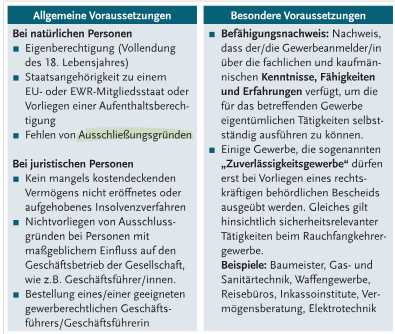

# Einführung

Eine unternehmenerische Tätigkeit ist eine **gewerbliche Tätigkeit**, wenn sie:
- **erlaubt** ist (nicht gegen Gesetze verstößt)
- **selbstständig** ist (auf eigene Rechnung und Gefahr)
- **regelmäßig** ist (wiederholende Handlung)
- **entgeltlich** ist (mit Absicht, Geld zu erzielen)

🫏🌉: *Bob kommt ins Gefängnis, weil er etwas gemacht hat, das nicht **erlaubt** ist. In seiner Zelle sitzt er nur alleine da, also ist er **selbstständig**. Weil er hier einsam ist, weint Bob **regelmäßig**. Da wünscht er sich, seine Tränen wären aus Gold, dann wäre das Weinen wenigstens **entgeltlich**.*

# Voraussetzungen
### Wichtige Voraussetzungen
- 18 Jahre alt
- Staatsbürgerschaft in der EU oder EWR; oder wenn Aufenthaltsberechtigung vorhanden
- Kein Ausschließungsgrund vorhanden
- Vorhandene Kenntnisse, Fähigkeiten, Erfahrung zur Tätigkeit
- "Zuverlässigkeitsgewerbe" benötigen behördlichen Bescheid

🫏🌉: *Im Gefängnis ist Bob **18** geworden. Deswegen wird er vom Jugendgefängnis im mitten von nirgendwo zu ein Normales in der **EU** deportiert, weil die Beamnten keinen mehr Grund sehen, ihn vom Normalen auszuschließen (haben keinen **Aussschließungsgrund**). Aber Bob kennt sich im neuen Gefängnis nicht aus! Ihm fehlen die **Kenntnisse, Fähigkeiten, Erfahrung**. Damit er diese bekommt geht er zur Gefängnisbibliothek und lest ein Buch über **Zuverlässigkeitsbewerbe**, wo steht dass diese einen **behördlichen Bescheid** brauchen (ka mir ist da nichts besseres eingefallen zu dem).*

### Alle Vorraussetzungen

# Gewerbearten

[nicht fertiggestellt weil ich bemerkt habe dass das nicht teil des Stoffs ist; s. Seite 118]