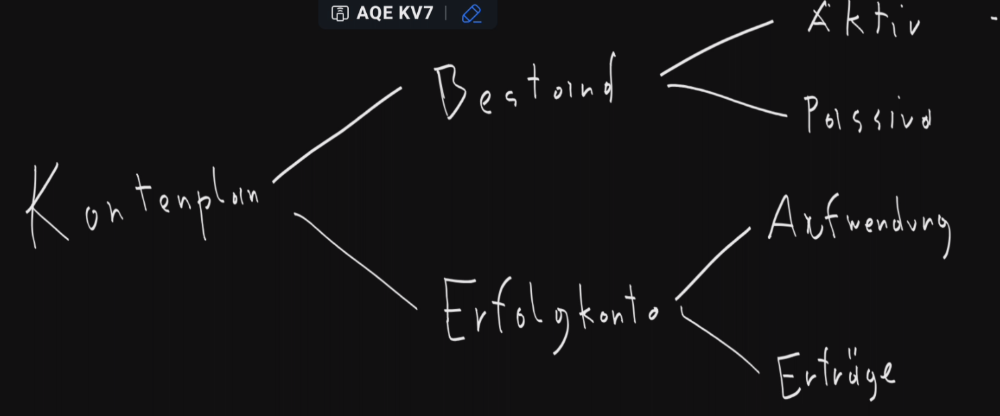
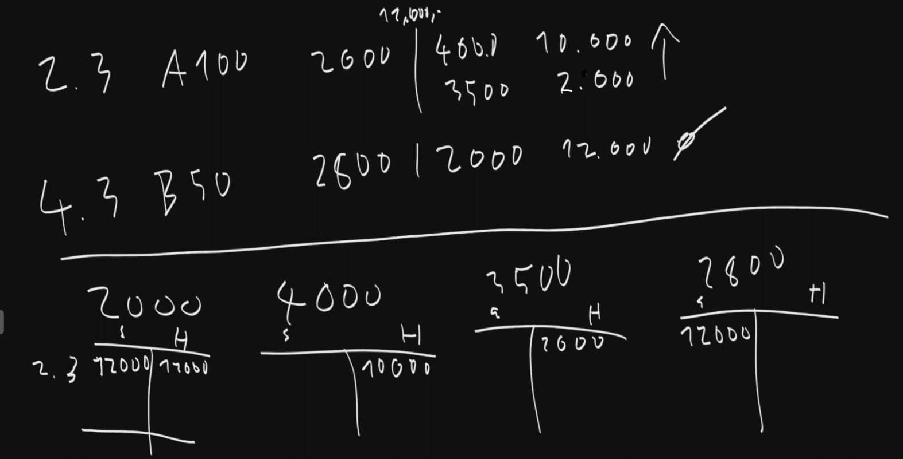

# Bewertungsgrundsätze
- **Vorsichtsprinzip**: Unternehmer darf sich nicht reicher machen als er ist, in der Tendenz nur ärmer.
- **Imparitätisches Realisationsprinzip**: Gewinne werden nur dann erfasst, wenn sie tatsächlich realisiert sind. Nicht realisierte Gewinne dürfen nicht ausgewiesen werden. 
- **Stetigkeitsprinzip**: Bewertungsmethoden müssen konstant angewendet werden.
- **Going-Concern-Prinzip**: Die Bewertung erfolgt unter der Annahme, dass das Unternehmen weitergeführt wird. 

# Bewertungsprinzipien für Vermögensgegenstände
- **Anschaffungskostenprinzip**: Vermögengsgegenstände werden zu den tatsächlichen Kosten bewertet, die bei der
- **Niederstwertprinzip**: Bei Wertverlusten muss der niedrigere Wert angesetzt werden.
- **Wertaufholungsgebot**:

# Bewertungsprinzipien für Vermögensgegenstände
- **Höchstwertprinzip**
- **Abzinsung**

# Kassa
- Umfasst Bargeld 
- Zählt zu den **liquiden Mitteln**
- Wichtig für kurzfristige Zahlungen
- Erscheint in der Bilanz unter "Umlaufvermögen"

# Bilanz
## Aktiv
- **Anlagevermögen**
- **Umlaufvermögen**
## Passiv
- **Eigenkapital**
- **Fremdkapital**

# GuV
- **Erträge**
- **Aufwendungen**
- **Ergebnis**: Differenz zwischen Erträge und Aufwendungen

## Aktive Bestandskonten
- Erfassen das Vermögen des Unternehmens
- Soll/Haben

## Passive Bestandskonten
- Erfassen Eigenkapital und Fremdkapital
- Soll/Haben umgekehrt zu aktiv

## Aufwandskosten
- z.B. Personalaufwand, Miete, Lohn
- Soll: Aufwand steigt; Haben: Aufwand verringert sich

## Ertragskonten
- z.B. Umsatzerlöse, Zinserträge
- Haben: Erträge steigen 

# Kontenplan: Grundsätze der Bewertung
- Klar in aktiva, passiva, Erträge, Aufwände gegliedert

## Vorteile des Kontenplans
- Übersichtlichkeit
- Effizienz
- Nachvollziehbarkeit
- Einteilung in Klassen:
  - Klasse 0: Anlagenkonten
  - ..
  - Klasse 6: Personalaufwandn
  - Klasse 7: ABschreibungen und sonstige betriebliche Aufwendungen
  - Klasse 8: Finanzerträge und -aufwendungen
  - Klasse 9: Eigenkapitalkonten und Abschlusskonten

# Buchungskreislauf
Beschreibt den Weg von **Eröffnungsbilanz** $\rightarrow$ **laufende Buchungen** $\rightarrow$ **Schlussbilanz**.

## Schritte
1. **Eröffnungsbilanz**
2. **Laufende Buchungen**
3. **Abschluss der Erfolgskonten**
4. **Abschluss der Bestandskonten**
5. **Schlussbilanz**

## Eröffnungsbilanz
- Übernimmt die Endbestände des letzten Jahres

## Laufende Buchungen
- Erfassung aller Geschäftsvorfälle während des Geschäftsjahres

## Abschluss der Erfolgskonten
- Irgendwas GuV ka

## Schlussbilanz
- Enthält alle Endbestände des Geschäftsjahres

## Prinzip der Bilanzkontinuität
- Schlussbilanz = Eröffnungsbilanz des Folgejahres
- Vergleichbarkeit, Fehlervermeidung, Transparenz
- UGB
- Stetigkeit- & Vorsichtsprinzip

# Merkmale der doppelten Buchhaltung
- Alles was im Soll steht, muss irgendwo im Haben ausgeglichen werden.
- Kann mit der **Kontrollfunktion** kontrolliert werden (Soll=Haben)
- Hauptbücher: **Grundbuch** und **Hauptbuch** (kann aber in Nebenbüchern aufgeteilt werden)
- **Doppelte Gewinnerfassung**: Erfolgt durch GuV, wird mit Eigenkapital verglichen

## Journal - Grundbuch der Buchhaltung
- Geschäftsvorfälle müssen chronologisch aufgeschrieben werden
- Läuft vom **Buchungssystem**, welches die Buchungen u.Ä. chronologisch im Hintergrund mitspeichert
- Hilfreich für Fehlersuche

## Hauptbuch - systematische Ordnung der Buchführung
- Ordnet alle Buchungen aus dem Journal nach **Konten**
- Aktiv/Passiv kommt zuerst, danach Aufwand/Ertrag

## Vorteile & Nachteile der doppelten Buchhaltung
- Vollständige Dokumentation
- Jedoch: Mehr Aufwand

# Wiederhohlung
## Kontenplan

## Journal
Bsp. 
- 2.3.: Kevin kauft was um 10 000,- bei uns ein (20% USt.)
- 4.3.: Kevin zahl diesen Kauf per Banküberweisung.

