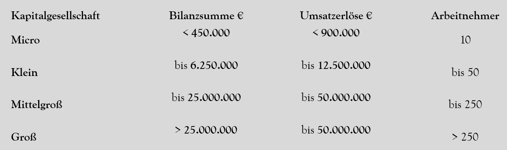
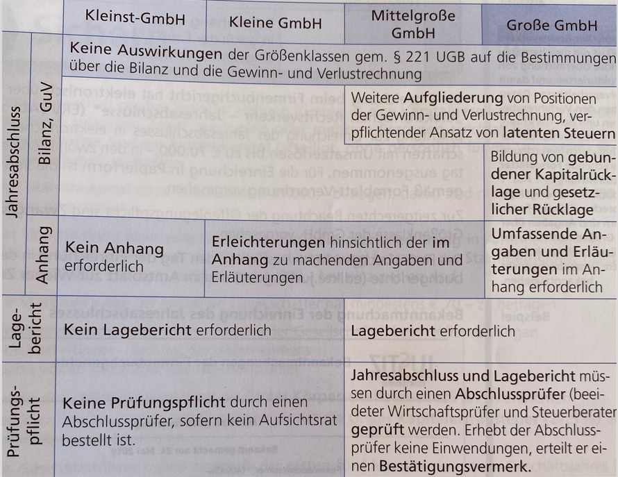
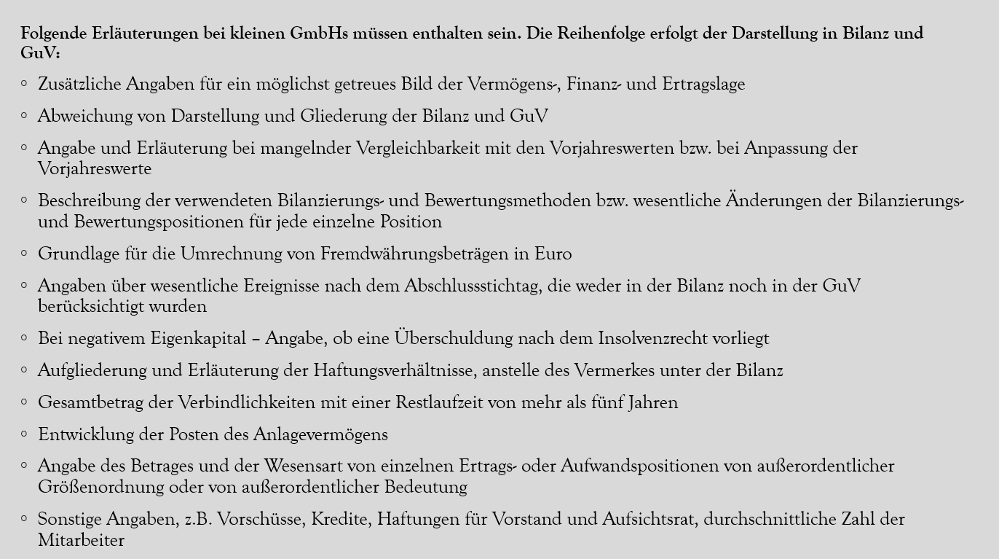

[ Alles was mit ⚠️ markiert ist ist laut ihr besonders wichtig ]

# Inhalt und Gliederung des Jahresabschlusses
1. **Eröffnungsbilanz**: Zu Beginn der Buchführung
2. **Jahresabschluss**: Muss spätestens 9 Monate nach Jahresende vom Vorjahr erstellt werden
3. Besteht aus der **Bilanz** und und **GuV**. Muss vom Unternehmer unterschrieben werden
4. Bei KG: 5 statt 9 Monate, und noch **Lagebericht** und **Corporate-Government-Bericht**
5. Moch kan Schaß jo

|*Erfordert*|Einzelunternehmen, Personengesellschaften|Kapitalgesellschaften|
|-|-|-|
|Bilanz|$\textcolor{lime}{\checkmark}$|$\textcolor{lime}{\checkmark}$|
|GuV|$\textcolor{lime}{\checkmark}$|$\textcolor{lime}{\checkmark}$|
|Anhang|$\textcolor{red}{\times}$|$\textcolor{lime}{\checkmark}$|
|Lagebericht|$\textcolor{red}{\times}$|$\textcolor{lime}{\checkmark}$|

# Größenklassen der Unternehmen
Mind. 2 der 3 Merkmale müssen erfüllt sein:





# ⚠️ Rücklagen, Rückstellungen

## Rücklagen
**Definition:** Gewinne, die das Unternehmen für einen bestimmten Zweck zurücklegt. Teil des **Eigenkapitals**

**Zweck:** Finanzierung von Investitionen, Sicherung von Liquidität, Bildung von Rücklagen für zukünftige Verluste

### Arten
- **Kapitalrücklagen**: Von außen finanziert (z.B. bei Ausgabe von Vorzugsaktien; keine Stimmrechte)
- **Gewinnrücklagen**: Vom Gewinn gebildet

<div></div>

- **Gebundene Rücklagen**: Dürfen nur zur Verlustabdeckung aufgelöst werden (z.B. Agio, Unterschied Nennwert und Verkaufswert der Aktie)
- **Freie Rücklagen**: Dürfen jederzeit aufgelöst werden. 

<div></div>

- **Gesetzliche Rücklagen**: 5% des Jahresüberschusses müssen gebildet werden, bis 10% des Nennkapitals erreicht sind

🫏🌉: "Peter will endlich mal Urlaub machen können und sich auf den **Rücken legen**. Er ist dem Finanzamt jedoch noch das **Kapital** schuldig, was er von **außen** geklaut ("**finanziert**") hat. Gegen dem Finanzamt **Gewinnt** Peter aber nicht! Sie schnappen ihn, und er bekommt Handschellen an**gebunden** (**Agio**! Schreit Peter, weil die Handschellen ihm weh tun). Also wird er in Haft genommen und ist somit nicht mehr **frei**. In seiner Zelle gelingt es ihm, die Tür **offen** zu machen. Er versucht dabei **still** zu bleiben, wird aber trotzdem erwischt! Oje, dass bedeutet weitere **gesetzliche** Probleme!

## Rückstellungen
**Definition:** Verbindlichkeiten, deren Fälligkeit und Höhe noch nicht bekannt sind. Teil des **Fremdkapitals**

**Zweck:** Absicherung von Risiken und ungewissen Verpflichtungen

### Arten
- **Einzelrückstellung**: Für einen bestimmten Geschäftsfall (z.B. Prozesskosten, Steuerberatung, bestimmten Garantiefall)
- **Pauschalrückstellung**: Für allgemeine drohende Verbindlichkeiten (z.B. Abfertigungen, Garantieleistungen, Urlaubsansprüche). Achtung: Sind **nicht gewinnmindernd**

<div></div>

- **Kurzfristige Rückstellungen**: Voraussichtliche Laufzeit \< 1 Jahr
- **Langfristige Rückstellungen**: Voraussichtliche Laufzeit \> 1 Jahr (z.B. Abfertigungen, Urlaubsansprüche, Garantieleistungen)

🫏🌉: "Peter hat sich in der Vergangenheit immer wieder **rück**wärts in die **Stellung** gebracht, um nicht erwischt zu werden. Er hat sich dabei immer **einzelne** Verbindlichkeiten ausgedacht, um nicht aufzufliegen. Doch irgendwann ist er aufgeflogen und muss nun für seine **pauschalen** Verbindlichkeiten aufkommen. Er hat sich dabei immer **kurzfristig** aus der Affäre gezogen, doch jetzt muss er auch für die **langfristigen** Folgen seiner Taten geradestehen."

# ⚠️ Anhang
**Definion:** Hier muss **Bilanz** und **GuV** so erläutert werden, dass sie ein möglichst getreues Bild der Finanzlage des Unternehmens vermitteln. 

**Zweck:** Transparenz und Nachvollziehbarkeit der Jahresabschlussinformationen

 \
*^ nicht sicher ob das wichtig ist, nervig viel text also ich bete einfach nicht 🙏*

# ⚠️ Lagebericht
**Definition:** Hier soll der **Geschäftsverlauf** (inkl. Geschäftsergebnis) und Lage des Unternehmens so dargestellt werden, dass sie ein möglichst getreues Bild der Finanzlage des Unternehmens vermitteln. Auch die wesentlichen **Risiken** und **Ungewissheiten** des Unternehmens sollen hier erläutert werden.

**Ergänzung** des **Jahresabschlusses** durch zusätzliche Informationen. 

Kann durch freiwillige Informationen als **Marketinginstrument** verwendet werden. 

Kleinst-KGs und kleine GmbHs brauchen keinen Lagebericht.

# ⚠️ Offenlegung Jahresbericht
**Jahresabschluss** inkl. Anhang und Lagebericht muss spätestens **9 Monate** nach Jahresende vom Vorjahr beim **Finanzamt** eingereicht werden. Muss **elektronisch** eingereicht werden, außer wenn Jahresumsatz <700k.

Werden in **Urkundensammlung** aufgenommen und sind **online einsehbar** (beim Firmenbuchgericht oder Firmenbuch-DB).

"Das Firmenbuchgericht muss den Tag der Einreichung in der Ediktsdatei der Firmenbuchgerichte und im Amtsblatt der Wiener Zeitung veröffentlichen." ja keine ahnung man ich will nicht mehr

# ⚠️ Imparitätisches Realisationsprinzip
**Definition:** Nicht realisierte Gewinne dürfen nicht in der Bilanz aufscheinen.


z.B. Grundstück: 
```
AW 100,-/m^2  ← Bilanzansatz wegen Anschaffungsprinzip 
                                Verkehrwert 500,-/m^2
Gewinn ist nicht realisiert!
```

Nicht realisierte Verluste **müssen** in der Bilanz aufscheinen: z.B. Rückstellungen (Höhe und Fälligkeit der Verbindlichkeit ist noch nicht bekannt)


