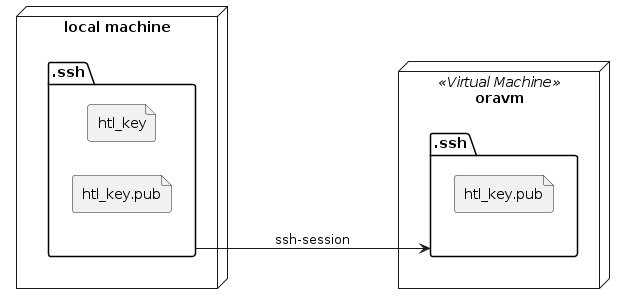

# Verbinden mit SSH

Mit `ssh-keygen` kann man einen public&private key pair erstellen. Der **public key** ist auch auf dem Server selber, während der **private key** versteckt bleiben soll, und nicht geteilt werden soll, da sich jedermann mit den **private key** sich auf dem Server verbinden kann. 

Man kann sich eine `config`-File im `~/.ssh`-Ordner erstellen, wo man den **Host**, den **User** und die **IdentityFile** stellen kann. Mit `ssh [alias]` kann man sich dann verbinden.

# Dateien kopieren

Mithilfe von [FileZilla](https://filezilla-project.org/) können Dateien von und zu dem Server kopiert oder gelöscht werden. Das Protokoll dazu ist **SFTP** (SSH File Transfer Protocol) und hier kann auch das Keypair verwendet werden. 