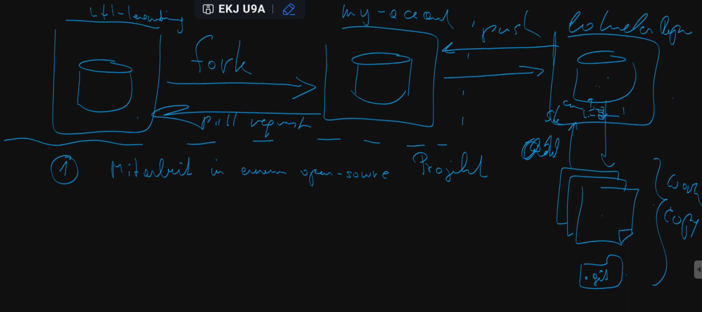

# Einführung
Git ist eine **dezentralisierte Versionierungssoftware**.

Mit `git clone` wird das Repo von GitHub o.Ä. in dein lokales Laufwerk kopiert, und mit `git init` erstellt. 

Im lokalen Repository (auf deinem PC) gibt es eine Working-Copy mit dem `.git`-Folder. Im lokalen Repository kann man alles machen, sei es Staging oder Braching - mit `git push` wird dann alles auf's online Repository gepusht.

# Staging
Mit `git add` kommen Änderungen in die **Staging-Area**. Mit `git commit` kann die Staging-Area committed werden. Die Commits können dann mit `git push` in GitHub o.Ä. gepusht werden. 

Warum überhaupt `git add`? Wenn man mehrere Files geändert hat, kann es gut sein, dass man jeweils für verschiedene Dateien verschiedene Commits machen möchte. Mit `git add` kann man nur die Dateien stagen, die zu dem Commit passen, und dann evntl. noch mehrere Commits für die anderen Dateien machen. 

# Stashing
"stashing" bedeuted auf Englisch "verstecken". Mit `git stash` kann man Dateien vom momentanen Repository verstecken, als wenn man diese Dateien löschen würde. Jedoch kann man mit `git stash apply` diese Dateien dann wieder zurückholen. Dies kann nützlich sein, wenn man lokale Änderungen zurücksetzen will, oder wenn man aus Versehen im falschen Branch gearbeitet hat. 

# Forking

## Use-Cases

1. Mitarbeit in einem open-source Projekt (man forkt ein Repository, dann kann einen Pull-Request auf's Original machen)
2. Ein Teamleiter möchte sämtliche Commits ins Repo prüfen 
3. Eigene Variante erstellen, z.B. MySQL $\rightarrow$ MariaDB

# GitHub Actions

## GitHub Runner

Wenn man eine GitHub Actions-File (`.workflow`) macht, kann man den **GitHub Runner** (gh-runner) nutzen.

Das ist eien virtuelle Maschine, welche ich für ~30 Sekunden pro Deploy in GitHub verwenden kann. Am besten verwendet man hier **Linux**, mit Windows würde es das doppelte und mit MacOS das 10-fache kosten. 

1. Checkout: Das Repo wird direkt ins Root kopiert
2. Compilation: Damit man Class-Files o.Ä. bekommen kann (z.B. `maven compile`); immer Intel (x86)-Architektur (nicht ARM). Mit Docker deployen
3. Dann kommt das Docker-Image auf den Server und die gh-runner VM wird gelöscht 