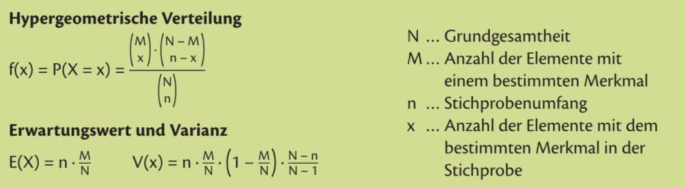

# Binomialverteilung

Wenn es zwei Ausgänge gibt, und diese mit Zurücklegen sind (Wahrscheinlichkeit verändert sich nicht)

**Beispiel:** 3 mal würfeln, genau zwei 6er: $3\cdot (\frac{1}{6})^2\cdot(\frac{5}{6})^1$

20 mal würfeln, genau fünf 6er: 20 über 5 Möglichkeiten (Kombinatorik)

**Allgemein:** $n$ Versuche, $k$ Erfolge, $p$ WSK für Erfolg
$$
\binom{n}{k}=\frac{n!}{k!\cdot(n-k)!}
$$
$$
\binom{n}{k}\cdot p^k\cdot (1-p)^{n-k}
$$

Hier: **genau** $k$ Erfolge (nicht mind, nicht max, genau)

# Hypergeometrische Verteilung
$\Rarr$ Ziehen **ohne** Zurücklegen

