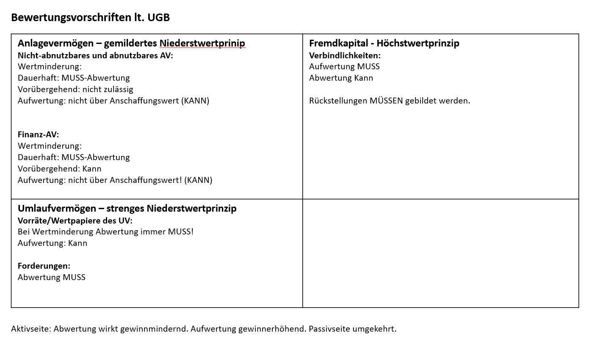

**Vorsichtsprinzip**: Das Unternehmen darf sich nicht reicher machen, als er ist, in der Tendenz sogar ärmer. Grund: Gläubigerschutz (damit hier keine Täuschung vor sich gehen kann).

**UGB**: Unternehmensgesetzbuch, schreibt vor, wie wir unser Unternehmen bewerten müssen. Genaue Vorschriften müssen befolgt werden. 

**Aktien**: Als Privatperson mit späterer Verkaufsabsicht ist es Umlaufvermögen, da es sich ständig verändert. Aber bei Beteiligung an das Unternehmen ist es Anlagevermögen. Also: Es geht um den Zweck.

**Umlaufvermögen und Anlagevermögen**: Niederstwertprinzip (bei AV das gemildete und beim UV das strenge), ist abgeleitet vom Vorsichtsprinzip.

**Abnutzbares AV**: Ist diese Wertminderung dauerhaft oder verübergehend? z.B. Das Grundstück: Wird grundsätzlich nicht abgeschrieben, kann sich beim Preis trotzdem etwas verändern; man **darf** (muss aber trotzdem nicht) aber nur abwerten, wenn diese Preisveränderung voraussichtlich dauerhaft ist. Abwertung wirkt gewinnmindernd $\darr$. 

Wann ist höherer Gewinn bester? Wenn man Investoren oder Kredite sucht. Man muss dann aber auch in Kauf nehmen, dass man höhere Steuern zahlt. Ist aber natürlich nur im Rahmen der Gesetzesmöglichkeit erlaubt. 

Wichtig: Wir dürfen in der Bilanzierung niemals über dem Anschaffungswert gehen. 

**Finanzanlagevermögen**: Man muss immer abwerten, egal ob's dauerhaft ist oder nicht. 

Wenn man niedrigen Gewinn möchte und deswegen weniger Steuern zahlen muss, dann eher abwerten. 

**Abwertung**: Gewinnminderung $\darr$

**Aufwertung**: Gewinnerhöhend $\uarr$. Man darf niemals über den Anschaffungswert aufwerten.

**Umlaufvermögen**: Es muss abgewertet werden, kann aber teilweise wider aufgewertet werden

**Forderungen**: Müssen auch abgewertet werden

**Fremdkapital**: Es muss aufgewertet werden, aber man kann teilweise wider abwerten

