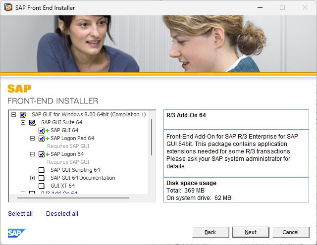

1. FileZilla/WinSCP installieren und auf `edufs.edu.htl-leonding.ac.at` mittels SFTP mit den Schul-Credentials verbinden
2. `/group/all/5chif/SAP` downloaden. Wird hier mit `SAP/` angegeben
3. OpenVPN installieren: https://openvpn.net/community/
4. Die zwei Dateien von `SAP/vpn` in `%USERPROFILE%\OpenVPN\config` kopieren
5. Bei Windows unten rechts den Pfeil drücken
6. In der Ecke oben links sollte ein Computersymbol sein. Das rechtsklicken
7. "Connect"
8. Nutzername: `htlsap121` wobei 121 mit deiner Katalognummer addiert wird 
9.  Für Passwort mich fragen
10. Jetzt sollte dieses Computersymbol grün sein
11. `SAP/SAPGUI8.0/PRES1/GUI/Windows/Win64/SapGui64Setup.exe` doppelklicken
12. Folgende Hakerl ansetzen: 