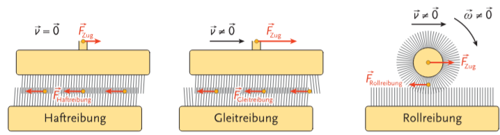

# Kinematik

$\Rarr$ Beziehungen zwischen **Weg** ($\vec{s}$), **Geschwindigkeit** ($\vec{v}$) und **Beschleunigung** ($\vec{a}$)

**Bezugssystem**: Geschwindigkeiten und ähnliche Größen sind immer **relativ** to einem Bezugssystem, z.B. die ruhende Umgebung auf der Erde oder ein anderes bewegendes Objekt. 

- **Translation** (Schiebung): Fortschreitende Bewegung
- **Rotation** (Drehung): Drehbewegung

## Weg, Geschwindigkeit, Beschleunigung

Die Formeln:
$$
\vec{s}=\vec{v} \cdot t 
$$
$$
\vec{v}=\vec{a}\cdot t 
$$

sind eigentlich so alleinestehend nicht das gesamte Bild, da $\vec{s}(t)$, $\vec{v}(t)$ und manchmal auch $\vec{a}(t)$ (meist aber ein konstanter Wert) Funktionen sind. Deswegen, um den Wert an einem spezifischen Zeitpunkt zu erhalten, muss der Durchschnittswert verwendet werden (Integral zum Punkt gibt gesamte Summe, $\div t$ gibt Durchschnitt): 

$$
\vec{s}(t)=\frac{\int_0^t \vec{v}(t) \ dt}{t} \cdot t = \int_0^t \vec{v}(t) \ dt
$$
$$
\vec{v}(t)=\frac{\int_0^t \vec{a}(t) \ dt}{t} \cdot t = \int_0^t \vec{a}(t) \ dt
$$

d.H. dass der Weg abgeleitet die Geschwindigkeit abgeleitet die Beschleunigung ist:
$$  
\vec{a}\ (t) = \vec{v}\ '(t) = \vec{s}\ ''(t)
$$

Die Einheiten können wiefolgt hergeleitet werden:

$$
[\vec{s}] \quad \ldots \text{m}
$$
$$
[\vec{s}(t)=\vec{v}\cdot t]\quad \ldots \text{m}=\frac{\text{m}}{\text{s}} \cdot \text{s}
$$
$$
[\vec{v}(t)=\vec{a}\cdot t]\quad \ldots \frac{\text{m}}{\text{s}}=\frac{m}{s^2}\cdot s
$$

### Übung: Herleitung zeitfreie Gleichung

$$
\vec{a}(t) = \vec{a} \quad \text{(konstant)}
$$
$$
\vec{v}(t) = \int \vec{a}(t)\space dt = \int x\space dt = \vec{a}\cdot t
$$
$$
\vec{s}(t) = \int\vec{v}(t)\space dt = \int (\vec{a}\cdot t) \space dt =  \frac{\vec{a}\cdot t^2}{2}
$$

## Freier Fall
Eigentlich einfach herleitbar von Weg, Geschwindigkeit, Beschleunigung, also schreibe ich hier nicht alle Formeln auf. 

Wichtig ist aber die **Erdbeschleunigung**:
$$
g \approx 9.81\frac{\text{m}}{\text{s}^2}
$$

Diese ist leicht abhängig vom Ort auf der Erde (Aufgrund der Zentrifugalkraft an den Polen höher als am Äquator).

### Übung: S38 B1.1.11: Zehnmeterturm

**Angabe:**

Wir lassen eine Kugel von einem Zehnmeterturm fallen. Wie lange ist diese in der Luft, bevor sie auf den Boden landet?

**Lösung:**

Gegeben:

$$
g = 9.81\frac{\text{m}}{\text{s}^2}
$$

$$
h = 10\text{m}
$$

$$
\vec{s}(t) = 0
$$

Gesucht:
$$
t =\ ?
$$

Gleichungen aufsetzen:

$$
\vec{a}(t) = g
$$

$$
\vec{v}(t) = \int \vec{a}(t)\ dt = g \cdot t
$$

$$
\vec{s}(t) = h - \int \vec{v}(t)\ dt=h-\frac{g\cdot t^2}{2}
$$


Gleichsetzen:
$$
h-\frac{g\cdot t^2}{2} = 0\quad/+\frac{g\cdot t^2}{2}
$$
Umformen:
$$
h = \frac{g\cdot t^2}{2} \quad /\times 2 \quad /\div g
$$
$$
\frac{2h}{g}=t^2 \quad / \sqrt\ldots
$$
$$
\sqrt{\frac{2h}{g}}=t
$$

Einsetzen:
$$
t=\sqrt{\frac{2\cdot10\text{m}}{9.81\frac{\text{m}}{\text{s}^2} }}=\sqrt{\frac{2\cdot10}{9.81}s^2}=\sqrt{\frac{20}{9.81}}s
$$
Ausrechnen:
```
sqrt(20/9.81) =1.4278431229270645
```

Lösung:
$$
t \approx 1.4278
$$

## Wurf

Ein schiefer Wurf mit einen Winkel $\alpha$ kann mittels Vektorrechnung und/oder Abspaltung in x (horizontal) und y (vertikal) Werte berechnet werden. Da in Polarkoordinatenform der Winkel von rechts aus gegen den Uhrzeigensinn verläuft, beschreibt der Cosinus die x-Komponente und der Sinus die y-Komponente:

$$
\vec{v}(t)\cdot\cos(\alpha)=\vec{v}_x(t)
$$
$$
\vec{v}(t)\cdot\sin(\alpha)=\vec{v}_y(t)
$$

Hier wird nur $\vec{v}_y$ von $g$ beeinflusst.

## Rotation

Ähnlich zu Translation aber mit anderen Symbolen:

|T Name|T Symbol|T Einheit||R Name|R Symbol|R Einheit|
|-|-|-|-|-|-|-|
|Weg|$\vec{s}$|$\text{m}$||Drehwinkel|$\varphi$|$\text{rad}$|
|Geschwindigkeit|$\vec{v}$|$\frac{\text{m}}{\text{s}}$||Winkelgeschwindigkeit|$\omega$|$\frac{\text{rad}}{\text{s}}$|
|Beschleunigung|$\vec{a}$|$\frac{\text{m}}{\text{s}^2}$||Winkelbeschleunigung|$\alpha$|$\frac{\text{rad}}{\text{s}^2}$|

Zusätzlich kann aber der Drehwinkel aus Bogenlänge und Radius geformt werden:

$$
\varphi = \frac{b}{r}
$$

Folgendes trifft für Änderungen zu:

$$
\frac{\Delta \varphi}{\Delta t}=\omega
$$
$$
\frac{\Delta \omega}{\Delta t}=\alpha
$$

Die Frequenz und Periodendauer:
$$
\text{Frequenz } f = \frac{\text{Anzahl der periodischen Vorgänge}}{\text{Dazu benötigte Zeit}}
$$
$$
[f] = \text{Hz} \quad \text{(Hertz)}
$$
$$
\text{Periodendauer } T = \frac{1}{f}
$$
$$
[T] = s
$$

# Dynamik

## Newtonische Gesetze bzw. Axiome

1. **Gleichförmige Bewegung außer bei Kraftauswirkung**: Jeder Körper verharrt im Zustand der Ruhe oder der gleichförmigen geradlinigen Bewegung, solange keine Kraft auf ihn wirkt. Wird auch "**Trägheitssatz**" genannt.
2. **Beschleunigung proportional zur Kraft**: Die Beschleunigung eines Körpers ist proportional zu der auf ihn wirkenden Kraft. Es gilt: $\vec{F}=m\cdot\vec{a}$
3. **Gleich große entgegengesetze Kräfte bei Kollision**: Wirkt ein Körper mit einer Kraft $\vec{F}_{1\rarr2}$ auf einen zweiten, so wirkt dieser mit einer gleich großen entgegengesetzten Kraft auf den ersten Körper zurück. Es gilt: $\vec{F}_{1\rarr2}=-\vec{F}_{2\rarr1}$. Wird auch "**Wechselwirkungs-**" bzw. "**Reaktionsprinzip**"" genannt. 

Diese gelten nur in einem ausgewählten Bezugssystem und nicht gleichzeitig in zwei zueinander beschleunigten. Bezugssysteme, wo diese Gesetze gelten, heißen **Inertialsysteme**.


## Grundgesetze der Dynamik

Kraft $\vec{F}$ ist gleich Masse mal Beschleunigung:

$$
\vec{F} = m \cdot \vec{a}
$$

$$
[F] = [m]\cdot[a]= \frac{\text{kg} \cdot \text{m}}{\text{s}^2} = \text{N} \quad \text{(Newton)}
$$

Ähnlich wie die Geschwindigkeit $\vec{v}$ das Integral der Beschleunigung $\vec{a}$ ist, ist der Impuls $\vec{p}$ das Integral der Kraft $\vec{F}$:
$$
\vec{p}(t)=\int_0^t \vec{F}(T)\ dt
$$

Impuls $\vec{p}$ ist gleich Masse mal Geschwindigkeit:

$$
\vec{p}=m\cdot\vec{v} 
$$

$$
[p]=[m]\cdot[v]=\frac{\text{kg}\cdot\text{m}}{\text{s}}=\text{N}\cdot\text{s}
$$

**Superpositionsprinzip**: Wirken mehrere Kräfte auf einen einzigen Körper so haben sie die gleiche Wirkung wie eine einzelne Kraft, welche die **Vektorsumme** der Kräfte ist.

Eine Kraft von $1\text{N}$ beschleunigt einen Körper der Masse $1\text{kg}$ mit $1\frac{\text{m}}{\text{s}^2}$.

**Impulserhaltungssatz**: In einem abgeschlossenen System bleibt der Gesamtimpuls konstant. Dies gilt auch für den Drehimpuls.

- **Elastischer Stoß**: Die Summe der kinetischen Energie der Stoßpartner ist konstant. 
- **Inelastischer Stoß**: Ein Teil der kinetischen Energie wird in **innere Energie** umgewandelt. 

**Kraftstoß**: Die Impulsänderung $\Delta\vec{p}$ ist gleich den Kraftstoß $\vec{F}\cdot\Delta t$:
$$
\Delta\vec{p}=\vec{F}\cdot\Delta t
$$

## Masse, Trägheit und Gewicht

Wenn wir zwei Massen ($m_1$ und $m_2$) haben, über sie gegenseitig eine Gravitation (Schwerkraft) aus:

$$
\vec{F}_G=G\cdot\frac{m_1\cdot m_2}{r^2}
$$

Hier ist $G$ die Gravitationskonstante:
$$
G \approx 6.67384 \cdot 10^{-11} \frac{m^3}{kg \cdot s^2}   
$$

diese Kraft ist auch gleich der Masse mal der Fallbeschleunigung:
$$
\vec{F}_G=m\cdot \vec{g}
$$

Die Masse kann man entweder mittels Schwere ("wie stark ist es von der Erde angezogen?") oder der Trägheit ("wie schwer ist es, es in Bewegung zu bringen?") gemessen werden, jedoch in der Praxis fast ausschließlich mit der Schwere.

## Dichte

Die Masse eines Körpers bleibt auch bei Änderung von:
- Aggregatszustand
- Form bzw. Volumen
- äußeren Bedingungen wie Druck oder Temperatur
konstant. 

Die Massendichte (auch als "spezifische Masse" bezeichnet) $\rho$ gleicht $\frac{\text{Masse}}{\text{Volumen}}$:
$$
\rho = \frac{m}{V} \qquad [\rho]=\left[\frac{\text{kg}}{\text{m}^3}\right]
$$

## Federkraft

**Federkraft** (Gesetz von Hooke): Die elastische Dehnung $\Delta x$ einer Schraubenfeder ist proportional der verformenden Kraft $F$.
$$
\vec{F} = D \cdot \Delta x
$$

Die Proportionalitätskonstante $D$ heißt **Federkonstante** oder **Richtgröße** (je größer, desto "härter" ist die Feder). Die Einheit:
$$
[D] = \frac{[F]}{[\Delta x]} = \frac{\text{N}}{\text{m} }
$$


## Reibungskräfte

- **Äußere Reibung**: An den Außenflächen von Festkörpern
- **Innere Reibung**: Tritt zwischen Fluidteilchen (Flüssigkeiten, Gase, Dämpfe, etc.) auf
  
**Größenordnung**: $F_\text{Haftreibung} > F_\text{Gleitreibung} > F_\text{Rollreibung}$



- **Haftreibung** (Ruhreibung): Gegensätzlich zur wirkenden Kraft, bis ein maximaler material- und oberflächenabhängiger Wert überschreitet wird. Dann setzt die Gleit- bzw. Rollreibung ein. 
- **Gleit**- und **Rollreibung**: Versucht, die Bewegung zwischen Körpern zu verzögern, jedoch bewegen sich beide Körper trotzdem relativ zu einander. 

**Reibungskraft** (Gesetz von Coulomb) ist der Verschieberichtung entgegengerichtet, und proportional der Normalkraft $\vec{F}_N$ auf die Berührungsfläche:

$$
\vec{F}_\text{Reibung}=\mu\cdot F_N
$$

wobei $\mu$ die dimensionslose **Reibungszahl** bzw. **Reibbeiwert** ist:
$$
\mu=\frac{F_\text{Reibung}}{F_N}
$$

## Trägheitskräfte

In einem mit $\vec{a}$ beschleunigten System tritt eine Trägheitskraft $\vec{F}_T$ auf, welche entgegengerichtet zur Beschleunigung ist:

$$
\vec{F}_T = -m \cdot \vec{a}
$$

## Rotation

**Zentripetalbeschleunigung** (Beschleunigung am Einheitskreis): 
$$
\vec{a}_\text{Zp}=\frac{\Delta v}{\Delta t}=\frac{v^2}{r}
$$

**Zentripetalkraft** ist einfach wieder $m\cdot\vec{a}$:
$$
\vec{F}_\text{Zp}=m\cdot \vec{a}
$$

**Zentrifugalkraft** bzw. Fliehkraft: 
$$
\vec{F}_\text{Zf}=m\cdot \omega^2 \cdot r=m\cdot\frac{v^2}{r}
$$

Zentrifugalkraft wird genutzt in:
- Zentrifugen (zur Stofftrennung)
- Kreiselpumpen 
- Schwerkraftaufhebung der ISS

**Corioliskraft** (wenn sich ein Körper mit Masse $m$ in einem mit $\omega$ rotierenden System bewegt, wirkt die Corioliskraft $F_\text{Cor}$, wobei $\vec{v}_r$ die Relativgeschwindigkeit des Körpers auf das rotierende System und $\beta$ der Winkel zwischen $\vec{\omega}$ und $\vec{v}_r$ ist):
$$
F_\text{Cor}=2\cdot m\cdot \omega\cdot v_r\cdot \sin\beta
$$

## Drehmoment, Trägheitsmoment und Drehimpuls


|T Name|T Symbol|T Einheit||R Name|R Symbol|R Einheit|
|-|-|-|-|-|-|-|
|Masse|$m$|$\text{kg}$||Trägheitsmoment|$J$|$\text{kg}\cdot\text{m}^2$|
|Kraft|$\vec{F}$|$\text{N}$||Drehmoment|$\vec{M}$|$\text{N}\cdot\text{m}$|
|Impuls|$\vec{p}$|$\text{N}\cdot\text{s}$||Drehimpuls|$\vec{L}$|$\text{N}\cdot\text{m}\cdot\text{s}$|

**Trägheitsmoment**: Gibt Widerstand gegen eine Winkelbeschleunigung $\alpha$ an.


**Drehmoment**: Wirkt eine Kraft $\vec{F}$ im Abstand $r$ auf eine Drehaxe, so ist das Drehmoment:
$$
\vec{M} = \vec{r}\times\vec{F}
$$
Für den Betrag $M$ mit einem Winkels $\varphi$ gilt:
$$
M = F \cdot r \cdot \sin(\varphi)
$$


**Drehimpuls**: Ist zu Drehmoment wie Impuls ist zu Kraft. 

Ähnlich wie beim Drehmoment:
$$
\vec{L} = \vec{r}\times \vec{p} \\
L = p\cdot r \cdot \sin(\varphi)
$$

Ansonsten sind die Rechenregeln gleich wie bei der Translation, dazu einfach die obige Tabelle beachten. 

# Statik

**Hebelgesetz:**
$$
F_1 \cdot r_1 = F_2 \cdot r_2
$$


**Gleichgewichtsbedingung**: Die auf einem starren Körper wirkengenden Kräfte verschwinden wenn die Summe aller wirkenden Kräfte bzw. Drehmomente $0$ ergibt. 


**Getriebe**: Übersetzt Drehmomente proportional und Drehzahlen indirekt proportional zur Anzahl der Zähne $Z$ (die Tangentialkräfte zwischen den Zahnrädern sind konstant):
$$
\frac{M_1}{M_2}=\frac{r_1}{r_2}=\frac{Z_1}{Z_2}=\frac{\omega_2}{\omega_1}=\frac{n_2}{n_1}
$$


## Hydrostatik & Aerostatik

**Druck $p$:**
$$
p = \frac{F_N}{A}
$$
Einheit:
$$
[p] = \left[\frac{F}{A}\right]=\frac{\text{N}}{\text{m}^2}=\ \text{Pa} \quad \text{(Pascal)}
$$

**Schweredruck:** Bei Fluiden erhöht sich der Druck mit der Tiefe, Dichte und Gravitationsbeschleunigung ($p=\frac{m\cdot g}{A}$).

## Elastostatik

**Mechanische Spannung $\sigma$**: Druck, der auf einem Körper auswirkt. 
$$
\sigma = \frac{F}{A}
$$
$$
[\sigma]= \text{Pa}
$$

**Dehnung $\varepsilon$**: Längenänderung $\Delta l$ im Verhältnis zur ursprünglichen Länge $l$
$$
\varepsilon = \frac{\Delta l}{l} \qquad [\varepsilon]=1
$$

**Elastitätsmodul**: Hookesches Gesetz für die Spannung (Dehnung ist direkt proportional zur Spannung):
$$
\sigma = E \cdot \varepsilon \qquad [E]= \frac{1\ \text{Pa}}{1}
$$


**Schubwinkel $\gamma$**, **Schubspannung $\tau$**, **Schub- oder Torsionsmodul $G$**: Hookesches Gesetz für die Scherung (Schubwinkel ist direkt proportional zur Schubspannung)
$$
\tau = G \cdot \gamma \qquad [G]=\left[\frac{\tau}{\gamma}\right]= \frac{1\ \text{Pa}}{1}
$$

# Energie, Leistung und Wirkungsgrad

**Arbeit $W$** (Skalarprodukt beachten!):
$$
W = \vec{F} \cdot \vec{s}
$$
$$
[W] = [F] \cdot [s] = \text{N} \cdot \text{m}=\text{J}\text{ (Joule)}
$$

Die Arbeit ist auch gleich der jeweiligen Energie. 

**Arbeitsformen:**
- **Hubarbeit $W_\text{Hub}$**: Die Arbeit um einen Körper mit einer konstanten Kraft um eine Höhe anheben. Die verrichtete Hubarbeit ist im Körper als **potenzielle Energie** ($E_\text{pot}$) gespeichert. 
- **Dehnungsarbeit $W_\text{Dehn}$**: Hier ist $D$ die Federkonstante. Diese Arbeit wird als **elastische Energie** ($E_\text{el}$) gespeichert. 
- **Beschleunigungsarbeit $W_\text{a}$**: Wird ein Körper körper aus dem Stillstand beschleunigt, ist dazu Beschleunigungsarbeit notwending. Diese wird in **kinetische Energie** ($E_\text{kin}$) gespeichert. 
- **Reibungsarbeit $W_\text{R}$**: Die Kraft soll der Reibungskraft entsprechen ($F_N \cdot \mu$ wo $\mu$ dem Reibungskoeffizienten entspricht). Diese wird in **innere Energie** ($U$) gespeichert. 
- **Rotationsarbeit $W_\text{Rot}$**: Wieder mal das selbe wie bei der Translation nur mit den Symbolen der Rotation ($M \cdot \varphi$). Wird in **Rotationsenergie** ($E_\text{Rot}$) gespeichert. 

**Erhaltung der Energie:** Ein System heißt "abgeschlossen" wenn die Gesamtenergie ($E_\text{ges}$) immer gleichbleibend ist. Energieformen können jedoch umgewandelt werden. Die Erhaltung der Energie ist in irgendeiner Art und Weise immer gegeben (bis auf astrophysische Ausnahmen? Rotverschiebung wegen Ausdehnung vom Universum??). Falls das System nicht abgeschlossen ist die Änderung der Gesamtenergie gleich der Arbeit der äußeren Kräfte.

**Mittlere Leistung:**
$$
\overline{P} = \frac{\Delta W}{\Delta t} \qquad [\overline{P}]=\frac{J}{s}=\text{W} \quad \text{(Watt)}
$$

**Wirkungsgrad**: Verhältnis von genutzter zu zugeführter Arbeit:
$$
\eta = \frac{W_\text{Nutz}}{W_\text{zu}}=\frac{P_\text{Nutz}}{P_\text{zu}} 
$$
Beispiel: Eine alte Glühbirne hat einen Wirkungsgrad von $\approx 5\%$ (da der Großteil der Energie in Wärme verloren wird), während eine LED einen Wirkungsgrad von $\approx 50\%$ hat.

### Übung: S108 B1.4.03
**Angabe**: Welche Beschleunigungsarbeit ist nötig, um einen Formel-1-Wagen mit $m=1t$ und auf $100\frac{m}{s}$ zu beschleunigen?

**Lösung:**

Gegeben ist:
$$
m=1000\text{kg} \qquad v(t)=100\frac{m}{s}
$$

Gesucht ist:
$$
W_a =\ ?
$$

Aufstellen der Formeln:
$$
W_a = F_a \cdot s(t) \qquad F_a=m\cdot a
$$
$$
v(t) = a\cdot t \qquad a=\frac{v(t)}{t}
$$
$$
s(t) = \int_0^t v\ dt = \frac{a\cdot t^2}{2}
$$
> 500. Zeile in der Datei "2 Mechanik.md". i wü nimma :(

Zusammensetzen:
$$
W_a=m\cdot a\cdot s(t)= m\cdot a \cdot \frac{a\cdot t^2}{2}=m\cdot a^2 \cdot \frac{t^2}{2}=m\cdot \frac{v(t)^2}{t^2} \cdot \frac{t^2}{2}=m\cdot\frac{v(t)^2}{2}
$$
Einsetzen:
$$
W_a=m\cdot \frac{v(t)^2}{2}=1000\text{kg}\cdot\frac{10000\text{m}^2\text{s}^{-2}}{2}=1000\cdot 5000\ \text{J}=5\text{MJ}
$$

# Gravitation

**Geozentrisches Weltbild**: Bis 16. Jh. Gedanke: Die Erde steht im Mittelpunkt des Universum, und die Himmelskörper bewegen sich auf kreisförmigen Umlaufbahnen um die Erde. 

**Heliozentrisches Weltbild**: Die Sonne ist das Mittelpunkt des Universums, es bewegen sich alle Planeten um die Sonne und die Erde dreht sich einmal am Tag um sich selbst. 

**Keplersche Gesetze** (ehemalige Haus von ihm ist in der Nähe vom Linzer Hauptplatz c: ):
1. Planeten bewegen sich auf Ellipsenbahnen, wobei der Brennpunkt die Sonne ist.
2. Der von der Sonne zu einem Planeten gezogene Fahrstrahl überstreicht in der gleichen Zeit die gleiche Fläche, egal wo auf der Ellipse.
3. Umlaufzeiten $T_1$ und $T_2$ verhalten sich wiefolgt zu den großen Halbachsen $a_1$ und $a_2$: $\frac{{T_1}^2}{{T_2}^2}=\frac{{a_1}^3}{{a_2}^3}$

**Bemerkungen dazu:**
- In Sonnenähe bewegt sich ein Planet schneller als in Sonnenferne (aufgrund des Flächensatzes).
- Diese Gesetze gelten auch für andere Planetensysteme und für Monde und Satelliten.

**AE**: "astronomische Einheit", bezeichnet die mittlere Entfernung zw. Erde und Sonne. 

**Bezeichnungen:**
- **Aphel**: Sonnenfernster Punkt einer Planetenbahn
- **Perihel**: Sonnennächster Punkt einer Planetenbahn

**Newtonsches Gravitationsgesetz**: Formel für die Gravitation, schon in Dynamik angesprochen.
