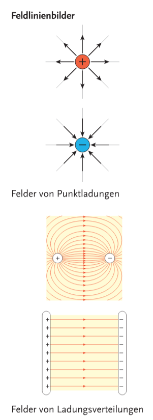

# Elektrostatik

**Reibungselektrizität:** Verschiene Stoffe können durch Reibung aufgeladen werden. Es werden geladene Teilchen von einem Körper abgelöst und vom anderem aufgenommen. Die elektrische Ladung bleibt erhalten. 

**Elektrische Ladung $Q$**: 
$$
[Q]=\text{A}\cdot\text{s}= \text{C}\ \text{(Coulomb)} 
$$

$1\text{C}$ ist eine sehr hohe Ladung, durch Reibung ist z.B. nur $\approx 1\text{nC}$ aufbringbar.

**Elementarladung $e$**: Die kleinste Ladung ist die Ladung des Protons bzw. negativ des Elektrons:
$$
e\approx1.6022\cdot10^{-19}\text{C}
$$

**Coulombsches Gesetz**: Ähnliche Formel zu Gravitation. Zwei Ladungen ($Q_1$, $Q_2$) mit einem Abstand $r$:
$$
F=\frac{1}{4\pi\cdot\varepsilon_0}\cdot\frac{Q_1\cdot Q_2}{r^2}
$$
Hier ist $\varepsilon_0$ die Dielektrizitätskonstante des Vakuums:
$$
\varepsilon_0=8.854\cdot10^{-12} \frac{\text{A}^2\text{s}^2}{\text{N}\text{m}^2}
$$

**Elektrostatisches Feld**: Vektorfeld um die Kraftwirkung einer Ladung $Q$ auf eine sich in der Umgebung befindende Ladung $q$ zu beschreiben. 

**Elektrische Feldstärke $E$**: Kraft $\vec{F}$ auf eine Ladung $q$ in einem bestimmten Punkt pro Größe der Ladung $q$
$$
\text{Feldstärke}=\frac{\text{Kraft}}{\text{Ladung}} \qquad \vec{E}=\frac{\vec{F}}{q} \qquad [E]=\frac{N}{C}
$$

**Richtung der Feldstärke**: Richtung wo's von positiv auf negativ hingeht

**Feldlinien**: Zeigen von positiven Ladungen (Quellen) zu negativen Ladungen (Senken).

**Elektrischer Fluss**: Wie viel Ladung durch eine bestimmte Fläche durchgeht. 
$$
\Phi_E=E\cdot A \qquad [\Phi_E]=\frac{\text{N}\text{m}^2}{\text{C}}
$$

**Grundgleichung der Elektrostatik**: Der Fluss durch eine beliebige Oberfläche hängt nur von der darin eingeschlossenen Ladung ab. 
$$
Q=\varepsilon_0\cdot\Phi_E
$$

## Influenz

**Influenz:** Trennung von Ladungen durch ein elektrisches Feld. 

**Geerdete Körper**: Wenn ein Körper mit der Erde verbunden ist, tritt ein Ladungsausgleich bis zum ungeladenen Zustand auf, da die Erde als sehr großer Leiter betrachtet werden kann.

## Potenzial und Spannung

Zum Verschieben einer Probeladung $q$ im elektrischen Feld wird Arbeit benötigt:
$$
W = \vec{F}\cdot \vec{s}=q\cdot \vec{E}\cdot \vec{s}
$$
Wenn die Probeladung $q$ im Feld einer Punktladung $Q$ von einem Abstand $r_1$ zu einem anderen $r_2$ verschoben wird:
$$
W = \frac{Q\cdot q}{4\pi\varepsilon_0}\cdot (\frac{1}{r_2}-\frac{1}{r_1})
$$

Bei positiven Vorzeichen ist Arbeit zu verrichten, bei negativem kann Arbeit gewonnen werden. 

Die Arbeit hier hängt nur von der Distanz zur Punktladung ab, und nicht vom gewählten Weg.

**Potenzial:**
$$
V=\frac{W}{Q} \qquad [V]=\frac{\text{J}}{\text{C}}=\text{V}\ \text{(Volt)}
$$

**Spannung $U$**: Potenzialdifferenz zwischen zwei Punkten des elektrisches Feldes:
$$
U=\Delta V
$$

**Elektronvolt $eV$**:
$$
eV \approx 1.6022 \cdot 10^{-19}\text{J}
$$

### S134 B2.1.03 Potenzial einer Punktladung
**Angabe**: Was ist das Potenzial einer Punktladung $Q$ mit einem Abstand $r$?

**Lösung:**

Gegeben ist:
$$
Q\qquad r
$$

Gesucht ist:
$$
V
$$

Formeln aufstellen:
$$
W = \frac{Q\cdot q}{4\pi\varepsilon_0}\cdot(\frac{1}{r_2}-\frac{1}{r_1})
$$
$$
V = \frac{W}{q} \qquad W=V\cdot q
$$

Da $r_1 \rarr \infin$:
$$
\lim_{r_1\rarr\infin}\frac{Q\cdot q}{4\pi\varepsilon_0}\cdot(\frac{1}{r_2}-\frac{1}{r_1})=\frac{Q\cdot q}{4\pi\varepsilon_0\cdot r_2}\Rarr\frac{Q\cdot q}{4\pi\varepsilon_0\cdot r}
$$

Gleichsetzen:
$$
V\cdot q=\frac{Q\cdot q}{4\pi\varepsilon_0\cdot r} \quad /\div q
$$
$$
V=\frac{Q}{4\pi\varepsilon_0\cdot r}
$$

## Kondensator

Ein Kondensator ist ein elektrisches Bauelement zur Speicherung von Ladungen. Anders zur Batterie speichert es diese elektrisch (und nicht chemisch)

**Kapazität des Kondensators $C$** (Kondensatorgleichung) hier ist $d$ der Abstand zw. leitenden Platten und $A$ die Fläche der Platten:
$$
C=\frac{Q}{U}=\frac{\varepsilon_0\cdot A}{d}\qquad[C]=\frac{\text{A}\cdot\text{s}}{\text{V}}=\text{F}\ \text{(Farad)}
$$

Füllt man den Zwischenraum der Platten mit einem polarisierbaren nicht leitenden Material, wird die Feldstärke im Kondensator um $\varepsilon_r$ abgeschwächt und ermöglicht dadurch eine höhere Aufladung der Platten:
$$
C=\frac{\varepsilon_0\cdot\varepsilon_r\cdot A}{d}
$$

> mich zaht des nicht mehr, ich bin informatiker und kann mir keine zwanzig kondensatorformeln merken, wenn ich das bei der matura bekomme werd ich was anderes auswählen