# Schwingungen

Sind periodische Vorgänge in der **Zeit**. 

Frequenz $f$ und Periodendauer $T$ sind bereits im Mechanik-Kapitel behandelt worden.

**Harmonische Schwingung**: Eine Schwingung heißt "harmonisch" wenn die momentane Auslenkung $y(t)$ durch folgende Gleichung beschrieben werden kann. Hier ist $r$ die Amplitude:
$$
y(t)=r\cdot \sin(\omega\cdot t+\varphi_0)
$$

**Lineares Kraftgesetz**: Bedingung für harmonische Schwingung: Wenn die Beschleunigung $a_y(t)$ negativ direkt proportional zur Auslenkung $y(t)$ ist:
$$
a_y(t) \propto -y(t)
$$

**Hooksche Kraftgesetz**: Hier ist $D$ die Federkonstante:
$$
D = \left|\frac{\Delta F}{\Delta y}\right| = \omega^2\cdot m 
$$

**Ableitungsregeln**: Für Ableitungen kann $y$ wie der Weg angesehen werden, dh. $\frac{d}{dt}y=v$.

## Federpendel

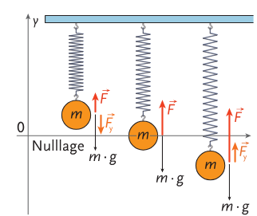

**Periodendauer eines Federpendels**: bzw. allgemein einer harmonischen Schwingung
$$
T=2\pi\sqrt{\frac{m}{D}}
$$

## Drehpendel

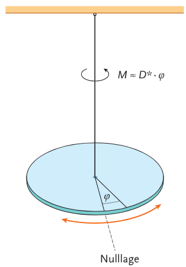

**Periodendauer eines Drehpendels**: genau wie beim Federpendel nur rotierend. Statt der Masse $m$ das Trägheitsmoment $J$, und statt der Richtgröße $D$ die Winkelrichtgröße $D^*$.

## Fadenpendel

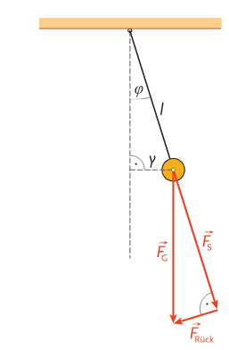

**Periodendauer eines Fadenpendels**: hier ist $l$ die Fadenlänge und $g$ die Erdbeschleunigung
$$
T=2\pi\sqrt{\frac{l}{g}}
$$

## Physisches Pendel

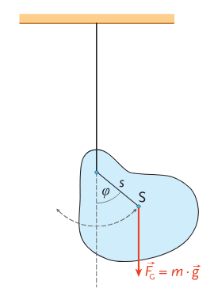

Ein beliebiger Körper, der auf einer Achse ist, führt eine (oft unerwünschte) Schwingung aus.

**Periodendauer eines physischen Pendels**:
$$
T=2\pi\sqrt{\frac{J}{m\cdot g\cdot s}}
$$

## Überlagerung von Schwingungen

Vektorielle Summierung der Einzelschwingungen. 

z.B. wie man hier sehen kann: https://www.desmos.com/calculator/cok7wluvos

Damit kann man auch grundsätzlich jede periodische Funktion annähern. 

**Senkrechte Überlagerung von Schwingungen**: Eine Schwingung ist die x und die andere die y Komponente, und $t$ erhöht sich linear.

z.B. wenn man $x(t)=\sin(t)$ und $y(t)=\sin(2t)$ senkrecht überladet:

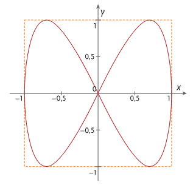

## Erzwungene und gedämpfte Schwingungen

z.B. wenn man ein Fadenpendel schwingen lässt, wird es Aufgrund der Reibung mit der Zeit schwächer, es ist also eine gedämpfte Schwingung. 

**Dämpfungskonstante $\delta$** (Einheit $s^{-1}$) Die Amplitude nimmt exponentiell ab:
$$
y(t)=r_0\cdot e^{-\delta\cdot t}\cdot\sin(\sqrt{{\omega_0}^2-\delta^2}\cdot t+\varphi_0)
$$

**Erzwungene Schwingungen**: Wenn ein schwingungsfähiges System nach einer periodischen äußeren Kraft nach einer Einschwingzeit zum Schwingen gebracht wird. 

**Resonanzdiagramm**: Wenn man die Oszillatoramplitude als Funktion der Frequenz nutzt bekommt man ein Resonanzdiagramm. Je größer die Dämpfung desto flacher ist das Resonanzdiagramm. 

**Resonanzkatastrophe**: Wenn die Amplitude eines Oszillators zu groß wird und dieser dadurch zerstört wird. 

## Kopplung von Pendeln

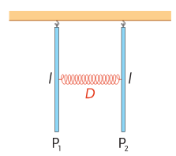

Beide Pendel haben die selbe Amplitude.

Formel:
$$
y_1(t)=2r\cdot\left(\sin\left((\omega_1+\omega_2)\cdot\frac{t}{2}\right)\cdot\cos\left((\omega_1-\omega_2)\cdot\frac{t}{2}\right)\right)
$$
$$
\frac{\omega_1-\omega_2}{2\pi}=f_1-f_2
$$

# Wellen

Hilfreiches Tool: https://cemsim.com/

Sind periodische Vorgänge im Ort und in der Zeit. 

**Wellenvektor $\vec{k}$** wobei **$\vec{x}$** die Position ist:
$$
y(\vec{x}, t)=r\cdot \sin(\omega \cdot t - \vec{k}\cdot\vec{x}) 
$$
$$
|\vec{k}|=k=\frac{\omega}{c}=\frac{2\pi}{\lambda}
$$
$$
[k]=\frac{1}{\text{m}}
$$

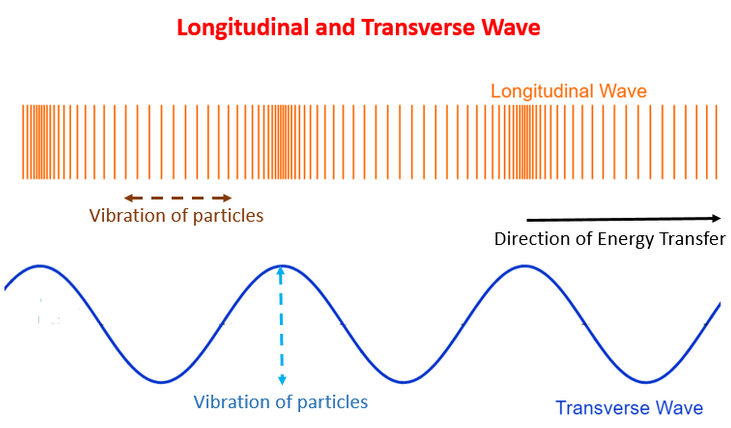

- **Longitudinalwelle** (LW) bzw. Längswelle: Die einzellnen Oszillatoren sind in der Ausbreitungsrichtung der Welle (z.B. Schallwellen)
- **Transversalwelle** (TW) bzw. Querwelle: Die einzelnen Oszillatoren sind quer zur Ausbreitungsrichtung der Welle (z.B. Lichtwellen oder Wasserwellen)
---
- **Lineare Welle**: Breitet sich längs einer Geraden aus ($\reals^1$)
- **Flächenwelle**: Auf einer (Ober-)Fläche ($\reals^2$)
- **Raumwelle**: Im 3D-Raum ($\reals^3$)
---
- **Stoßwelle**: Breitet sich mit einer Störung aus
- **Periodische Welle**: Breitet sich bei einer periodischen Erregung aus
---
- **Wellenzentrum**: Ort des Erregers (wo sich die Welle ausbreitet)
- **Wellenfront**: Alle Punkte der Welle mit gleicher Phasenlage verbinden. In $\reals^2$ ein Kreis, in $\reals^3$ eine Kugel.
- **Wellenvektoren**: Senkrecht auf den Wellenfronten (gibt Ausbreitungsrichtung der Welle an)

**Ausbreitungsgeschwindigkeit $c$**: Anders für Licht (=Lichtgeschwindigkeit), Wasser, Luft (=Schallgeschwindigkeit), etc. 
$$
c=\sqrt{\frac{\text{Kopplungsmaß}}{\text{Trägheitsmaß}}}
$$
$$
c=\sqrt{\frac{\sigma}{\rho}}=\sqrt{\frac{F}{A\cdot\rho}}
$$

Schallgeschwindigkeit (Druck und Temperaturabhängung):
$$
c_\text{Schall}\approx 340\frac{\text{m}}{\text{s}}
$$

Die Lichtgeschwindigkeit ist exakt:
$$
c_\text{Licht}=299\  792\ 458\frac{\text{m}}{\text{s}}
$$

**Wellenlänge $\lambda$:**
$$
[\lambda]=\text{m}
$$

**Prinzip von Huygens:** Eine Welle breitet sich aus, indem von jeden ihrer Punkte eine neue halb-kugelförmige ($n$-Dimensional) **Elementarwelle** ausgeht. Die tatsächliche Welle ergibt sich aus **Interferenz**.

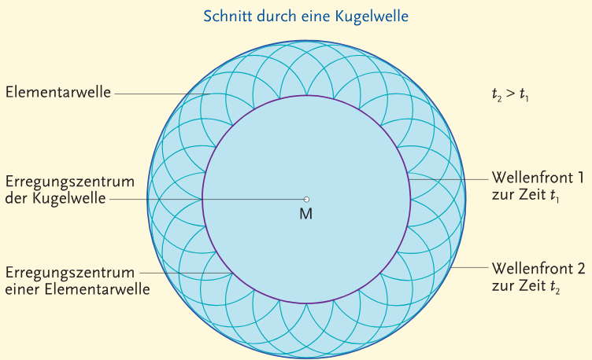

**Reflexionsgesetz**: Einfallswinkel = Reflexionswinkel

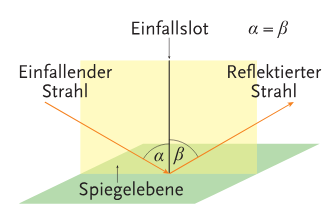

**Brechzahl $n$:**
$$
n=\frac{\text{Vakuumlichtgeschwindigkeit}}{\text{Mediumlichtgeschwindigkeit}}
$$

**Brechungsgesetz von Snellius:**
$$
\frac{\sin\alpha}{\sin\beta}=\frac{c_1}{c_2}=\frac{\lambda_1}{\lambda_2}=\frac{n_2}{n_1}
$$
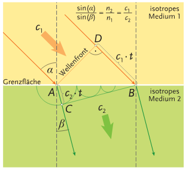

Auch:
$$
\alpha=\arctan\left(\frac{n_2}{n_1}\right)
$$

**Totalreflexion:** Die welle bleibt innerhalb des ersten Mediums und tritt nicht ins andere Medium über. Kann nur passieren, wenn eine Welle von einem dichten in ein dünneres Medium gelangt.

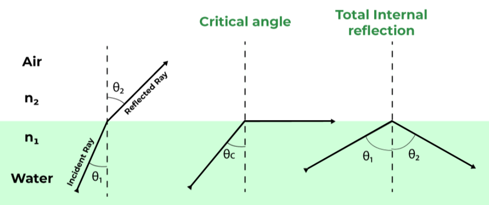

Formel für diesen Grenzwinkel:
$$
\alpha_\text{Grenz}=\arcsin\left(\frac{n_2}{n_1}\right)=\arcsin\left(\frac{c_1}{c_2}\right)=\arcsin\left(\frac{\lambda_1}{\lambda_2}\right)
$$

**Beugung:** Wenn eine Welle in einem Raum eintritt, breitet sich von jeden Punkt in dieser Öffnung eine Elementarwelle laut Huygens aus, und durch Interferenz aller Wellen ergibt sich die tatsächlich beobachtete Welle. 

**Gang- und Phasendifferenz**: Wenn man einen Punkt hat, und die Distanz vom Erreger zum Punkt ein Vielfaches der Wellenlänge hat, kommt es zu einer **Verstärkung** falls dieses Vielfaches gerade ist, ansonsten einer.

Hier sieht man Beugung und Interferenz mit zwei Spalten:
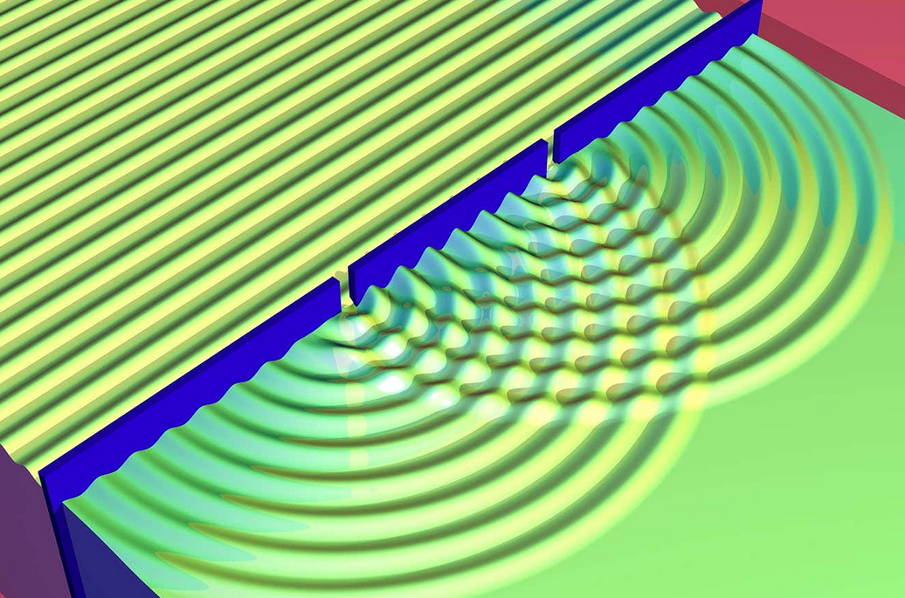

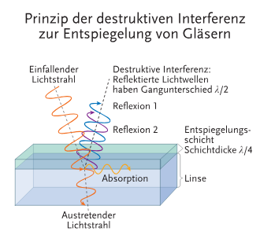
  
Hier sieht man **stehende Wellen**, wenn zwei Wellen mit gleicher Wellenlänge aufeinandertreffen, welche Punkte mit starker Auslenkung und andere mit keiner Auslenkung hat: https://www.desmos.com/calculator/cok7wluvos

# Geometrische und Wellenoptik

- **Licht**: Elektromagnetische Welle die erkennbar für das menschliche Auge ist. Die Wellenlänge ist zwischen $\approx 400\text{nm}$ (rotes Licht) und $\approx 800\text{nm}$ (violettes Licht)
- **Kugelwelle**: Licht breitet sich in der Regel vom Entstehungsort als Kugelwelle in alle Richtungen aus. 
- **Strahlenbündel**: Einzelne Sektoren der Kugelwelle
- **Lichtstrahlen**: Unendlich enge Strahlenbündel
- **Schatten**: Projektion eines Objektes wenn Licht auf ein undurchsichtiges Objekt tritt
- **Geometrische Optik** bzw. Strahlenoptik: Beschreibt den Verlauf von Lichtstrahlen hinreichend genau bei Objekten welche im Vergleich zur Wellenlänge groß sind (z.B. bei sichtbaren Licht viel größer als $1\mu \text{m}$)

- **Dispersion**: Wellengeschwindigkeit in einem Medium hängt von der Wellenlänge ab (so spaltet Prisma das Licht in mehrere Farben)
- **Brechung** bzw. Refraktion: Änderung der Ausbreitungsrichtung einer Welle durch Brechungsindex des Mediums (so schaut der Hintergrund eines Wasserglases oft gespiegelt aus)
- **Beugung** bzw. Diffraktion: Ablenkung von Wellen an einem Hindernis (wenn der Lochdurchmesser deutlich kleiner ist entstehen dahinter Kugelwellen)
- **Reflexion**: Zurückwerfen von Wellen an einer Grenzfläche wo sich Wellenwiderstand oder Brechungsindex ändert (so funktioniert Spiegel und so)
- **Interferenz**: Änderung Amplitude bei Überlagerung von zwei oder mehr wellen (so funktionieren Regenbogenfarben in Ölpfützen oder auf CDs, ist auch essentiell für das Doppelspaltexperiment der Quantenphysik)
- **Polarisation**: Richtung der Schwingung einer Welle, Licht kann z.B. vertikal, horizontal, zirkular oder gar nicht (gemischt) polarisiert sein (so funktioniert z.B. oft 3D-Kino mit 2 Bilder gleichzeitig mit anderen Polarisationen und Brillen mit zwei versch. Polarisationsfiltern)

Wenn Licht auf ein Objekt wie eine Glasplatte trifft, wird immer ein Teil reflektiert, ein anderer absorbiert und ein weiterer geht hindurch (wird transmittiert).

**Reflexionsgrad** $\rho$, **Absorptionsgrad** $\alpha$, **Transmissionsgrad** $\tau$: Welcher Anteil vom Licht wird reflektiert, absorbiert und transmittiert? Insg. immer $=1$.

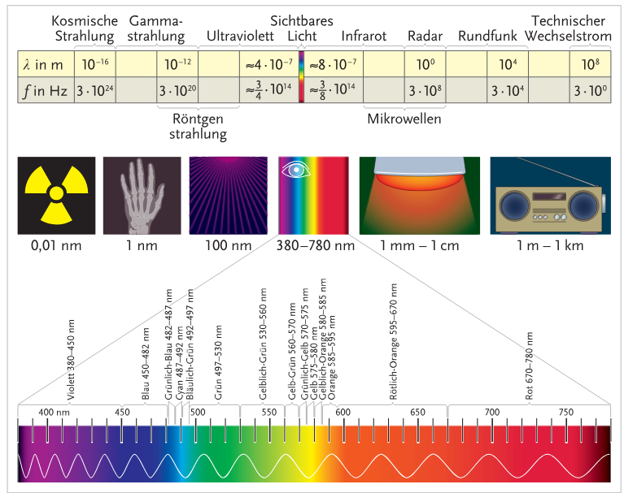

Elektromagnetische Strahlung im ultravioletten Bereich an, ionisierend und schädlich für Lebewesen zu sein. 

**Spektrum**: Intensitätsverteilung einer elektromagnetischen Strahlung in Abhängigkeit der Wellenlänge

Lichtwellen breiten sich zwar scheinbar in anderen Medien langsamer aus, (z.B. in Luft $\approx 1.0003\times$), jedoch ist die Lichtgeschwindigkeit als Informationsträger immer $299\ 729\ 458\frac{\text{m}}{\text{s}}$.

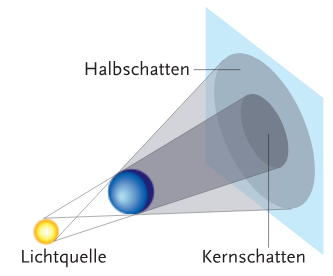

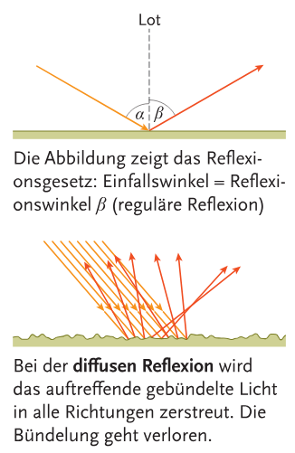

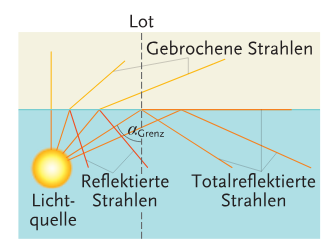
**Anwendung der Totalreflexion**: Glasfaserkabel zur Informationsweitergabe

**Dispersion**: Abhängigkeit der Brechzahl $n$ von der Frequenz, wobei höhere Frequenzen (violletes Licht, Gammastrahlen, etc.) mehr gebrochen als niedrigere (rotes Licht, Mikrowellen, Radiowellen, etc.)

## Spiegel

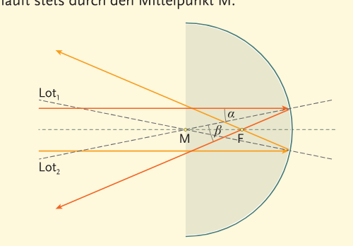

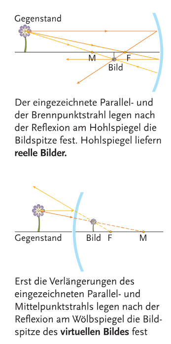

## Linsen

Kameras und Linsen sehr gut und einfach erklärt: https://ciechanow.ski/cameras-and-lenses/

Es gibt **konvexe Linsen** (Sammellinsen) und **konkave Linsen** (Zerstreuungslinsen):

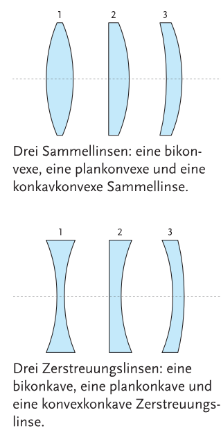

Merkhilfe (danke herr gruber):
> Ist das Mädchen brav, bleibt der Bauch konkav. Hat das Mädchen Sex, wird der Bauch konvex. 

In der Praxis: Oft **Fresnel-** oder **Stufenlinsen**

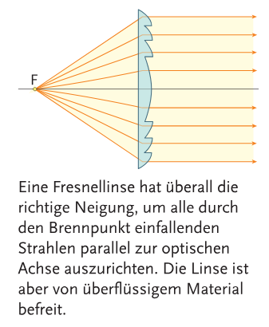

**Brennweite $f$:** (Fokuspunkt)
$$
[f]=\text{m}
$$

**Brechkraft $D$:**
$$
D=\frac{1}{f} \qquad [D]=\text{m}^{-1}=\text{dpt}\ \text{(Dioptrie)}
$$

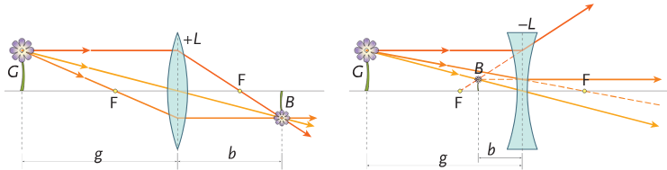

Hier:

|Name|Symbol|
|-|-|
|Brennweite|f|
|Gegenstandsgröße|G|
|Gegenstandsweite|g|
|Bildgröße|B|
|Bildweite|b|
|Vergrößerung|v|

**Linsengleichung:**
$$
\frac{1}{f}=\frac{1}{g}+\frac{1}{b}
$$
**Vergrößerung:**
$$
v=\frac{B}{G}=\frac{b}{g}
$$
$$
v < 0;\ b>0?\qquad \text{reell; umgekehrtes Bild}\\
v > 0;\ b<0?\qquad \text{virtuell; aufrechtes Bild}
$$

## Optische Instrumente

**Sehwinkel**: Winkel, unter dem eine lineare Ausdehnung eines Objektes in bestimmter Entfernung erscheint. 

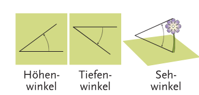

**Lupe**: Konvexlinse kleiner Brennweite

**Vergrößerung $v$**: Hier ist $\alpha_V$ der Sehwinkel mit optischen Instrument und $\alpha$ ohne
$$
v=\frac{\tan\alpha_V}{\tan\alpha}
$$

**Mikroskop:**

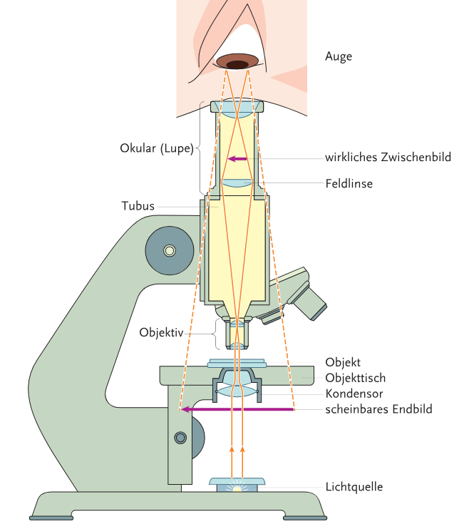

- **Objektiv**: Dem Objekt zugewandte Linse
- **Okular**: Die andere
- **Tubuslänge**: Abstand der inneren Brennpunkte 

**Auflösungsvermögen**: Kleinster noch wahrnehmbarer Abstand zweier Punktförmiger Objekte. 

**Fernrohr:**

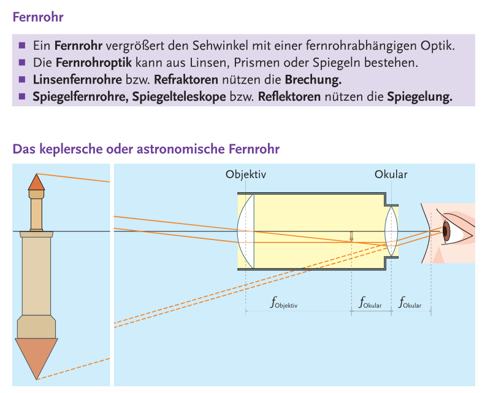

$$
v_\text{Fernrohr}=\frac{f_\text{Objektiv}}{f_\text{Okular}}
$$

**Kamera:**

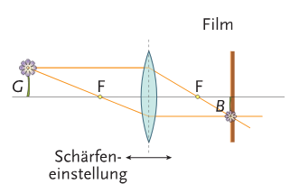

**Projektor:**

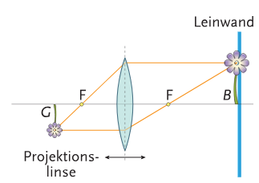

**Auge:**

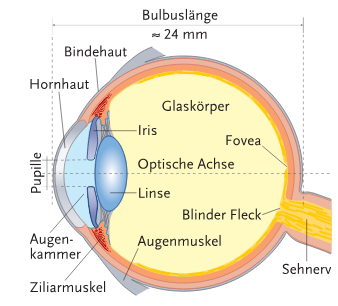

- **kurzsichtig** (myop): Bild erscheint vor der Netzhaut, Brechkraft ist zu groß
- **weitsichtig** (hyperop): Bild erscheint nach der nach der Netzhaut, Brechkraft ist zu klein

## Polarisation

Polarisation mit Polarisationsfilter:

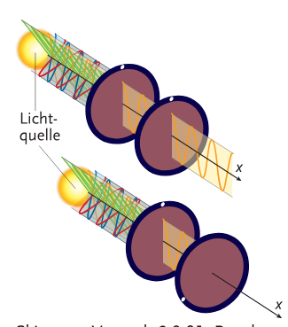

# Akustik

**Schallausbreitung**: Materie hat in allen Aggregatzuständen mehr oder weniger Volumselastizität, und deswegen können überall **Longitudinalwellen** auftreten. **Transversalwellen** sind bei Festkörpern und Flüssigkeitsoberflächen nötig. 

**Schalldruck $p$:**
$$
p=\frac{F}{A}\qquad [p]=\frac{\text{N}}{\text{m}^2}=\text{Pa}
$$

**Schallintensität $I$**: Mittlere Energie pro Zeit und Fläche bzw. mittlere Leistung pro Fläche
$$
I=\frac{I}{t\cdot A}\qquad[I]=\frac{\text{J}}{\text{s}\cdot\text{m}^2}=\frac{\text{W}}{\text{m}^2}
$$

**Schallkennidempedanz $Z$:**
$$
Z=\frac{p^2}{I}\qquad [Z]=\frac{\text{kg}}{\text{s}\cdot\text{m}^2}
$$

**Abnahme der Schallintensität durch kugelförmige Abstrahlung**: Hier ist $P$ die Schallleistung und die Kugeloberfläche $A=4\pi r^2$
$$
I(r)=\frac{P}{4\pi r^2}
$$

**Abnahme der Schallintensität durch Absorbation von Energie im Medium**: Hier ist $\alpha$ der Dämpfungskoeffizient des Mediums ($[\alpha]=\text{m}^{-1}$) und $x$ die Distanz
$$
I(x)=I_0\cdot e^{-a\cdot x}
$$

Menschliche Gehör kann Frequenzen von $20\text{Hz}$ bis $20\text{kHz}$ wahrnehmen, wobei die obere Grenze sich mit dem Alter stark verringert.

**Schallintentsitätspegel $L$**: Beschreibt die Wahrnehmung der Lautstärke
$$
L=10\cdot\log_{10}\left(\frac{I}{I_0}\right)=20\log_{10}\left(\frac{p}{p_0}\right)
$$
$$
[L]=\text{dB}\ \text{(Dezibel)}
$$
