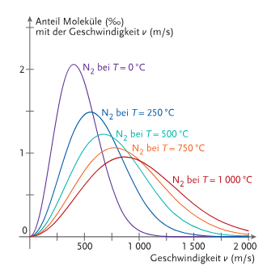
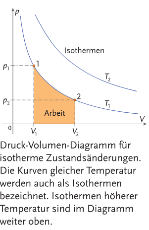
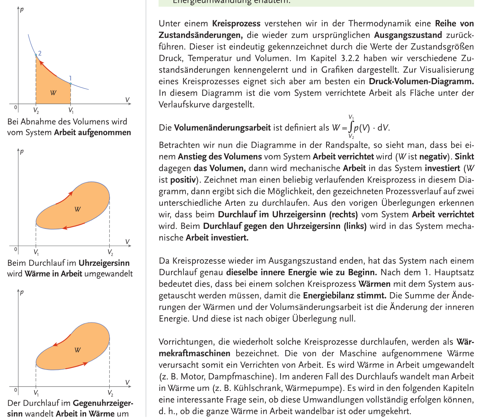
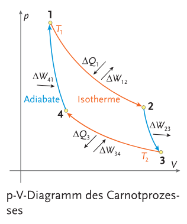

https://www.youtube.com/watch?v=4i1MUWJoI0U

# Kinetische Gastheorie

**Das ideale Gas**: Stark vereinfachtes Modell eines realen Gases, kann jedoch das thermodynamische Verhalten gut beschreiben. 

**Gasdruck eines idealen Gases**: Hier ist die $N$ die Anzahl der Teilchen mit Masse $m$ einer Geschwindigkeit $v$ eingesperrt in einem Volumen $V$ (Teilchendichte = $\frac{N}{V}$). Mittlere Impulsbetrag $\Delta p$ in einer Zeit $\Delta t$ auf eine Wandfläche der Größe $A$ durch elastische Stöße ergibt sich aus:
$$
|\Delta\vec{p}|=\frac{1}{6}\cdot\left(\frac{N}{V}\cdot A\cdot v\cdot\Delta t\right)\cdot 2mv
$$
hier beschreibt der eingeklammerte Teil die Teilchen, die mit der Wand wechselwirken können, weil sie die Wand in einer Zeit $\Delta t$ erreichen können. 

**Druck $p$:**
$$
p=\frac{1}{3}\cdot\frac{N}{V}\cdot m\cdot v^2 = \frac{2}{3}\cdot \frac{N}{V}\cdot\overline{E_\text{kin}}
$$

**Bar:**
$$
1\ \text{bar}=10^5\ \text{Pa}=1\ 000\ \text{hPa}
$$

**Boltzmannkonstante $k$:**
$$
k\approx 1.3806488\cdot10^{-23}\frac{\text{J}}{\text{K}}
$$

**Zustandsgleichung des idealen Gases:**
$$
p\cdot V=N\cdot k\cdot T
$$

**Anzahl der Teilchen in einem Mol (Avogadrokonstante $N_A$):**
$$
N_A=6.022\cdot 10^{23}\text{mol}^{-1}
$$

**Gesetz von Avogadro**: Ein Mol eines beliebigen Gases nimmt beim Druck von $p_0=1.01325\ \text{bar}$ und einer Temperatur von $T_0=273.15\ \text{K}$ ($0\degree\text{C}$) ein Volumen von $V_m=22.4\ \text{dm}^3$ ein. Joa. 

**Universelle Gaskonstante $R$:**
$$
R=N_A\cdot k\approx8.314\frac{\text{J}}{\text{K}\cdot\text{mol}}
$$

Für $n$ Mol eines idealen Gases gilt:
$$
p\cdot V=n\cdot R\cdot T
$$

**Spezifische Gaskonstante $R_s$**: Hier ist $M$ die Masse eines Mols des speziellen Gases.
$$
R_s=\frac{R}{M}
$$
Es gilt also:
$$
p\cdot V = m\cdot R_s\cdot T
$$

Besondere Fälle (konst = konstant):

|Name|$p$ konst?|$V$ konst?|$n$ konst?|$T$ konst?|Proportionalität|Was ist konst?|Formel|
|-|-|-|-|-|-|-|-|
|Gesetz von Boyle-Mariotte|$\textcolor{red}{\times}$|$\textcolor{red}{\times}$|$\textcolor{lime}{\checkmark}$|$\textcolor{lime}{\checkmark}$|$p\propto \frac{1}{V}$|$p\cdot V$|$\frac{p_1}{p_2}=\frac{V_2}{V_1}$|
|(erstes) Gesetz von Gay-Lussac|$\textcolor{lime}{\checkmark}$|$\textcolor{red}{\times}$|$\textcolor{lime}{\checkmark}$|$\textcolor{red}{\times}$|$V\propto T$|$\frac{V}{T}$|$\frac{V_1}{V_2}=\frac{T_1}{T_2}$|
|Gesetz von Amontons/zweites von Gay-Lussac|$\textcolor{red}{\times}$|$\textcolor{lime}{\checkmark}$|$\textcolor{lime}{\checkmark}$|$\textcolor{red}{\times}$|$p\propto T$|$\frac{p}{T}$|$\frac{p_1}{p_2}=\frac{T_1}{T_2}$|
|Gesetz der Gleichförmigkeit|$\textcolor{lime}{\checkmark}$|$\textcolor{red}{\times}$|$\textcolor{red}{\times}$|$\textcolor{lime}{\checkmark}$|$V\propto N$|$\frac{N}{V}$|$\frac{V_1}{V_2}=\frac{N_1}{N_2}$|

Infos dazu:
- Die Gesetze, bei denen der Druck nicht konstant ist (Boyle-Mariotte & Amontons) versagen bei zu hohen Druck.
- Gesetz der Gleichförmigkeit sagt aus, dass ein ideales Gas überall die selbe Dichte aufweist. 

**Gesetz von Dalton**: Wenn Gase nicht chemisch reagieren kann man sie beliebig vermischen. Die Summe der Partialdrücke der einzelnen Gase gleicht den Gesamtdruck des Gemisches. 
$$
p=\sum_i{p_i}
$$

**Zustandsänderung**: Auch wenn sich nur die Zustandsgrößen $p,V,n,T$ ändern, auch wenn sich der Aggregatszustand nicht ändert. 

- **isobar**: $p$ ist konst
- **isochor**: $V$ ist konst
- **isotherm**: $T$ ist konst

**Maxwell-Boltzmann-Verteilung**: Temperatur beschreibt mittlere Geschwindigkeit der Teilchen in einem idealen Gas. Diese Teilchenbewegungen sind zufällig. Diese Geschwindigkeit ist normalverteilt wie man im Bild sieht:

Die Formel dazu lautet ($\exp(x)=e^x$):
$$
f(v)=4\pi\cdot\left(\frac{m}{2\pi k T}\right)^{1.5}\cdot v^2\cdot \exp\left(-\frac{mv^2}{2kT}\right)
$$

Hier wird das mit den zufälligen Teilchenbewegungen und wie daraus Druck wird gut erklärt: https://ciechanow.ski/airfoil/

# Hauptsätze der Thermodynamik

**Nullter Hauptsatz:** Wenn zwei System A und B mit einen dritten System C im thermodynamischen Gleichgewicht stehen, dann stehen sie auch zueinander im Gleichgewicht. Also: Wenn zwei Systeme im thermodynamischen Gleichgewicht stehen dann haben sie die selbe Temparatur.

**Kelvinskala**: Anders wie Celsiusskala ist diese absolut, d.H. es gibt nichts kälteres als $0\text{K}$ (auch genant "absoluter Nullpunkt"). Die Kelvinskala ist die selbe wie die Celsiusskala, aber um exakt $273.15$ nach oben verschoben. 

**Wie man Temparatur erhöhen kann:**
- **Reibung**: Wenn Arbeit verrichtet wird, spielt im realen Fall Reibung immer eine Rolle. Reibung erhöht ungeordnete mikroskopische Bewegungen an den reibenden Grenzflächen, welches die innere Energie und damit die Temparatur erhöht. 
- **Thermischer Kontakt**: Wenn man zwei Systeme mit unterschiedlichen Temparaturen in thermischen Kontakt bringt, haben sie oft nach langer Zeit die selbe Temparatur und sind dann im thermodynamischen Gleichgewicht. 

Wärme ist auch eine Form der Energieübertragung, ist jedoch selbst keine Energieform. 

## Erster Hauptsatz

**Erster Hauptsatz:** Die Zufuhr von Wärme $Q$ oder mechanischer Arbeit $W$ vergrößert die innere Energie $U$ des Systems. 
$$
Q+W=\Delta U
$$

**Volumenänderungsarbeit $W$:**
$$
W=-p\cdot\Delta V
$$

**Innere Energie $U$:** Bei der Zufur oder Entnahme von Wärme keine Volumsänderung ($W=0$). Hier ist $c_V$ die spezifische Wärmekapazität bei konstantem Volumen. 
$$
U=c_V\cdot m\cdot T
$$

**Enthalpie $H$:** Wenn Vorgänge unter der Bedingung eines konstant bleibenden Umgebungsdruckes ablaufen.
$$
H=U+p\cdot V
$$

Hier ist $c_p$ die spezifische Wärmekapazität bei konstantem Druck
$$
H = c_p\cdot m\cdot T
$$

**Isochore Zustandsänderung**: Das Volumen verändert sich nicht ($\Delta V=0$)
$$
Q=\Delta U=c_V\cdot m\cdot \Delta T
$$

**Isobare Zustandsänderung**: Der Druck verändert sich nicht ($\Delta p=0$)
$$
Q=\Delta U=c_p\cdot m \cdot \Delta T
$$

**Isotherme Zustandsänderung**: Die Temparatur verändert sich nicht ($\Delta T=0$)
$$
W=-\int_{V_1}^{V_2}p\ dV=p\cdot V\cdot \ln\left(\frac{V_1}{V_2}\right)
$$

**Adiabate (isentrope) Zustandsänderung** (poissonische Gleichungen): Es gibt kein Austausch von Wärme ($\Delta Q=0$). Hier ist $\kappa=\frac{c_p}{c_V}$ der Isentropenexponent
$$
\frac{T_1}{T_2}=\left(\frac{V_2}{V_1}\right)^{\kappa-1}\qquad \text{oder}\qquad T\cdot V^{\kappa-1}=\text{konst.}
$$
$$
\frac{T_1}{T_2}=\left(\frac{p_1}{p_2}\right)^{(\kappa-1)\div\kappa}\qquad \text{oder}\qquad T\cdot p^{1-\kappa}=\text{konst.}
$$
man erhält das **poissonische Gesetz** wenn man beide Gleichungen zusammenstellt:
$$
\frac{p_1}{p_2}=\left(\frac{V_2}{V_1}\right)^\kappa\qquad \text{oder}\qquad p\cdot V^\kappa=\text{konst.}
$$

## Kreisprozesse und Carnotprozess

**Kreisprozess**: Reihe von Zustandsänderungen, die wieder zurück zum ursprünglichen Ausgangszustand zurückführen. 

**Reversible Prozesse**: Prozesse, die in einem geschlossenen System ablaufen und ohne Energiezufuhr rückgängig gemacht werden können.

**Carnotische Kreisprozess:** Höchster Wirkungsgrad, jedoch nur theoretisch und in der Praxis nur näherungsweise realisierbar. Zustandsänderungen:
- $1\Rarr2$ **Isotherme Expansion** ($\Delta T=\Delta U=0$). Wärme muss bei der Ausdehnung aufgenommen werden um Abkühlung zu vermeiden. \
  Es gilt: $W_\text{ab}=-Q_\text{zu}$ \
  Formel: $Q_\text{zu}=m\cdot R\cdot T_1\cdot\ln\left(\frac{V_2}{V_1}\right)$ 
- $2\Rarr3$ **Adiabatische Expansion** ($\Delta Q=0$). Es wird keine Wärme aufgenommen. \
  Es gilt: $Q_\text{zu}=0$\
  Formel: $\frac{m\cdot R}{\kappa-1}\cdot(T_2-T_1)$
- $3\Rarr4$ **Isotherme Kompression**  ($\Delta T=\Delta U=0$). Analog zu Schritt $1\Rarr2$, aber es wird Wärme bei der Kompression abgegeben. \
  Es gilt: $W_\text{zu}=-Q_\text{ab}\qquad\ldots \text{Wert ist positiv}$ \
  Formel: $Q_\text{ab}=m\cdot R\cdot T_2\cdot\ln\left(\frac{V_4}{V_3}\right)\qquad \ldots \text{Wert ist negativ}$
- $4\Rarr1$ **Adiabatische Kompression** ($\Delta Q=0$). Es erhöht sich die Temparatur aufgrund von Volumenänderungsarbeit. \
  Es gilt: $Q_\text{ab}=0$\
  Formel: $W_\text{zu}=\frac{m\cdot R}{\kappa-1}\cdot(T_1-T_2)$

Im gesamten Prozess gilt: 
$$
|Q_\text{zu}|>|Q_\text{ab}|
$$

Tabelle:

|Zustandsänderung|Was ist $0$?|Was gilt?|Formel|
|-|-|-|-|
|$1\Rarr2$|$\Delta T,\Delta U$|$W_\text{ab}=-Q_\text{zu}$|$Q_\text{zu}=m\cdot R\cdot T_1\cdot\ln\left(\frac{V_2}{V_1}\right)$|
|$2\Rarr3$|$\Delta Q$|$Q_\text{zu}=0$|$\frac{m\cdot R}{\kappa-1}\cdot(T_2-T_1)$|
|$3\Rarr4$|$\Delta T,\Delta U$|$W_\text{zu}=-Q_\text{ab}$|$Q_\text{ab}=m\cdot R\cdot T_2\cdot\ln\left(\frac{V_4}{V_3}\right)$|
|$4\Rarr1$|$\Delta Q$|$Q_\text{ab}=0$|$W_\text{zu}=\frac{m\cdot R}{\kappa-1}\cdot(T_1-T_2)$|

Wirkungsgrad:
$$
\eta=\frac{T_1-T_2}{T_1}
$$
