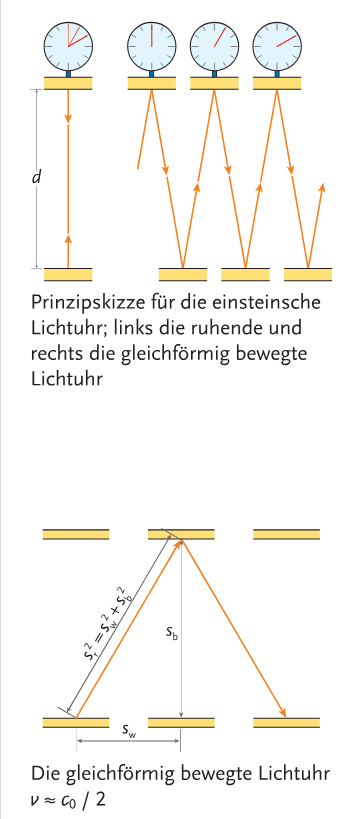

# Relativitätstheorie

Wird in die **Relativitätstheorie** (RT), **spezielle Relativitätstheorie** (SRT) und **allgemeine Relativitätstheorie** (ART) unterteilt.

**Lichtgeschwindigkeit:**
$$
c_0=\frac{\Delta s}{\Delta t} = 299\ 792\ 458 \frac{\text{m}}{\text{s}}
$$
Das Licht würde ca. 7.5 Umrundungen pro Sekunde um die Erde machen. 

**Einsteinsche Postulate:**
- **Relativitätsprinzip**: Die Naturgesetze nehmen in allen Inertialsystemen die gleiche mathematische Form an, und alle Inertialsysteme sind gleichberechtigt.
- **Prinzip der Konstanz der Lichtgeschwindigkeit**: Die Lichtgeschwindigkeit hat im Vakuum unabhängig vom Bewegungszustand der Quelle und des Beobachters in allen Inertialsystemen den Wert $c_0$.

**Relativistische Geschwindigkeitsaddition:** Die Gesamtgeschwindigkeit (Relativgeschwindigkeit) für zwei Einzelgeschwindigkeiten $v_1$ und $v_2$
$$
v_\text{ges}=\cfrac{v_1+v_2}{1+\cfrac{v_1\cdot v_2}{{c_0}^2}}
$$

**Einsteinsche Lichtuhr**: Wenn wir eine Uhr haben, welche sich beim hin- und herpendeln von Lichtteilchen zählt, bekommen wir als Betrachter ein anderes Ergebnis ob wir die Uhr zusehen während sie ruht oder sich relativ zu uns bewegt. 

Dies kann mittels **Zeitdilatation $t_b$** bzw Zeitdehnung ersichtlich gemacht werden. Hier ist $t_r$ die Vorgangszeit des ruhenden Systemes und $t_b$ die Zeit des mit $v$ bewegtem Systems. 
$$
t_b=t_r\cdot\sqrt{1-\left(\frac{v}{c_0}\right)^2}
$$
In anderen Worten, wenn sich ein Vorgang relativ zu dir bewegt, vergeht dieser aus einer Sichweise langsamer als für jemanden, der sich mit dem Vorgang bewegt.

**Eigenzeit**: Wenn sich jemand relativ zum Ort des Geschehens nicht bewegt. Ist die kleinste gemessene Zeit für den Vorgang.

**Längenkontraktion $l_b$** bzw. Längenverkürzung: Selbe Formel wie für die Zeitdilatation
$$
l_b=l_r\cdot\sqrt{1-\left(\frac{v}{c_0}\right)^2}
$$

Gutes Video das Zeitdilatation und Längenkontraktion erklärt: https://www.youtube.com/watch?v=uTyAI1LbdgA&list=PLoRmCUauOEZYfojsuM7z8PibuugLL9yYZ&index=115

**Lorentztransformation**: Dies ist eigentlich das wichtige. Die obigen Formeln stehen nicht in der Formelsammlung, weil man eigentlich nur das hier braucht. 

Hier wird sehr gut erklärt was das ist: https://www.youtube.com/watch?v=uTyAI1LbdgA&list=PLoRmCUauOEZYfojsuM7z8PibuugLL9yYZ&index=115

Hier dargestellt ist die einfachste Form der Lorentztransformation, wenn sich ein Inertialsystem relativ zum anderen auf der x-Achse bewegt. Dies alleine reicht aus, um die Transformation für alle vektoriellen Geschwindigkeiten zu Bilden; da man alle Koordinaten so wählen bzw. rotieren kann, damit die Bewegung nur relativ zur x-Achse ist. Rotationsmethoden sind in `1 Einführung` beschrieben. 

Hier sind $x,y,z$ die Koordinaten und $t$ eine Dauer des ersten Systems $I_1$, dann sind diese Werte anders relativ zum System $I_2$ das sich relativ zu $I_1$ mit $v$ entlang der x-Achse bewegt.

$$
\gamma = \left(1-\left(\cfrac{v}{c_0}\right)^2\right)^{-0.5}
$$

$$
x_b = \gamma (x - v t) 
$$
$$
t_b = \gamma \left( t - \frac{v}{{c_0}^2} x \right) 
$$
$$
y_b = y \\
z_b = z
$$

Die Rücktransformation funktioniert gleich, nur mit $-v$.

**Herleitung der Formel für die relativistische Gesamtgeschwindigkeit:**

Wir haben ein System $I$, und ein zweites $I_a$ das sich mit $v_1$ relativ zu $I$ bewegt und eines das sich noch mal um $v_2$ schneller als $I_a$ relativ zu $I$ bewegt, welches wir $I_b$ nennen. 

Wir nehmen einen Punkt $x$ und eine Zeit $t$ relativ zu $I$ und berchnen, was diese relativ zu $I_a$ sind.
$$
\gamma_{\rarr a} = \left(1-\left(\cfrac{v_1}{c_0}\right)^2\right)^{-0.5}
$$
$$
x_{\rarr a}=\gamma_{\rarr a}(x-v_1t)
$$
$$
t_{\rarr a}=\gamma_{\rarr a}\left(t-\frac{v_1}{{c_0}^2}x\right)
$$

$I_b$ bewegt sich mit $v_2$ relativ zu $I_a$:
$$
\gamma_{a\rarr b} = \left(1-\left(\cfrac{v_2}{c_0}\right)^2\right)^{-0.5}
$$
$$
x_{a\rarr b}=\gamma_{a\rarr b}(x_{\rarr a}-v_2t_{\rarr a})
$$
$$
t_{a\rarr b}=\gamma_{a\rarr b}\left(t_{\rarr a}-\frac{v_2}{{c_0}^2}x_{\rarr a}\right)
$$

Die wichtige Frage: Wie schnell bewegt sich jetzt $I_b$ relativ to $I$? Die gesuchte Geschwindigkeit ist mit $v_\text{ges}$ markiert.
$$
\gamma_{b\rarr} = \left(1-\left(\cfrac{v_\text{ges}}{c_0}\right)^2\right)^{-0.5}
$$
$$
x_{b\rarr}=\gamma_{b\rarr}(x_{a\rarr b}-v_\text{ges}t_{a\rarr b})
$$
$$
t_{b\rarr}=\gamma_{b\rarr}\left(t_{a\rarr b}-\frac{v_\text{ges}}{{c_0}^2}x_{a\rarr b}\right)
$$

Jetzt müsste man noch rekursiv Einsetzen ($\ldots_{a\rarr b}$ mit den Variablen von Schritt 2, und hier auch wieder statt $\ldots_{\rarr a}$ die Variablen von Schritt 1) und dann auf $v_\text{ges}$ umformen und lösen. Zugegebenermaßen schafft es das Buch wesentlich kürzer, bin mir aber auch nicht genau sicher wie es da vorgeht. 

## Relativistische Masse

Energie ist ja laut der Mechanik ein Produkt aus Masse mal Geschwindigkeit (Aufgrund Weg*Kraft) ($E_\text{kin}=m\cdot \frac{v^2}{2}$)

**Ruheenergie $E_0$**: Ein ruhender Körper der Ruhemasse $m_0$ hat folgende Ruheenergie:
$$
E_0=m_0\cdot {c_0}^2 \quad \cancel{+\text{AI}}
$$

Diese Energie ist üblicherweise extrem hoch, ein Kilogram hat bspw. $90 \text{PJ}$, das Äquivalent der Verarbeitung von drei Millionen Tonnen Steinkohle eines Kohlekraftwerkes. 
