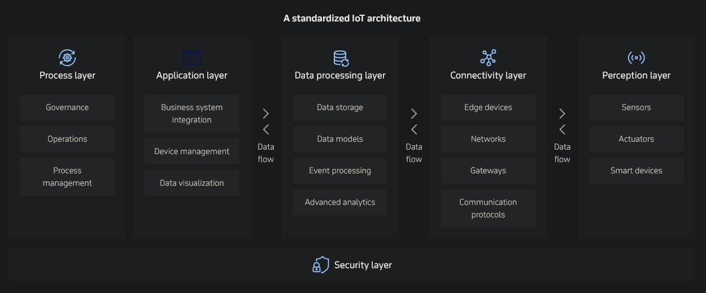
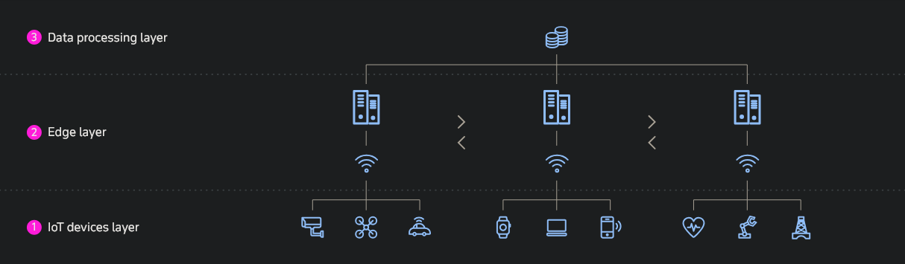
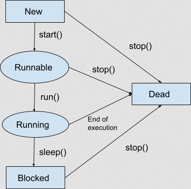

# IoT-Architektur

https://www.itransition.com/iot/architecture





Arten von IoT:
- **Consumer IoT**: Persönliche Geräte und Smart Home Gadgets für individuellen Nutzen
- **Commercial IoT**: Geräte in Buisness-Kontexten, zB Handel, Medizin, Finanzen, um Effizienz zu erhöhen
- **Industrial IoT** (IIoT): Verbundene Maschinen, Sensoren, und andere System in der Fertigung, Energiebranche und Logistikbranche
- **Infrastructure IoT**: Großflächige System um Städte, Transport und Energieversorgung zu unterstützen

# IoT-Protokolle (MQTT)

Verschiedene Protokolle:
- **MQTT**: Leichtgewichtig. Über TCP/IP für Datensammlung von hardwarenahen Geräten
- **CoAP**: Alternative zu MQTT
- **HTTP(S)**: Für Web-basierte IoTs, ist aber schwergewichtiger als MQTT
- **AMQP**: Wird in industriellen IoT genutzt
- **DDS**: Gute Performance und gut für Echtzeit Datenaustausch wenn Risiko hoch ist

https://www.elektronik-kompendium.de/sites/net/2204051.htm

MQTT Besonderheiten:
- Verbindung bleibt auch bestehen, wenn keine Daten übertragen werden ("zustandhaltenes Protokoll")
- Leichtgewichtig, kaum Overhead
- Abgebrochene Verbindungen können wieder aufgenommen/fortgesetzt werden
- Unterschiedliche Quality of Service (QoS) Level mit verschiedenen Zuverlässigkeitsstufen 


- **MQTT-Server** (Message Broker): Zentraler Server, der die Nachrichten von ein oder mehreren Publishern entgegennimmt und an Subscriber weiterleitet
- **MQTT-Clients** (Publisher und Subscriber): Publisher ist oft ein Sensor, muss aber nicht sein. Subscriber macht irgendwas mit mit der Nachricht vom Publisher, zB je nach Werten irgendwas schalten


**Topics**: Wie finden Publisher und Subscriber zu einander? Die Subscriber abonnieren "Topics" vom Broker, welche aussagen, welche Nachricht die Subscriber erhalten sollen. Der Publisher muss Inhalt und Topic beim Versand der Nachricht festlegen. 

**Quality of Service** (QoS): 3 Stufen für die Zuverlässigkeit der Zustellung
- **Level 0**: *at most once, unreliable* / *fire and forget*: Null Zuverlässigkeit, die Zustellung wird nicht garantiert
- **Level 1**: *at least once*: Die Nachricht kommt mindestens einmal (oder auch mehrmals) beim Broker an
- **Level 2**: *exactly once*: Die Nachricht kommt garantiert nur einmal beim Broker an. Ist die verlässlichste Variant, aber für Performance und Netzlast aufwendig, langsam und teuer


## HiveMQ

MQTT-Client Software. 

```xml
    <dependencies>
        <dependency>
            <groupId>com.hivemq</groupId>
            <artifactId>hivemq-mqtt-client</artifactId>
            <version>1.3.3</version>
        </dependency>
    </dependencies>
```

Client erstellen:
```java
    Mqtt3AsyncClient client = MqttClient.builder()
        .useMqttVersion3()
        .identifier("my-mqtt-client-id")
        .serverHost("localhost")
        .serverPort(1883)
        .useSslWithDefaultConfig()
        .buildAsync();
```

Mit dem Broker verbinden:
```java
    client.connectWith()
        .simpleAuth()
            .username("my-user")
            .password("my-password".getBytes())
            .applySimpleAuth()
        .send()
        .whenComplete((connAck, throwable) -> {
            if (throwable != null) {
                // handle failure
            } else {
                // setup subscribes or start publishing
            }
        });
```

Topic abonnieren:
```java
    client.subscribeWith()
        .topicFilter("the/topic")
        .callback(publish -> {
            // Process the received message
        })
        .send()
        .whenComplete((subAck, throwable) -> {
            if (throwable != null) {
                // Handle failure to subscribe
            } else {
                // Handle successful subscription, e.g. logging or incrementing a metric
            }
        });
```

Zu nen Topic was publishen:
```java
    client.publishWith()
        .topic("the/topic")
        .payload("hello world".getBytes())
        .send()
        .whenComplete((publish, throwable) -> {
            if (throwable != null) {
                // handle failure to publish
            } else {
                // handle successful publish, e.g. logging or incrementing a metric
            }
        });
```

## Weitere Tools

**MQTT-Explorer**: MQTT-Client, mit dem man Übersicht über ein Topic bekommen kann


**Arduino**, **PlatformIO**, etc.

# Multithreading - Atomics, Mutex, Semaphore, Locks

Threads: Um mehrere Tasks gleichzeitig ausführen zu können. Ist nötig wenn man zB nicht will dass die UI blockiert. 

**Probleme, die auftreten können:**
- **Race Conditions**: Wenn mehrere Threads gleichzeitig die selben Daten lesen/schreiben kann es zu inkonsistentheiten kommen
- **Deadlocks**: Thread A hält Lock1 und wartet auf Lock2, Thread B hält Lock2 und wartet auf Lock1, beide warten aufeinander, nichts geht weiter
- **Starvation**: Threads bekommen nie CPU oder Locks 

https://www.simplilearn.com/tutorials/java-tutorial/thread-in-java

Threads mit `java.lang.Thread`:
```java
    package test;

    public class MyThread extends Thread {
        public void run() {
            System.out.println("thread is running...");
        }

        public static void main(String[] args) {
            MyThread obj = new MyThread();
            obj.start();
        }
    }
```

Mit `runnable`-Interface: 
```java
    package test;

    public class MyThread implements Runnable {
        public void run() {
            System.out.println("thread is running...");
        }

        public static void main(String[] args) {
            Thread t = new Thread(new MyThread());
            t.start();
        }
    }
```



**Atomics**: Atomare Operationen auf primitiven Werten ohne Lock, mit `AtomicInteger`, `AtomicLong`, `AtomicReference`, etc. Benötigt kein Lock, und ist oft schneller & skalierbar
```java
    import java.util.concurrent.atomic.AtomicInteger;

    public class AtomicCounter {
        private final AtomicInteger count = new AtomicInteger(0);

        public void increment() {
            count.incrementAndGet(); // atomar
        }

        public int get() {
            return count.get();
        }

        public static void main(String[] args) throws InterruptedException {
            AtomicCounter c = new AtomicCounter();
            Thread t1 = new Thread(() -> { for (int i=0;i<10000;i++) c.increment(); });
            Thread t2 = new Thread(() -> { for (int i=0;i<10000;i++) c.increment(); });
            t1.start(); t2.start();
            t1.join(); t2.join();
            System.out.println(c.get()); // erwartet 20000
        }
    }
```

**Mutex** (Mutual Exclusion): Exklusiver Zugriff, nur ein Thread zur Zeit
```java
    public class SynchronizedCounter {
        private int count = 0;
        private final Object lock = new Object();

        public void increment() {
            synchronized (lock) {
                count++;
            }
        }

        public int get() {
            synchronized (lock) {
                return count;
            }
        }

        public static void main(String[] args) throws InterruptedException {
            SynchronizedCounter c = new SynchronizedCounter();
            Thread t1 = new Thread(() -> { for (int i=0;i<10000;i++) c.increment(); });
            Thread t2 = new Thread(() -> { for (int i=0;i<10000;i++) c.increment(); });
            t1.start(); t2.start();
            t1.join(); t2.join();
            System.out.println(c.get()); // erwartet 20000
        }
    }
```

**Semaphore**: Steuert Zugriff durch einen Zähler (`permit > 1` erlaubt k gleichzeitige Zugriffe, `permit == 1` ist ähnlich zu mutex)
```java
    import java.util.concurrent.Semaphore;

    public class SemaphoreExample {
        private final Semaphore sem = new Semaphore(3); // 3 gleichzeitige Zugriffe

        public void useResource(int id) {
            try {
                sem.acquire();
                System.out.println("Thread " + id + " using resource");
                Thread.sleep(500); // Arbeit simulieren
            } catch (InterruptedException e) {
                Thread.currentThread().interrupt();
            } finally {
                System.out.println("Thread " + id + " releasing resource");
                sem.release();
            }
        }

        public static void main(String[] args) {
            SemaphoreExample ex = new SemaphoreExample();
            for (int i = 0; i < 10; i++) {
                final int id = i;
                new Thread(() -> ex.useResource(id)).start();
            }
        }
    }
```

**Locks**: `ReentrantLock` bietet zusätzliche Kontrolle 
```java
    import java.util.concurrent.locks.Condition;
    import java.util.concurrent.locks.Lock;
    import java.util.concurrent.locks.ReentrantLock;

    public class BoundedBuffer<T> {
        private final Object[] items;
        private int putIdx = 0, takeIdx = 0, count = 0;
        private final Lock lock = new ReentrantLock();
        private final Condition notEmpty = lock.newCondition();
        private final Condition notFull = lock.newCondition();

        public BoundedBuffer(int capacity) {
            items = new Object[capacity];
        }

        public void put(T x) throws InterruptedException {
            lock.lock();
            try {
                while (count == items.length) {
                    notFull.await();
                }
                items[putIdx] = x;
                putIdx = (putIdx + 1) % items.length;
                count++;
                notEmpty.signal(); // signal consumer
            } finally {
                lock.unlock();
            }
        }

        @SuppressWarnings("unchecked")
        public T take() throws InterruptedException {
            lock.lock();
            try {
                while (count == 0) {
                    notEmpty.await();
                }
                T x = (T) items[takeIdx];
                items[takeIdx] = null;
                takeIdx = (takeIdx + 1) % items.length;
                count--;
                notFull.signal(); // signal producer
                return x;
            } finally {
                lock.unlock();
            }
        }

        // Test
        public static void main(String[] args) {
            BoundedBuffer<Integer> buf = new BoundedBuffer<>(5);
            // Producer
            new Thread(() -> {
                try {
                    for (int i = 0; i < 20; i++) {
                        buf.put(i);
                        System.out.println("Produced " + i);
                    }
                } catch (InterruptedException e) { Thread.currentThread().interrupt(); }
            }).start();

            // Consumer
            new Thread(() -> {
                try {
                    for (int i = 0; i < 20; i++) {
                        int v = buf.take();
                        System.out.println("Consumed " + v);
                    }
                } catch (InterruptedException e) { Thread.currentThread().interrupt(); }
            }).start();
        }
    }
```

# Producer-Consumer

https://removepaywalls.com/https://anmolsehgal.medium.com/multi-threading-producer-consumer-pattern-using-wait-notify-3dde8fd49f65

- **Producer**: Erstellt die Werte in einen Puffer (zB Array)
- **Consumer**: Konsumiert den Wert von dem Puffer

Beispiel:
```java
    public class ProducerConsumer {
        static Object key = new Object();
        private static boolean[] buffer;
        private static int currentSize;

        public static void main(String[] args) throws InterruptedException {
            buffer = new boolean[10];
            currentSize = 0;

            final Producer producer = new Producer();
            final Consumer consumer = new Consumer();

            Runnable prodRunn = new Runnable() {
                @Override
                public void run() {
                    for (int x = 0; x < 100; x++) {
                        producer.produce();
                    }
                    System.out.println("Produced...");
                }
            };

            Runnable consRunn = new Runnable() {
                @Override
                public void run() {
                    for (int x = 0; x < 100; x++) {
                        consumer.consume();
                    }
                    System.out.println("Consumer...");
                }
            };

            Thread prodThread = new Thread(prodRunn);
            Thread consThread = new Thread(consRunn);

            prodThread.start();
            consThread.start();

            prodThread.join();
            consThread.join();

            System.out.println("Buffer size : " + currentSize);
        }

        static class Producer {
            void produce() {
                synchronized (key) {
                    if (currentSize == buffer.length) {
                        try {
                            key.wait();
                        } catch (InterruptedException e) {
                            e.printStackTrace();
                        }
                    }
                    buffer[currentSize] = true;
                    currentSize++;
                    key.notifyAll();
                }
            }
        }

        static class Consumer {
            void consume() {
                synchronized (key) {
                    if (currentSize == 0) {
                        try {
                            key.wait();
                        } catch (InterruptedException e) {
                            e.printStackTrace();
                        }
                    }
                    currentSize--;
                    buffer[currentSize] = false;
                    key.notifyAll();
                }
            }
        }
    }
```

Warum? Enkoppelt Erzeugung (Production) und Verarbeitung (Consumption) von Daten über einen gemeinsamen Puffer, sodass beide unabhängig, skalierbar und ohne Busy‑waiting arbeiten können.

# Parallel Computing - Virtual Threads

**Virtual Threads**: Seit Java 19. Viel leichtgewichtiger im RAM-Sinne als echte Threads. Man kann viel mehr virtuelle Threads haben als Plattformthreads. 

Beispiel:
```java
    Thread.startVirtualThread(() -> {
                System.out.println("Running virtual thread: " + Thread.currentThread().getName());
    });

    // or
    Thread.ofVirtual().start(() -> System.out.println("Running virtual thread: " + Thread.currentThread().getName());
    thread.join(); // for allowing you to see the message as it waits for the thread to terminate, before the main thread terminates
```

oder auch mit dem `ExecutorService`:
```java
    ExecutorService executor = Executors.newVirtualThreadPerTaskExecutor();
            executor.submit(() -> {
                System.out.println("Running virtual thread with ExecutorService: " + Thread.currentThread().getName());
            });
```

Wie funktioniert das ganze? Wenn man zB ein Szenario hat, bei dem man eine DB-Anfrage macht, möchte man nicht, dass da die UI blockiert. Um die Blockierung eines Plattform-Threads zu verhinder, erkennt der virtuelle Thread dan die blockierende I/O-Operation (die DB-Abfrage) und trennt sich vom Plattform-Thread, indem sein Kontext/Stack auf dem Heap-Speicher verschiebt. 

# Parallel Computing - Completeable Futures

Asynchrone Programmierung. Seit Java 5 gibt es das `Future`-Interface in Java (wie `Task` in C#), und seit Java 8 die `CompleteableFuture`-Klasse. 

Beispiel `CompleteableFuture`:
```java
    public Future<String> calculateAsync() throws InterruptedException {
        CompletableFuture<String> completableFuture = new CompletableFuture<>();

        Executors.newCachedThreadPool().submit(() -> {
            Thread.sleep(500);
            completableFuture.complete("Hello");
            return null;
        });

        return completableFuture;
    }

    // -- Usage --

    Future<String> completableFuture = calculateAsync();

    // ... 

    String result = completableFuture.get();
    assertEquals("Hello", result);
```

Man kann auch zB mehrere Futures auf einmal ausführen:

```java
    CompletableFuture<String> future1  
    = CompletableFuture.supplyAsync(() -> "Hello");
    CompletableFuture<String> future2  
    = CompletableFuture.supplyAsync(() -> "Beautiful");
    CompletableFuture<String> future3  
    = CompletableFuture.supplyAsync(() -> "World");

    CompletableFuture<Void> combinedFuture 
    = CompletableFuture.allOf(future1, future2, future3);

    // ...

    combinedFuture.get();

    assertTrue(future1.isDone());
    assertTrue(future2.isDone());
    assertTrue(future3.isDone());
```
